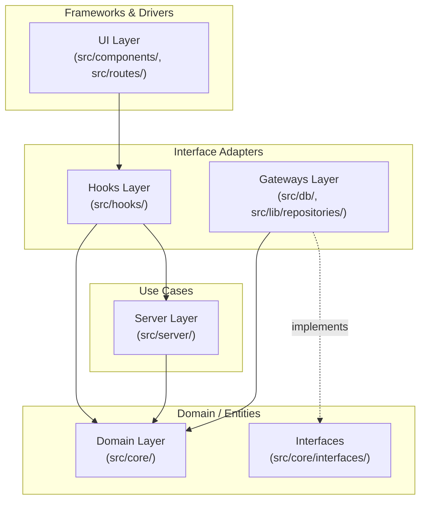

# Design Document: Clean Architecture Migration

## Overview

This design specifies the structural refactoring to enforce Clean Architecture dependency rules across the codebase. The migration eliminates inward-pointing dependency violations without changing any observable behavior. The core strategy is **Dependency Inversion via Parameter Injection**: domain functions that currently import infrastructure modules are refactored to accept abstract interfaces as parameters, with concrete implementations injected at call sites in the hooks/server layer.

## Architecture



**Dependency Rule**: Arrows point from dependent → dependency. The Domain layer (including `src/core/interfaces/`) has zero outgoing dependencies. Gateways implement interfaces defined in Domain (dashed arrow = "implements").

## Components and Interfaces

### Component 1: Repository Interfaces (`src/core/interfaces/`)

**Purpose**: Define abstract contracts for data access operations using only domain-owned types. These interfaces live inside the Domain layer so that domain functions can reference them without violating the dependency rule.

#### Domain-Owned Data Types

The interfaces use domain-owned types rather than re-exporting Dexie/infrastructure types. These are defined in `src/core/interfaces/types.ts`:

```typescript
// src/core/interfaces/types.ts

/**
 * Domain representation of a card record.
 * Mirrors the shape needed by domain logic without coupling to IndexedDB schema.
 */
export interface CardRecord {
  tenantId: string;
  cardId: string;
  userId: string | null;
  status:
    | "active"
    | "blocked_tamper"
    | "blocked_fraud"
    | "blocked_expired"
    | "blocked_admin"
    | "deleted";
  balance: number;
  counter: number;
  keyVersion: number;
  createdAt: number;
  lastActivityAt: number | null;
  expiresAt: number | null;
  notes: string | null;
}

/**
 * Domain representation of a user record.
 */
export interface UserRecord {
  tenantId: string;
  userId: string;
  name: string;
  status: "active" | "suspended" | "deleted";
}

/**
 * Result of a remote UID existence check.
 */
export interface UIDCheckResult {
  exists: boolean;
  tenantId?: string;
}
```

#### Interface Definitions

```typescript
// src/core/interfaces/CardRepository.ts
import type { CardRecord } from "./types";

export interface CardRepository {
  /**
   * Get a single card by compound key [tenantId, cardId].
   * Returns undefined if not found.
   */
  getByTenantAndCardId(tenantId: string, cardId: string): Promise<CardRecord | undefined>;

  /**
   * Find all non-deleted cards matching a cardId across all tenants.
   * Used by UID global validation to detect cross-tenant duplicates.
   */
  filterByCardIdExcludingDeleted(cardId: string): Promise<CardRecord[]>;

  /**
   * Update a card's status by compound key.
   */
  updateStatus(tenantId: string, cardId: string, status: CardRecord["status"]): Promise<void>;

  /**
   * Insert or replace a card record.
   */
  put(card: CardRecord): Promise<void>;
}
```

```typescript
// src/core/interfaces/UserRepository.ts
import type { UserRecord } from "./types";

export interface UserRepository {
  /**
   * Get a single user by compound key [tenantId, userId].
   * Returns undefined if not found.
   */
  getByTenantAndUserId(tenantId: string, userId: string): Promise<UserRecord | undefined>;
}
```

```typescript
// src/core/interfaces/UIDRemoteValidator.ts
import type { UIDCheckResult } from "./types";

export interface UIDRemoteValidator {
  /**
   * Check if a UID exists in any tenant via network API.
   * Throws on network failure (caller handles fail-closed behavior).
   */
  checkUIDExists(normalizedUID: string): Promise<UIDCheckResult>;
}
```

```typescript
// src/core/interfaces/OnlineStatusProvider.ts

export interface OnlineStatusProvider {
  /**
   * Returns true if the device currently has network connectivity.
   */
  isOnline(): boolean;
}
```

```typescript
// src/core/interfaces/index.ts — barrel export
export type { CardRepository } from "./CardRepository";
export type { UserRepository } from "./UserRepository";
export type { UIDRemoteValidator } from "./UIDRemoteValidator";
export type { OnlineStatusProvider } from "./OnlineStatusProvider";
export type { CardRecord, UserRecord, UIDCheckResult } from "./types";
```

### Component 2: Refactored Domain Functions

**Purpose**: Transform domain functions from importing infrastructure directly to accepting repository interfaces as parameters. Pure synchronous functions remain unchanged.

#### `uidGlobalValidator.ts` — After Migration

```typescript
// src/core/validation/uidGlobalValidator.ts
import type { CardRepository } from "../interfaces/CardRepository";
import type { UIDRemoteValidator } from "../interfaces/UIDRemoteValidator";
import type { OnlineStatusProvider } from "../interfaces/OnlineStatusProvider";

// Types and normalizeUID remain unchanged (pure, no dependencies)
export interface UIDValidationResult {
  /* unchanged */
}
export function normalizeUID(serialNumber: string): string {
  /* unchanged */
}

// Refactored: accepts dependencies as parameters
export async function validateUIDLocal(
  serialNumber: string,
  currentTenantId: string,
  deps: { cardRepo: CardRepository },
): Promise<UIDValidationResult> {
  const normalizedUID = normalizeUID(serialNumber);
  const formatError = validateFormat(normalizedUID);
  if (formatError) return formatError;

  const localResult = await checkLocalDB(normalizedUID, currentTenantId, deps.cardRepo);
  if (localResult) return localResult;
  return { valid: true };
}

export async function validateUID(
  serialNumber: string,
  currentTenantId: string,
  deps: {
    cardRepo: CardRepository;
    remoteValidator: UIDRemoteValidator;
    onlineStatus: OnlineStatusProvider;
  },
): Promise<UIDValidationResult> {
  const normalizedUID = normalizeUID(serialNumber);
  const formatError = validateFormat(normalizedUID);
  if (formatError) return formatError;

  const localResult = await checkLocalDB(normalizedUID, currentTenantId, deps.cardRepo);
  if (localResult) return localResult;

  if (deps.onlineStatus.isOnline()) {
    try {
      const data = await deps.remoteValidator.checkUIDExists(normalizedUID);
      if (data.exists) {
        return {
          valid: false,
          reason: "UID_REGISTERED_OTHER_TENANT",
          existingTenantId: data.tenantId,
        };
      }
    } catch {
      return { valid: false, reason: "NETWORK_ERROR" };
    }
  }
  return { valid: true };
}

// Internal helper now accepts CardRepository
async function checkLocalDB(
  normalizedUID: string,
  currentTenantId: string,
  cardRepo: CardRepository,
): Promise<UIDValidationResult | null> {
  const localCards = await cardRepo.filterByCardIdExcludingDeleted(normalizedUID);
  if (localCards.length > 0) {
    const existingCard = localCards[0];
    if (existingCard.tenantId === currentTenantId) {
      return { valid: false, reason: "UID_ALREADY_REGISTERED", existingCardId: normalizedUID };
    }
    return {
      valid: false,
      reason: "UID_REGISTERED_OTHER_TENANT",
      existingTenantId: existingCard.tenantId,
    };
  }
  return null;
}
```

#### `blockEnforcer.ts` — After Migration

```typescript
// src/core/validation/blockEnforcer.ts
import type { CardRecord } from "../interfaces/types";
import type { CardRepository } from "../interfaces/CardRepository";
import { CardStatus } from "../payload/types";

// Pure sync functions remain unchanged
export function checkBlockedSync(
  onCardStatus?: CardStatus,
  dbCard?: CardRecord | null,
): BlockCheckResult {
  /* unchanged */
}

// Refactored: accepts CardRepository parameter
export async function checkBlocked(
  tenantId: string,
  cardId: string,
  deps: { cardRepo: CardRepository },
  onCardStatus?: CardStatus,
): Promise<BlockCheckResult> {
  if (onCardStatus !== undefined && isBlockedStatus(onCardStatus)) {
    return makeBlockedResult(onCardStatus);
  }
  const dbCard = await deps.cardRepo.getByTenantAndCardId(tenantId, cardId);
  return checkBlockedSync(onCardStatus, dbCard ?? null);
}

export async function enforceOnCheckin(
  tenantId: string,
  cardId: string,
  deps: { cardRepo: CardRepository },
): Promise<BlockCheckResult> {
  return checkBlocked(tenantId, cardId, deps);
}

export async function enforceOnCheckout(
  tenantId: string,
  cardId: string,
  deps: { cardRepo: CardRepository },
): Promise<BlockCheckResult> {
  return checkBlocked(tenantId, cardId, deps);
}

export async function applyAdminBlock(
  tenantId: string,
  cardId: string,
  deps: { cardRepo: CardRepository },
): Promise<void> {
  const existingCard = await deps.cardRepo.getByTenantAndCardId(tenantId, cardId);
  if (existingCard) {
    await deps.cardRepo.updateStatus(tenantId, cardId, "blocked_admin");
  } else {
    await deps.cardRepo.put({
      tenantId,
      cardId,
      userId: null,
      status: "blocked_admin",
      balance: 0,
      counter: 0,
      keyVersion: 1,
      createdAt: Math.floor(Date.now() / 1000),
      lastActivityAt: Math.floor(Date.now() / 1000),
      expiresAt: null,
      notes: null,
    });
  }
}
```

#### `printButtonValidator.ts` — After Migration

```typescript
// src/core/validation/printButtonValidator.ts
import type { CardRecord } from "../interfaces/types";
import type { CardRepository } from "../interfaces/CardRepository";

// Pure sync function remains unchanged
export function evaluatePrintEligibilitySync(
  card: CardRecord | undefined,
  options: PrintOptions,
): PrintEligibility {
  /* unchanged */
}

// Refactored: accepts CardRepository parameter
export async function evaluatePrintEligibility(
  cardId: string,
  options: PrintOptions,
  tenantId: string,
  deps: { cardRepo: CardRepository },
): Promise<PrintEligibility> {
  let card: CardRecord | undefined;
  try {
    card = await deps.cardRepo.getByTenantAndCardId(tenantId, cardId);
  } catch {
    return { enabled: false, reason: "CARD_NOT_FOUND" };
  }
  return evaluatePrintEligibilitySync(card, options);
}
```

#### `localStatusCheck.ts` — After Migration

```typescript
// src/core/nfc/localStatusCheck.ts
import type { CardRepository } from "../interfaces/CardRepository";
import type { UserRepository } from "../interfaces/UserRepository";

export async function checkLocalBlockedStatus(
  tenantId: string,
  serialNumber: string,
  deps: { cardRepo: CardRepository; userRepo: UserRepository },
): Promise<LocalStatusResult> {
  const normalizedSerial = serialNumber.replaceAll(/[^a-fA-F0-9]/g, "").toLowerCase();

  const cardRecord = await deps.cardRepo.getByTenantAndCardId(tenantId, normalizedSerial);

  if (!cardRecord) {
    return { blocked: false, reason: null, notInLocalDb: true };
  }

  if (cardRecord.status !== "active") {
    return {
      blocked: true,
      reason: `Kartu diblokir: ${cardRecord.status.replaceAll("blocked_", "")}`,
      notInLocalDb: false,
    };
  }

  const linkedUserId = cardRecord.userId ?? null;
  if (linkedUserId) {
    const userRecord = await deps.userRepo.getByTenantAndUserId(tenantId, linkedUserId);
    if (userRecord && userRecord.status !== "active") {
      return {
        blocked: true,
        reason: "Akun anggota ditangguhkan. Hubungi admin.",
        notInLocalDb: false,
      };
    }
  }

  return { blocked: false, reason: null, notInLocalDb: false };
}
```

### Component 3: Gateway Implementations (`src/lib/repositories/`)

**Purpose**: Concrete implementations of repository interfaces backed by IndexedDB (Dexie) and the HTTP client. These live in the Gateways layer and depend inward on Domain interfaces.

```typescript
// src/lib/repositories/DexieCardRepository.ts
import type { CardRepository } from "#/core/interfaces/CardRepository";
import type { CardRecord } from "#/core/interfaces/types";
import { localDb } from "#/db/local-db";

export class DexieCardRepository implements CardRepository {
  async getByTenantAndCardId(tenantId: string, cardId: string): Promise<CardRecord | undefined> {
    const card = await localDb.cards.get([tenantId, cardId]);
    return card ? this.toCardRecord(card) : undefined;
  }

  async filterByCardIdExcludingDeleted(cardId: string): Promise<CardRecord[]> {
    const cards = await localDb.cards
      .filter((card) => card.cardId === cardId && card.status !== "deleted")
      .toArray();
    return cards.map((c) => this.toCardRecord(c));
  }

  async updateStatus(
    tenantId: string,
    cardId: string,
    status: CardRecord["status"],
  ): Promise<void> {
    await localDb.cards.update([tenantId, cardId], { status });
  }

  async put(card: CardRecord): Promise<void> {
    await localDb.cards.put({
      ...card,
      syncStatus: "pending",
    });
  }

  private toCardRecord(
    card: typeof localDb.cards.schema.primKey extends never ? never : any,
  ): CardRecord {
    return {
      tenantId: card.tenantId,
      cardId: card.cardId,
      userId: card.userId,
      status: card.status,
      balance: card.balance,
      counter: card.counter,
      keyVersion: card.keyVersion,
      createdAt: card.createdAt,
      lastActivityAt: card.lastActivityAt,
      expiresAt: card.expiresAt,
      notes: card.notes,
    };
  }
}
```

```typescript
// src/lib/repositories/DexieUserRepository.ts
import type { UserRepository } from "#/core/interfaces/UserRepository";
import type { UserRecord } from "#/core/interfaces/types";
import { localDb } from "#/db/local-db";

export class DexieUserRepository implements UserRepository {
  async getByTenantAndUserId(tenantId: string, userId: string): Promise<UserRecord | undefined> {
    const user = await localDb.users.get([tenantId, userId]);
    if (!user) return undefined;
    return { tenantId: user.tenantId, userId: user.userId, name: user.name, status: user.status };
  }
}
```

```typescript
// src/lib/repositories/ApiUIDRemoteValidator.ts
import type { UIDRemoteValidator } from "#/core/interfaces/UIDRemoteValidator";
import type { UIDCheckResult } from "#/core/interfaces/types";
import { API_BASE_URL, apiFetch } from "#/lib/api";

export class ApiUIDRemoteValidator implements UIDRemoteValidator {
  async checkUIDExists(normalizedUID: string): Promise<UIDCheckResult> {
    const response = await apiFetch(`${API_BASE_URL}/api/cards/check-uid?uid=${normalizedUID}`);
    const data = await response.json();
    return { exists: data.exists, tenantId: data.tenantId };
  }
}
```

```typescript
// src/lib/repositories/NavigatorOnlineStatusProvider.ts
import type { OnlineStatusProvider } from "#/core/interfaces/OnlineStatusProvider";

export class NavigatorOnlineStatusProvider implements OnlineStatusProvider {
  isOnline(): boolean {
    return navigator.onLine;
  }
}
```

```typescript
// src/lib/repositories/index.ts — barrel export + singleton instances
import { DexieCardRepository } from "./DexieCardRepository";
import { DexieUserRepository } from "./DexieUserRepository";
import { ApiUIDRemoteValidator } from "./ApiUIDRemoteValidator";
import { NavigatorOnlineStatusProvider } from "./NavigatorOnlineStatusProvider";

// Singleton instances — created once, injected at call sites
export const cardRepo = new DexieCardRepository();
export const userRepo = new DexieUserRepository();
export const uidRemoteValidator = new ApiUIDRemoteValidator();
export const onlineStatus = new NavigatorOnlineStatusProvider();
```

### Component 4: Dependency Injection at Call Sites

**Purpose**: Hooks and server modules inject concrete repository instances when calling domain functions. This is simple parameter injection — no DI container needed.

#### Example: `useBlockedCheck.ts` — After Migration

```typescript
// src/hooks/useBlockedCheck.ts
import { checkLocalBlockedStatus } from "#/core/nfc/localStatusCheck";
import { cardRepo, userRepo } from "#/lib/repositories";

// Inside the hook:
checkLocalBlockedStatus(tenantId, serialNumber, { cardRepo, userRepo }).then((result) => {
  /* unchanged logic */
});
```

#### Example: `CardSection.tsx` call site moves to a hook

```typescript
// src/hooks/useUIDValidation.ts (new hook)
import { validateUID } from "#/core/validation/uidGlobalValidator";
import { cardRepo, uidRemoteValidator, onlineStatus } from "#/lib/repositories";

export function useUIDValidation() {
  const validate = useCallback(async (serialNumber: string, tenantId: string) => {
    return validateUID(serialNumber, tenantId, {
      cardRepo,
      remoteValidator: uidRemoteValidator,
      onlineStatus,
    });
  }, []);

  return { validate };
}
```

### Component 5: Type Re-exports for UI Layer (`src/hooks/types.ts`)

**Purpose**: The UI layer must not import directly from `src/core/`. Instead, the Hooks layer re-exports domain types that UI components need.

```typescript
// src/hooks/types.ts — re-exports domain types for UI consumption
export type { CardPayload, SessionGrant, LogEntry } from "#/core/payload/types";
export { CardState, CardStatus, TxType, MAGIC, CARD_SCHEMA_VERSION } from "#/core/payload/types";
export type { NfcPhase } from "#/core/nfc/stateMachine";
export type { CardClassification, RawNfcResult } from "#/core/nfc/types";
export type { BlockCheckResult } from "#/core/validation/blockEnforcer";
export type { PrintEligibility } from "#/core/validation/printButtonValidator";
export type { UIDValidationResult } from "#/core/validation/uidGlobalValidator";
export type { LocalStatusResult } from "#/core/nfc/localStatusCheck";
```

UI components then import from `#/hooks/types` instead of `#/core/payload/types`:

```typescript
// Before (violation):
import { CardStatus } from "#/core/payload/types";

// After (compliant):
import { CardStatus } from "#/hooks/types";
```

### Component 6: Domain Logic Re-exports for UI Layer

**Purpose**: UI components that call domain functions directly (e.g., `applyDebit`, `validateTransition`) should access them through hooks or hook-layer re-exports.

```typescript
// src/hooks/domain.ts — re-exports pure domain functions for UI consumption
export {
  applyDebit,
  applyCheckin,
  applyBlockStatus,
  applyTopup,
  applyResetState,
  isWriteEligible,
  validateTransition,
  validateCheckoutBalance,
  validateTopup,
  MAX_TOPUP_AMOUNT,
  MAX_BALANCE,
} from "#/core/state-machine/engine";

export { readCard, isNfcSupported, extractCardBytes } from "#/core/nfc/engine";
export { decodePayload } from "#/core/payload/engine";
export { prepareWrite, decryptCardBody } from "#/core/nfc/pipelineEngine";
export { encodeTenantBind } from "#/core/payload/tenantBind";
```

### Component 7: Boundary Enforcement Script

**Purpose**: A Node.js script that statically analyzes import statements to enforce architectural layer boundaries. Runs in CI as a lint step.

#### Design

The script uses a simple regex-based approach (no AST parsing needed — TypeScript import patterns are predictable). It scans all `.ts`/`.tsx` files and checks imports against layer rules.

```typescript
// scripts/check-boundaries.ts
import { readFileSync, readdirSync, statSync } from "node:fs";
import { join, relative } from "node:path";

interface Violation {
  file: string;
  line: number;
  importPath: string;
  rule: string;
}

const RULES = [
  {
    name: "Domain must not import from Gateways",
    sourcePattern: /^src\/core\//,
    forbiddenImports: [/["']#\/db\//, /["']#\/lib\//],
  },
  {
    name: "UI must not import from Domain directly",
    sourcePattern: /^src\/(components|routes)\//,
    forbiddenImports: [/["']#\/core\//],
  },
  {
    name: "UI must not import from Gateways (except utils)",
    sourcePattern: /^src\/(components|routes)\//,
    forbiddenImports: [/["']#\/db\//, /["']#\/lib\/(?!utils)/],
  },
];

// Exempt test files from boundary checks
const EXEMPT_PATTERN = /\/__tests__\/|\.test\.|\.spec\./;
```

The script:

1. Recursively walks `src/` collecting all `.ts`/`.tsx` files (excluding test files)
2. For each file, extracts all `import` and `from` statements via regex
3. Matches the file path against `sourcePattern` rules
4. Checks each import against `forbiddenImports` patterns
5. Collects violations and exits with code 1 if any are found
6. Prints clear error messages: `VIOLATION: {file}:{line} — {rule} — imports "{importPath}"`

#### CI Integration

Added as a new step in `.github/workflows/ci-test.yml`:

```yaml
boundary-check:
  name: Architecture Boundaries
  runs-on: ubuntu-latest
  steps:
    - uses: actions/checkout@v4
    - uses: pnpm/action-setup@v6.0.8
      with:
        version: 11
    - uses: actions/setup-node@v4
      with:
        node-version: 24
        cache: pnpm
    - run: pnpm install --frozen-lockfile
    - run: pnpm tsx scripts/check-boundaries.ts
```

A corresponding npm script is added to `package.json`:

```json
"check:boundaries": "tsx scripts/check-boundaries.ts"
```

## Dependency Injection Strategy

This project uses **parameter injection** — the simplest form of DI suitable for this codebase:

1. **No DI container** — no runtime overhead, no framework dependency
2. **`deps` parameter object** — each refactored function receives a `deps` object containing the interfaces it needs
3. **Singleton instances** — concrete implementations are instantiated once in `src/lib/repositories/index.ts`
4. **Call-site injection** — hooks/server modules import singletons and pass them to domain functions
5. **Test injection** — tests create mock implementations of interfaces and pass them directly

**Why `deps` object instead of positional parameters?**

- Avoids breaking existing positional parameters (backward-compatible addition)
- Self-documenting at call sites: `{ cardRepo, userRepo }` is clearer than positional args
- Easy to extend: adding a new dependency doesn't shift parameter positions

## Migration Order

The migration follows a strict dependency-safe order where each step leaves the codebase in a compilable, test-passing state:

| Step | Action                                                                   | Files Changed              |
| ---- | ------------------------------------------------------------------------ | -------------------------- |
| 1    | Create `src/core/interfaces/` with all interface + type definitions      | New files only             |
| 2    | Create `src/lib/repositories/` with concrete implementations             | New files only             |
| 3    | Refactor `uidGlobalValidator.ts` to accept `deps` parameter              | 1 domain file + call sites |
| 4    | Refactor `blockEnforcer.ts` to accept `deps` parameter                   | 1 domain file + call sites |
| 5    | Refactor `printButtonValidator.ts` to accept `deps` parameter            | 1 domain file + call sites |
| 6    | Refactor `localStatusCheck.ts` to accept `deps` parameter                | 1 domain file + call sites |
| 7    | Create `src/hooks/types.ts` and `src/hooks/domain.ts` re-exports         | New files                  |
| 8    | Update UI components to import from `#/hooks/types` and `#/hooks/domain` | ~20 UI files               |
| 9    | Add `scripts/check-boundaries.ts` and CI integration                     | New script + CI config     |
| 10   | Verify zero violations and all tests pass                                | No file changes            |

**Key constraint**: Steps 1-2 are additive (no existing code changes). Steps 3-6 each modify one domain file and its call sites atomically. Steps 7-8 handle the UI decoupling. Step 9 locks in the rules.

## Data Models

This migration introduces no new runtime data. The domain-owned types (`CardRecord`, `UserRecord`, `UIDCheckResult`) in `src/core/interfaces/types.ts` are structural mirrors of the existing IndexedDB schema — they define the same shape without coupling to Dexie. No database schema changes, no new tables, no data migrations.

| Type             | Fields                                                                                                      | Source                                                                                  |
| ---------------- | ----------------------------------------------------------------------------------------------------------- | --------------------------------------------------------------------------------------- |
| `CardRecord`     | tenantId, cardId, userId, status, balance, counter, keyVersion, createdAt, lastActivityAt, expiresAt, notes | Mirrors `Card` from `src/db/local-db.ts` (minus `syncStatus`)                           |
| `UserRecord`     | tenantId, userId, name, status                                                                              | Mirrors `User` from `src/db/local-db.ts` (minus `syncStatus`, `createdAt`, `updatedAt`) |
| `UIDCheckResult` | exists, tenantId?                                                                                           | Mirrors the JSON response from `/api/cards/check-uid`                                   |

## Error Handling

- **IndexedDB read failures**: Preserved as-is. `printButtonValidator` catches and returns `CARD_NOT_FOUND`. Other functions let errors propagate to the caller (hooks handle via `.catch()`).
- **Network failures in UID validation**: Preserved fail-closed behavior. The `UIDRemoteValidator.checkUIDExists()` throws on network error; the domain function catches and returns `NETWORK_ERROR`.
- **Missing card records**: Repository methods return `undefined` (not throw) for missing records. Domain logic handles `undefined` as "not found".

## Testing Strategy

- **Existing tests**: Must pass without assertion changes. Call sites in tests are updated to inject mock repositories.
- **New unit tests**: Each repository implementation gets basic tests verifying it delegates to Dexie correctly.
- **Property tests**: Validate behavioral equivalence — refactored functions produce identical outputs to originals for all inputs.
- **Boundary script tests**: The script itself is tested by running it against known-violating and known-compliant file sets.

## Correctness Properties

_A property is a characteristic or behavior that should hold true across all valid executions of a system — essentially, a formal statement about what the system should do. Properties serve as the bridge between human-readable specifications and machine-verifiable correctness guarantees._

### Property 1: Domain layer import isolation

_For any_ TypeScript source file within `src/core/`, scanning all import statements shall yield zero matches against patterns `#/db/*`, `#/lib/api`, `#/lib/formatters`, or `#/lib/transactionLogService`.

**Validates: Requirements 1.1, 5.1**

### Property 2: UI layer domain isolation

_For any_ TypeScript source file within `src/components/` or `src/routes/` (excluding test files), scanning all import statements shall yield zero matches against the pattern `#/core/*`.

**Validates: Requirements 4.1, 5.2**

### Property 3: UI layer gateway isolation

_For any_ TypeScript source file within `src/components/` or `src/routes/` (excluding test files), scanning all import statements shall yield zero matches against patterns `#/db/*` or `#/lib/*` except for the exempted `#/lib/utils` path.

**Validates: Requirements 4.2, 5.3**

### Property 4: validateUID behavioral equivalence

_For any_ valid `(serialNumber, currentTenantId)` pair and _for any_ card database state, calling the refactored `validateUID` with a mock `CardRepository` that replicates the original Dexie query behavior, a mock `UIDRemoteValidator`, and a mock `OnlineStatusProvider` shall produce an identical `UIDValidationResult` to what the original implementation would produce given the same database state and network conditions.

**Validates: Requirements 6.4, 6.8**

### Property 5: checkBlocked behavioral equivalence

_For any_ valid `(tenantId, cardId, onCardStatus)` triple and _for any_ card database state, calling the refactored `checkBlocked` with a mock `CardRepository` shall produce an identical `BlockCheckResult` to what the original implementation would produce given the same database state.

**Validates: Requirements 6.5**

### Property 6: evaluatePrintEligibility behavioral equivalence

_For any_ valid `(cardId, options, tenantId)` triple and _for any_ card database state (including the "card not found" and "IndexedDB error" cases), calling the refactored `evaluatePrintEligibility` with a mock `CardRepository` shall produce an identical `PrintEligibility` to what the original implementation would produce.

**Validates: Requirements 6.6, 6.8**

### Property 7: checkLocalBlockedStatus behavioral equivalence

_For any_ valid `(tenantId, serialNumber)` pair and _for any_ combination of card and user database states, calling the refactored `checkLocalBlockedStatus` with mock `CardRepository` and `UserRepository` shall produce an identical `LocalStatusResult` to what the original implementation would produce.

**Validates: Requirements 6.7**

### Property 8: Boundary enforcement script correctness

_For any_ source file path and import statement, the boundary enforcement script shall report a violation if and only if the file's layer and the import target violate the defined architectural rules (Domain→Gateways, UI→Domain, UI→Gateways excluding utils).

**Validates: Requirements 5.1, 5.2, 5.3, 5.8**

### Property 9: Repository interface purity

_For any_ TypeScript source file within `src/core/interfaces/`, all import statements shall resolve exclusively to paths within `src/core/` (the interfaces themselves have zero outward dependencies).

**Validates: Requirements 2.5**
