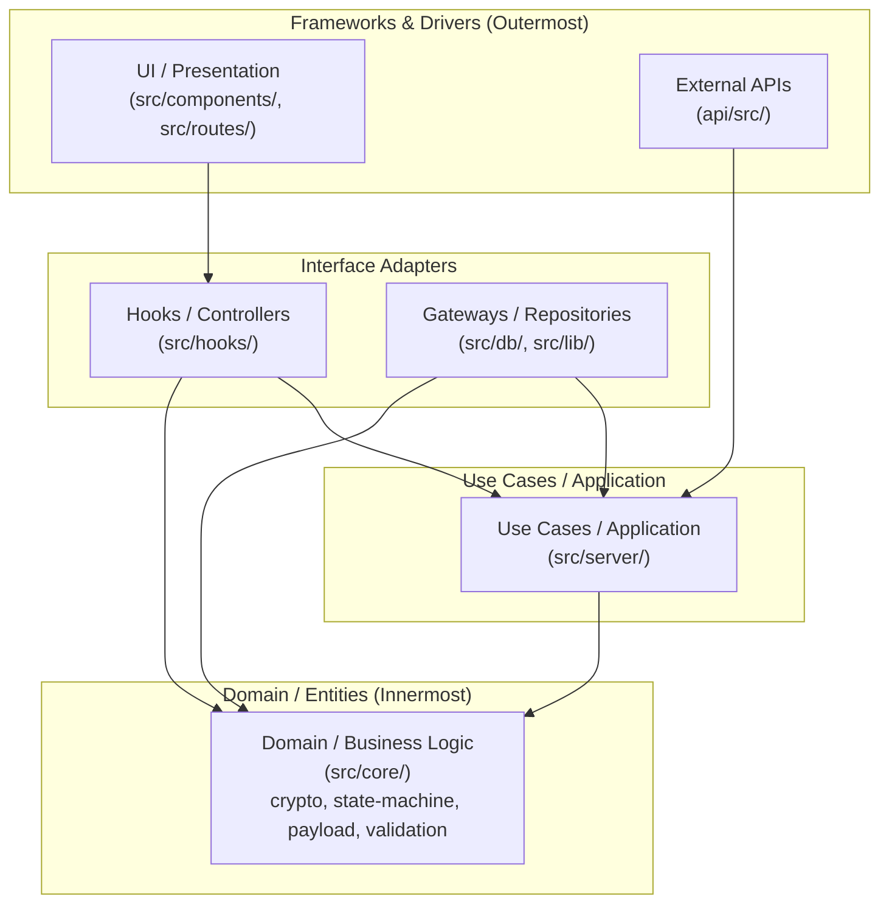
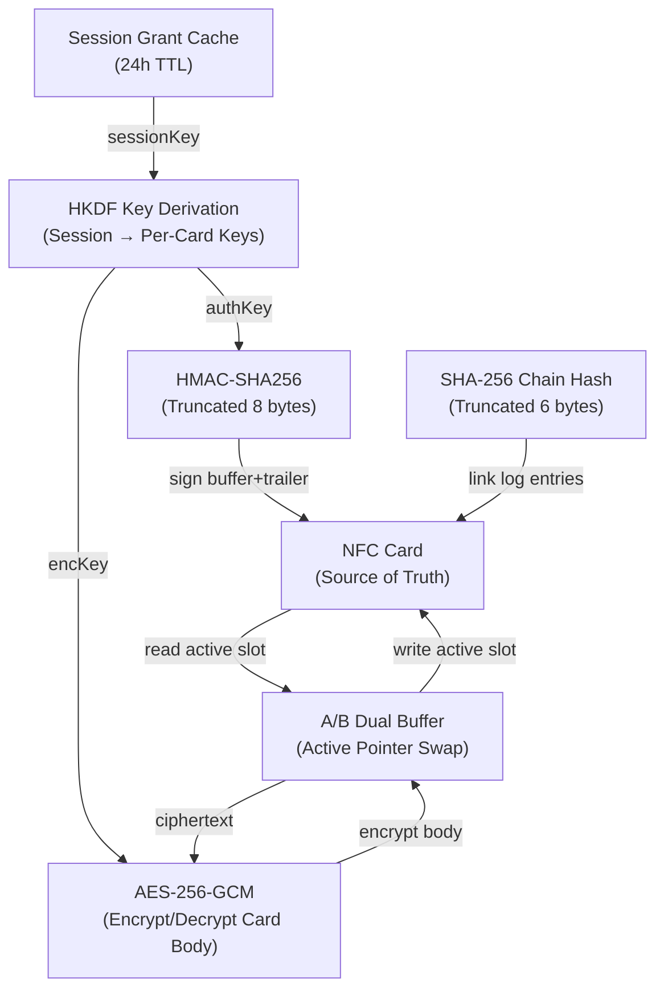
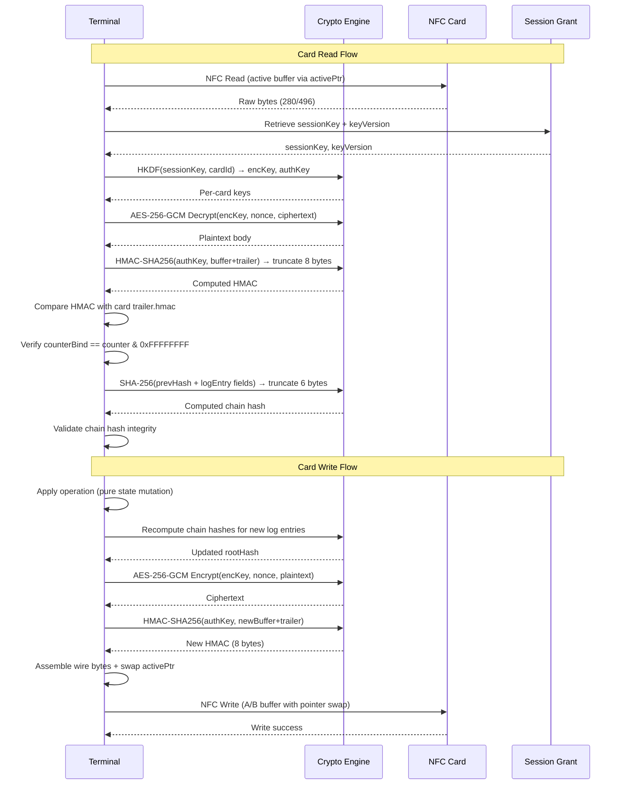
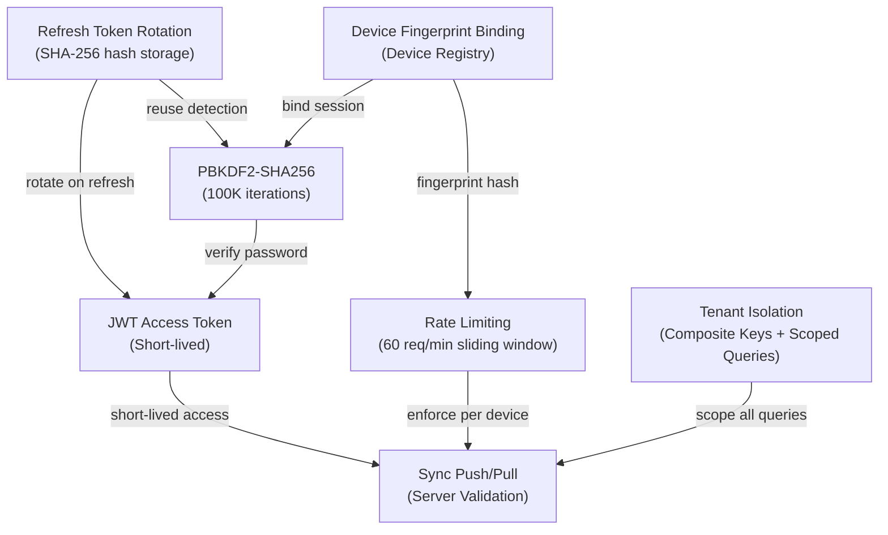
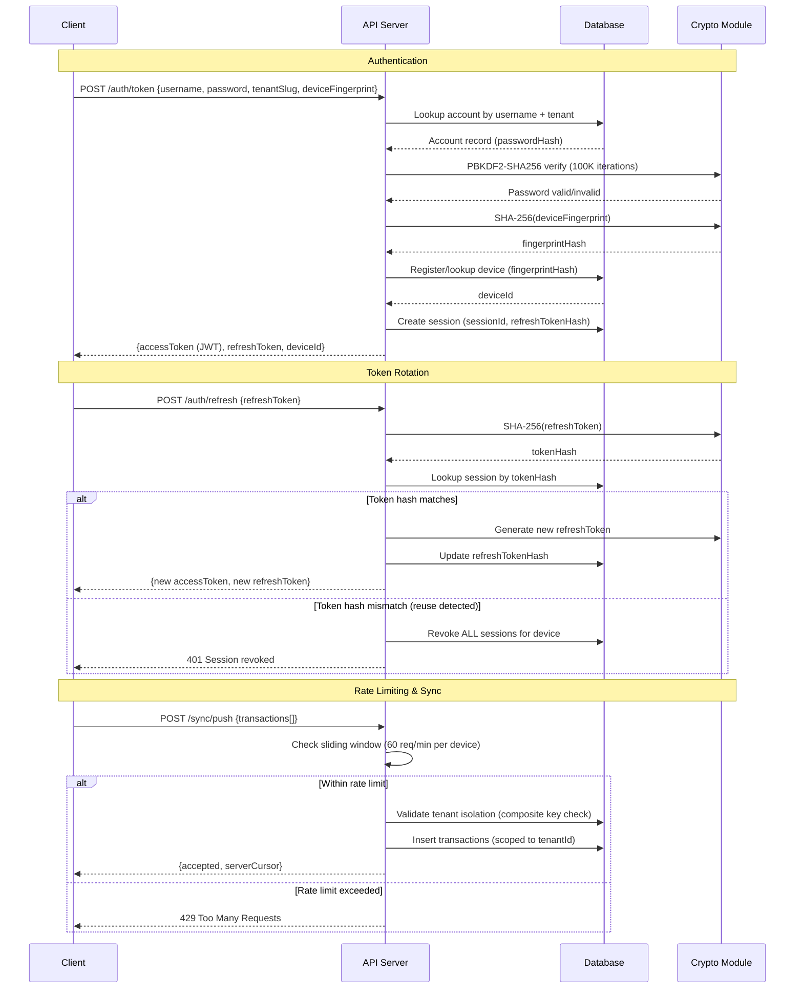

# Design Document: docs-arch

## Overview

This feature adds three sets of Mermaid diagrams to the existing architecture documentation at `.kiro/specs/koperasi-kegelapan-codebase-system-architecture/design.md`:

1. A **Clean Architecture Integration Diagram** (flowchart) showing dependency direction between the eight application layers
2. An **Offline Security Architecture** section with a flowchart overview and a sequence diagram for offline cryptographic operations
3. An **Online Security Architecture** section with a flowchart overview and a sequence diagram for server-side authentication and security flows

The diagrams are inserted into the existing document structure — the clean architecture diagram goes inside the existing `## Architecture` section, and a new `## Security Architecture` section is added between `## Architecture` and `## Sequence Diagrams`.

## Architecture

This is a documentation-only change. No new code components, interfaces, or runtime behavior are introduced. The change modifies a single Markdown file by inserting Mermaid diagram code blocks at specific locations.

### Document Structure After Modification

```
## Architecture
  ### High-Level System Architecture (existing)
  ### Deployment Architecture (existing)
  ### Data Flow Architecture (existing)
  ### Clean Architecture Integration Diagram  ← NEW
## Security Architecture                      ← NEW SECTION
  ### Offline Security
    #### Component Overview (flowchart)
    #### Operation Sequence (sequence diagram)
  ### Online Security
    #### Component Overview (flowchart)
    #### Operation Sequence (sequence diagram)
## Sequence Diagrams (existing, unchanged)
```

### Insertion Points

1. **Clean Architecture Diagram**: Insert a new `### Clean Architecture Integration Diagram` subsection after the existing `### Data Flow Architecture` subsection, still within `## Architecture`.
2. **Security Architecture Section**: Insert a new `## Security Architecture` H2 section immediately before the existing `## Sequence Diagrams` H2 section.

## Components and Interfaces

### Component 1: Clean Architecture Integration Diagram

**Location**: Under `## Architecture` → `### Clean Architecture Integration Diagram`

**Purpose**: This diagram represents the **ideal/target architecture** — the proper clean architecture with strict dependency rules that the codebase will be refactored toward. It does NOT represent the current implementation.

**Mermaid Content** (graph TD with subgraphs for concentric layers):



**Clean Architecture Rules Enforced**:

- **Dependencies ONLY point inward** — outer layers depend on inner layers, never the reverse
- **Domain layer has ZERO outgoing dependencies** — `CORE` has no outgoing arrows; it contains pure business logic (crypto, state-machine, payload, validation engines) with zero external imports
- **UI/Presentation never directly accesses Domain** — always goes through Hooks/Controllers (`UI → HOOKS → SERVER → CORE`)
- **Data layer implements interfaces defined by Use Cases** — `GATEWAYS → SERVER` (not the other way around); the Use Cases layer defines repository interfaces, and the Gateways layer provides concrete implementations
- **External APIs depend only on Use Cases** — `EXTAPI → SERVER`, never directly on Domain or Adapters

**Layer Responsibilities (innermost → outermost)**:

1. **Domain/Entities** (`src/core/`) — Pure business logic, zero dependencies. Contains crypto engines, state-machine logic, payload structures, validation rules.
2. **Use Cases / Application** (`src/server/`) — Orchestrates domain logic. Depends ONLY on Domain. Defines repository/gateway interfaces.
3. **Interface Adapters** — Split into:
   - **Hooks/Controllers** (`src/hooks/`) — Adapts use cases for the UI framework. Depends on Use Cases + Domain types.
   - **Gateways/Repositories** (`src/db/`, `src/lib/`) — Implements data access interfaces defined by Use Cases. Depends on Use Cases + Domain types.
4. **Frameworks & Drivers** (outermost) — Split into:
   - **UI/Presentation** (`src/components/`, `src/routes/`) — Depends on Hooks/Controllers only.
   - **External APIs** (`api/src/`) — Depends on Use Cases/Server only.

**Design Decisions**:

- Uses `graph TD` (top-down) with subgraphs representing concentric rings from outermost (top) to innermost (bottom)
- Subgraph nesting visually communicates the layered architecture and dependency direction
- Arrows point from dependent → dependency (e.g., `UI --> HOOKS` means UI depends on Hooks)
- `CORE` has no outgoing arrows — the Dependency Rule is strictly enforced
- This is the TARGET architecture; current code may violate these rules and will be refactored incrementally

### Component 2: Offline Security Flowchart

**Location**: Under `## Security Architecture` → `### Offline Security` → `#### Component Overview`

**Mermaid Content** (graph TD):



### Component 3: Offline Security Sequence Diagram

**Location**: Under `## Security Architecture` → `### Offline Security` → `#### Operation Sequence`

**Mermaid Content** (sequenceDiagram):



### Component 4: Online Security Flowchart

**Location**: Under `## Security Architecture` → `### Online Security` → `#### Component Overview`

**Mermaid Content** (graph TD):



### Component 5: Online Security Sequence Diagram

**Location**: Under `## Security Architecture` → `### Online Security` → `#### Operation Sequence`

**Mermaid Content** (sequenceDiagram):



## Data Models

No new data models are introduced. This feature modifies documentation content only.

## Error Handling

| Scenario                    | Handling                                                                            |
| --------------------------- | ----------------------------------------------------------------------------------- |
| Invalid Mermaid syntax      | Validate diagrams render correctly in a Mermaid-compatible viewer before committing |
| Incorrect section placement | Verify document heading hierarchy after insertion                                   |
| Missing diagram components  | Cross-reference each diagram against the requirements checklist                     |

## Correctness Properties

_A property is a characteristic or behavior that should hold true across all valid executions of a system — essentially, a formal statement about what the system should do. Properties serve as the bridge between human-readable specifications and machine-verifiable correctness guarantees._

This feature is a documentation-only change that adds static Mermaid diagram content to an existing Markdown file. All acceptance criteria describe the presence, structure, and placement of static content within a document. None of the criteria involve:

- Code logic that varies with input
- Functions with input/output behavior
- Universal properties that hold across a range of inputs

Therefore, **no property-based tests are applicable**. All acceptance criteria are best validated with example-based tests that verify:

- The correct Mermaid code blocks exist in the document
- The diagrams are placed at the correct locations relative to existing sections
- The Mermaid syntax is valid (parseable)
- The required nodes and participants are present in each diagram

### Verification Strategy

All requirements should be verified with **example-based unit tests** that:

1. Parse the modified Markdown file
2. Extract Mermaid code blocks by position
3. Assert the presence of required nodes, edges, and participants
4. Assert correct section ordering (Architecture → Security Architecture → Sequence Diagrams)
5. Optionally validate Mermaid syntax using a parser library
