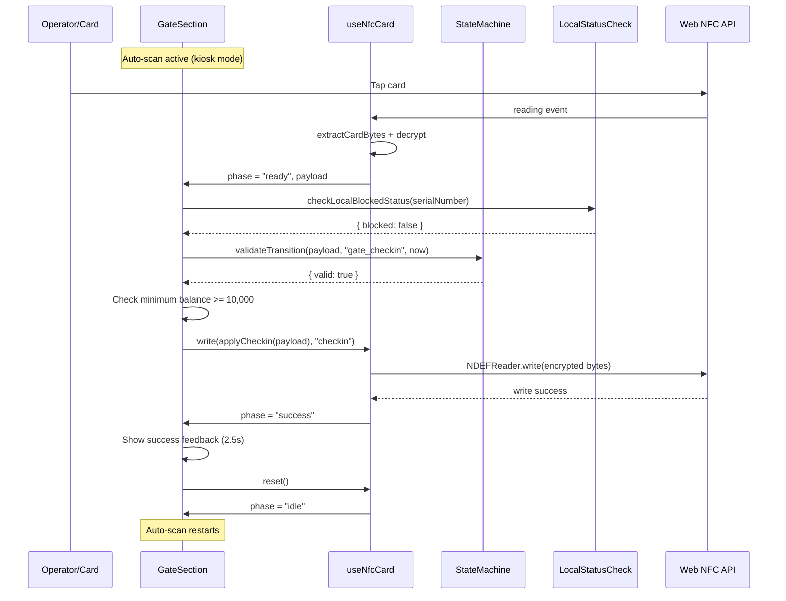
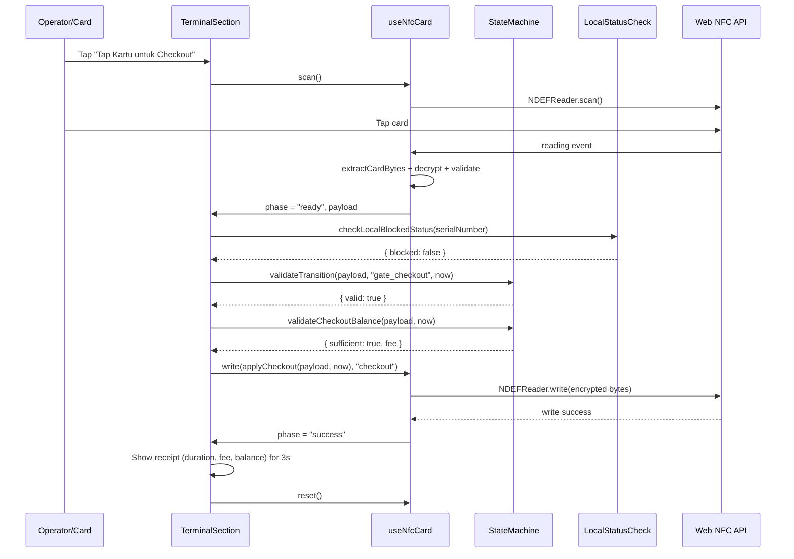
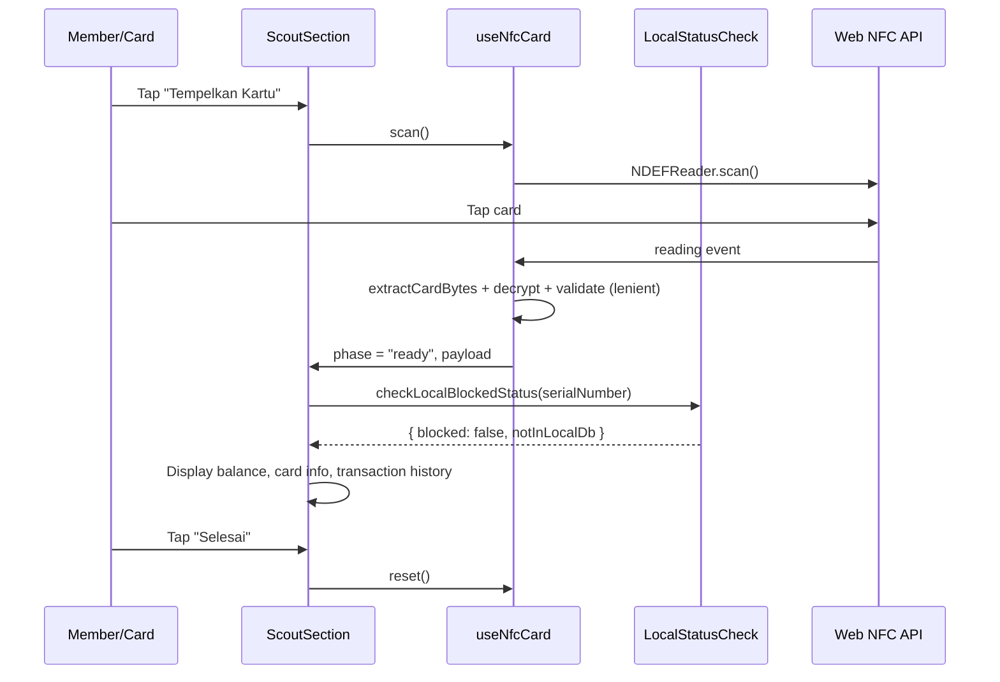

# Design Document: Gate-Terminal-Scout UX Stabilization

## Overview

This design addresses the UX/UI improvement and flow stabilization of the three kiosk-mode NFC card interaction screens in the koperasi system: **Gate** (check-in), **Terminal** (check-out with parking fee deduction), and **Scout** (balance check). These three flows share a common NFC interaction pattern via the `useNfcCard` hook and `NfcTapArea` component, but each has distinct state management needs and user feedback requirements.

The current implementation has several UX gaps: race conditions between async blocked-status checks and render states, missing auto-scan loops for continuous kiosk operation, inconsistent error recovery patterns, and limited feedback during intermediate states. This design introduces a unified state machine approach for NFC interaction phases, standardized feedback patterns, and improved error recovery — all while preserving the existing offline-first architecture and cryptographic card validation pipeline.

The stabilization focuses on three axes: (1) eliminating race conditions in the scan→validate→act pipeline, (2) providing clear, consistent visual feedback at every phase transition, and (3) ensuring continuous kiosk operation without operator intervention between card taps.

## Architecture

```mermaid
graph TD
    subgraph "Kiosk UI Layer"
        G[GateSection<br/>Check-in]
        T[TerminalSection<br/>Check-out]
        S[ScoutSection<br/>Balance Check]
    end

    subgraph "Shared UI Components"
        KL[KioskLayout]
        NTA[NfcTapArea]
        NSL[NfcStatusLabel]
        FB[FeedbackCard]
    end

    subgraph "Hook Layer"
        UNC[useNfcCard]
        USG[useSessionGrant]
        USC[useSyncEngine]
    end

    subgraph "Core Logic"
        SM[State Machine Engine]
        PE[Pipeline Engine<br/>validate / prepareWrite]
        LS[Local Status Check]
        NE[NFC Engine<br/>Web NFC API]
    end

    subgraph "Persistence"
        IDB[(IndexedDB<br/>Dexie)]
        OB[(Reconciliation<br/>Outbox)]
    end

    G --> KL
    T --> KL
    S --> KL
    G --> NTA
    T --> NTA
    S --> NTA

    G --> UNC
    T --> UNC
    S --> UNC

    UNC --> PE
    UNC --> NE
    G --> SM
    T --> SM
    G --> LS
    T --> LS
    S --> LS

    UNC --> OB
    LS --> IDB
end
```

## Sequence Diagrams

### Gate Check-in Flow



### Terminal Check-out Flow



### Scout Balance Check Flow



## Components and Interfaces

### Component 1: NfcInteractionFeedback (New)

**Purpose**: Unified feedback component that replaces inline conditional rendering in each section with a declarative feedback card system.

**Interface**:

```typescript
interface FeedbackCardProps {
  variant: "success" | "error" | "warning" | "info" | "blocked";
  title: string;
  subtitle?: string;
  details?: Array<{ label: string; value: string }>;
  actions?: Array<{ label: string; onClick: () => void; variant?: "primary" | "outline" }>;
  autoClose?: number; // ms before auto-dismiss
  onClose?: () => void;
}
```

**Responsibilities**:

- Render consistent feedback cards across all three flows
- Handle auto-dismiss timers
- Provide accessible status announcements (aria-live)

### Component 2: NfcTapArea (Enhanced)

**Purpose**: Enhanced NFC tap area with additional phase support and accessibility improvements.

**Interface**:

```typescript
interface NfcTapAreaProps {
  phase: NfcPhase;
  onClick?: () => void;
  disabled?: boolean;
  label?: string;
  sublabel?: string;
  tamperDetected?: boolean;
  /** Progress indicator for multi-step operations */
  progress?: { current: number; total: number };
}
```

**Responsibilities**:

- Visual NFC interaction target with phase-based styling
- Accessibility: role="button", aria-label, aria-busy states
- Haptic feedback trigger on phase transitions (via navigator.vibrate)

### Component 3: KioskAutoScan (New Hook)

**Purpose**: Encapsulates the auto-scan loop logic currently duplicated between Gate and Terminal.

**Interface**:

```typescript
interface UseKioskAutoScanOptions {
  enabled: boolean;
  grant: SessionGrant | null;
  loading: boolean;
  phase: NfcCardPhase;
  scan: () => void;
  resetDelay?: number; // ms after success before auto-restart
}

function useKioskAutoScan(options: UseKioskAutoScanOptions): {
  hasCompletedCycle: boolean;
  isAutoScanning: boolean;
};
```

**Responsibilities**:

- Manage the idle→scan auto-restart loop for kiosk mode
- Track cycle completion state
- Configurable delay between cycles

### Component 4: useBlockedCheck (New Hook)

**Purpose**: Encapsulates the async local-DB blocked status check with proper race condition handling.

**Interface**:

```typescript
interface UseBlockedCheckOptions {
  tenantId: string;
  serialNumber: string | null;
  phase: NfcCardPhase;
  payload: CardPayload | null;
}

interface BlockedCheckResult {
  isChecking: boolean;
  isBlocked: boolean;
  blockedReason: string | null;
  notInLocalDb: boolean;
  isReady: boolean; // true when check is complete and card is not blocked
}

function useBlockedCheck(options: UseBlockedCheckOptions): BlockedCheckResult;
```

**Responsibilities**:

- Run `checkLocalBlockedStatus` when phase transitions to "ready"
- Prevent render of intermediate states before check completes
- Reset state on phase transitions back to idle
- Eliminate race condition between async check and auto-action triggers

## Data Models

### NFC Interaction State (Enhanced)

```typescript
interface NfcCardState {
  phase: NfcCardPhase;
  payload: CardPayload | null;
  serialNumber: string | null;
  error: string | null;
  tamperDetected: boolean;
  warning: string | null;
  /** Timestamp of last successful operation for debounce */
  lastOperationAt: number | null;
}

type NfcCardPhase = "idle" | "scanning" | "validating" | "ready" | "writing" | "success" | "error";
```

**Validation Rules**:

- `payload` is non-null only when phase is "ready", "writing", or "success"
- `serialNumber` is non-null only when phase is "ready", "writing", or "success"
- `error` is non-null only when phase is "error"
- `tamperDetected` is true only when phase is "error"
- Phase transitions follow: idle → scanning → validating → ready → writing → success → idle

### Checkout Receipt Data

```typescript
interface CheckoutReceipt {
  memberName: string;
  durationSeconds: number;
  fee: number;
  balanceAfter: number;
  timestamp: number;
}
```

**Validation Rules**:

- `durationSeconds` >= 0
- `fee` >= 0 and fee = ceil(durationSeconds / 3600) × PARKING_RATE_PER_HOUR
- `balanceAfter` >= MIN_BALANCE_AFTER_CHECKOUT (10,000)

## Algorithmic Pseudocode

### Gate Auto-Checkin Algorithm

```typescript
ALGORITHM gateAutoCheckin(payload, serialNumber, tenantId, terminalId, nowSeconds)
INPUT: payload: CardPayload, serialNumber: string, tenantId: string, terminalId: number, nowSeconds: number
OUTPUT: action: "write" | "blocked" | "already_checked_in" | "insufficient_balance"

BEGIN
  // Step 1: Check on-card status
  IF payload.identity.status !== CardStatus.ACTIVE THEN
    RETURN "blocked" with reason from status code
  END IF

  // Step 2: Check local DB status (async, must complete before proceeding)
  statusResult ← AWAIT checkLocalBlockedStatus(tenantId, serialNumber)

  IF statusResult.blocked THEN
    RETURN "blocked" with statusResult.reason
  END IF

  // Step 3: Validate state transition
  result ← validateTransition(payload, "gate_checkin", nowSeconds)

  IF NOT result.valid THEN
    // Card is CHECKED_IN or STATION_OPERATION
    RETURN "already_checked_in"
  END IF

  // Step 4: Minimum balance check
  IF payload.wallet.balance < 10_000 THEN
    RETURN "insufficient_balance"
  END IF

  // Step 5: Apply check-in
  updatedPayload ← applyCheckin(payload, terminalId, nowSeconds)
  write(updatedPayload, "checkin")
  RETURN "write"
END
```

**Preconditions:**

- `payload` is a valid decrypted CardPayload
- `serialNumber` is the hardware NFC serial from the scan event
- `grant` is a valid, non-expired SessionGrant with "checkin" in allowedOps
- NFC reader is in active scan state

**Postconditions:**

- If "write": card transitions to CHECKED_IN state, counter incremented, session started
- If "blocked": no card modification, user shown rejection reason
- If "already_checked_in": no card modification, user informed
- If "insufficient_balance": no card modification, user directed to top-up

**Loop Invariants:**

- `autoCheckinTriggered` ref prevents re-entry during a single scan cycle
- `blockedCheckDone` flag prevents premature render of intermediate states

### Terminal Auto-Checkout Algorithm

```typescript
ALGORITHM terminalAutoCheckout(payload, serialNumber, tenantId, nowSeconds)
INPUT: payload: CardPayload, serialNumber: string, tenantId: string, nowSeconds: number
OUTPUT: action: "write" | "blocked" | "not_checked_in" | "insufficient_balance"

BEGIN
  // Step 1: Check local DB status
  statusResult ← AWAIT checkLocalBlockedStatus(tenantId, serialNumber)

  IF statusResult.blocked THEN
    RETURN "blocked" with statusResult.reason
  END IF

  // Step 2: Verify card is in checkable-out state
  cardState ← payload.wallet.state

  IF cardState === CardState.IDLE OR cardState === CardState.CHECKED_OUT THEN
    RETURN "not_checked_in"
  END IF

  // Step 3: Validate state transition
  trigger ← IF cardState === STATION_OPERATION THEN "force_checkout" ELSE "gate_checkout"
  result ← validateTransition(payload, trigger, nowSeconds)

  IF NOT result.valid THEN
    RETURN "blocked" with "Transisi tidak valid"
  END IF

  // Step 4: Balance sufficiency check
  balanceCheck ← validateCheckoutBalance(payload, nowSeconds)

  IF NOT balanceCheck.sufficient THEN
    RETURN "insufficient_balance" with { fee, deficit, currentBalance }
  END IF

  // Step 5: Apply checkout
  updatedPayload ← applyCheckout(payload, nowSeconds)
  durationSeconds ← nowSeconds - payload.session.startTime
  fee ← ceil(durationSeconds / 3600) × PARKING_RATE_PER_HOUR

  write(updatedPayload, "checkout")
  RETURN "write" with { durationSeconds, fee }
END
```

**Preconditions:**

- `payload` is a valid decrypted CardPayload
- Card state is CHECKED_IN or STATION_OPERATION for successful checkout
- `grant` has "checkout" in allowedOps

**Postconditions:**

- If "write": card transitions to CHECKED_OUT, balance deducted by fee, session endTime set
- If "insufficient_balance": no modification, user shown deficit amount
- Balance after checkout >= MIN_BALANCE_AFTER_CHECKOUT (10,000)

### Scout Read-Only Algorithm

```typescript
ALGORITHM scoutBalanceCheck(payload, serialNumber, tenantId)
INPUT: payload: CardPayload, serialNumber: string, tenantId: string
OUTPUT: displayData: { balance, name, cardId, counter, status, transactions, warnings }

BEGIN
  // Step 1: Check local DB status (informational only)
  statusResult ← AWAIT checkLocalBlockedStatus(tenantId, serialNumber)

  // Step 2: Build display data
  displayData ← {
    balance: payload.wallet.balance,
    name: payload.identity.name,
    cardId: hex(payload.header.cardId),
    counter: payload.wallet.counter - 1,
    status: payload.identity.status,
    transactions: payload.logEntries.filter(valid),
    warnings: []
  }

  IF statusResult.blocked THEN
    displayData.status ← "blocked"
    displayData.warnings.push(statusResult.reason)
  END IF

  IF statusResult.notInLocalDb THEN
    displayData.warnings.push("Kartu tidak ditemukan di database lokal")
  END IF

  RETURN displayData
END
```

**Preconditions:**

- `payload` is a valid decrypted CardPayload (lenient mode allows unregistered cards)
- No write operations are performed

**Postconditions:**

- Card state is never modified
- All available information is displayed regardless of blocked status

## Key Functions with Formal Specifications

### Function 1: useKioskAutoScan()

```typescript
function useKioskAutoScan(options: UseKioskAutoScanOptions): {
  hasCompletedCycle: boolean;
  isAutoScanning: boolean;
};
```

**Preconditions:**

- `options.grant` is either null or a valid SessionGrant
- `options.phase` is a valid NfcCardPhase
- `options.scan` is a stable callback reference

**Postconditions:**

- When `phase` transitions to "idle" after a completed cycle AND `enabled` is true AND `grant` is non-null: `scan()` is called automatically
- `hasCompletedCycle` is true after at least one success or error phase has been observed
- Auto-scan does NOT trigger on initial mount (only after first manual scan)

### Function 2: useBlockedCheck()

```typescript
function useBlockedCheck(options: UseBlockedCheckOptions): BlockedCheckResult;
```

**Preconditions:**

- `options.tenantId` is a valid tenant identifier
- `options.serialNumber` may be null (check skipped)
- `options.phase` is a valid NfcCardPhase

**Postconditions:**

- `isChecking` is true only while the async DB lookup is in progress
- `isReady` is true only when: phase === "ready" AND check is complete AND card is not blocked
- State resets to initial values when phase transitions to "idle"
- No stale closures: if phase changes during async check, result is discarded

### Function 3: validateCheckoutBalance()

```typescript
function validateCheckoutBalance(
  payload: CardPayload,
  nowSeconds: number,
): { sufficient: boolean; fee: number; deficit: number };
```

**Preconditions:**

- `payload.wallet.balance` >= 0
- `payload.session.startTime` > 0 and < nowSeconds
- `nowSeconds` is a valid Unix timestamp

**Postconditions:**

- `fee` = ceil((nowSeconds - payload.session.startTime) / 3600) × PARKING_RATE_PER_HOUR
- `sufficient` = (payload.wallet.balance - fee) >= MIN_BALANCE_AFTER_CHECKOUT
- If not sufficient: `deficit` = MIN_BALANCE_AFTER_CHECKOUT - (balance - fee)
- If sufficient: `deficit` = 0

## Example Usage

```typescript
// Example 1: GateSection using new hooks
function GateSection({ tenantId, tenantName, accountId, deviceId, terminalId }: GateSectionProps) {
  const { grant, loading } = useSessionGrant(tenantId, accountId, deviceId, "gate");
  const { state, scan, write, reset } = useNfcCard(grant, tenantId, terminalId, { lenient: true });

  const blockedCheck = useBlockedCheck({
    tenantId,
    serialNumber: state.serialNumber,
    phase: state.phase,
    payload: state.payload,
  });

  useKioskAutoScan({
    enabled: true,
    grant,
    loading,
    phase: state.phase,
    scan,
    resetDelay: 2500,
  });

  // Auto check-in when blocked check completes and card is eligible
  useEffect(() => {
    if (!blockedCheck.isReady || !state.payload) return;

    const result = validateTransition(state.payload, "gate_checkin", getNowSeconds());
    if (!result.valid) return; // already checked in
    if (state.payload.wallet.balance < 10_000) return; // insufficient balance

    write(applyCheckin(state.payload, terminalId, getNowSeconds()), "checkin");
  }, [blockedCheck.isReady, state.payload]);

  return (
    <KioskLayout title="Gerbang Masuk" subtitle="Check-in" ...>
      {/* Phase-based rendering */}
    </KioskLayout>
  );
}

// Example 2: Scout using simplified read-only pattern
function ScoutSection({ tenantId, tenantName, accountId, deviceId, terminalId }: ScoutSectionProps) {
  const { grant, loading } = useSessionGrant(tenantId, accountId, deviceId, "scout");
  const { state, scan, reset } = useNfcCard(grant, tenantId, terminalId, { lenient: true });

  const blockedCheck = useBlockedCheck({
    tenantId,
    serialNumber: state.serialNumber,
    phase: state.phase,
    payload: state.payload,
  });

  return (
    <KioskLayout title="Cek Saldo" ...>
      {state.phase === "ready" && state.payload && (
        <BalanceDisplay
          payload={state.payload}
          blockedReason={blockedCheck.blockedReason}
          notInLocalDb={blockedCheck.notInLocalDb}
        />
      )}
    </KioskLayout>
  );
}

// Example 3: FeedbackCard usage
<FeedbackCard
  variant="success"
  title="✓ Check-in Berhasil"
  subtitle={payload.identity.name}
  details={[{ label: "Saldo", value: `Rp ${payload.wallet.balance.toLocaleString("id-ID")}` }]}
  autoClose={2500}
  onClose={reset}
/>
```

## Correctness Properties

_A property is a characteristic or behavior that should hold true across all valid executions of a system — essentially, a formal statement about what the system should do. Properties serve as the bridge between human-readable specifications and machine-verifiable correctness guarantees._

### Property 1: NFC Phase Transition Validity

_For any_ sequence of NFC phase transitions, only transitions following the sequence idle → scanning → validating → ready → writing → success → idle (or any state → error → idle) SHALL be permitted by the state machine.

**Validates: Requirement 1.1**

### Property 2: NFC State Data Invariants

_For any_ reachable NFC state, the following invariants hold: (a) payload and serialNumber are non-null if and only if phase ∈ {ready, writing, success}, (b) error is non-null if and only if phase = error, (c) tamperDetected is true only when phase = error.

**Validates: Requirements 1.2, 1.3, 1.4**

### Property 3: Idle Transition Resets All State

_For any_ NFC state that transitions to "idle", all mutable state (payload, serialNumber, error, tamperDetected, blockedReason, blockedCheckDone, notInLocalDb, autoActionTriggered) SHALL be reset to initial values.

**Validates: Requirements 1.5, 5.5, 6.3, 7.3**

### Property 4: Gate Rejects Invalid Cards Without Writing

_For any_ card payload scanned at the Gate where (a) card status ≠ ACTIVE, OR (b) local DB returns blocked, OR (c) card state ∈ {CHECKED_IN, STATION_OPERATION}, OR (d) wallet balance < 10,000 — no NFC write operation SHALL be performed.

**Validates: Requirements 2.1, 2.2, 2.3, 2.4**

### Property 5: Gate Check-in Produces Correct State Transition

_For any_ valid card payload (status = ACTIVE, not blocked, state = IDLE, balance ≥ 10,000), applying check-in SHALL produce a payload where state = CHECKED_IN and counter is incremented by 1.

**Validates: Requirement 2.5**

### Property 6: Terminal Rejects Invalid Cards Without Writing

_For any_ card payload scanned at the Terminal where (a) local DB returns blocked, OR (b) card state ∈ {IDLE, CHECKED_OUT}, OR (c) balance minus calculated fee would leave less than MIN_BALANCE — no NFC write operation SHALL be performed.

**Validates: Requirements 3.1, 3.2, 3.3**

### Property 7: Terminal Checkout Produces Correct Balance Deduction

_For any_ valid checkout (card state = CHECKED_IN, sufficient balance), applying checkout SHALL produce a payload where balanceAfter = balanceBefore − fee AND balanceAfter ≥ MIN_BALANCE (10,000).

**Validates: Requirements 3.4, 10.4**

### Property 8: Fee Calculation Correctness

_For any_ positive parking duration in seconds, the calculated fee SHALL equal ceil(duration_seconds / 3600) × PARKING_RATE_PER_HOUR (2,000). Specifically: 59 minutes → 1 hour fee, 61 minutes → 2 hours fee, exactly 60 minutes → 1 hour fee.

**Validates: Requirements 3.6, 10.1, 10.2, 10.3**

### Property 9: Balance Sufficiency Check Correctness

_For any_ card payload and current time, validateCheckoutBalance SHALL return sufficient=true if and only if (balance − fee) ≥ MIN_BALANCE, and when insufficient, deficit SHALL equal MIN_BALANCE − (balance − fee).

**Validates: Requirements 10.4, 10.5**

### Property 10: Scout Never Writes

_For any_ card payload in any state (ACTIVE, blocked, IDLE, CHECKED_IN, CHECKED_OUT, tampered), the Scout flow SHALL never invoke an NFC write operation.

**Validates: Requirement 4.1**

### Property 11: Scout Displays All Required Fields

_For any_ valid card payload scanned at the Scout, the display output SHALL contain member name, balance, card ID (hex), transaction counter, and status.

**Validates: Requirement 4.2**

### Property 12: Blocked Check Completes Before Action Rendering

_For any_ scan cycle where phase transitions to "ready", the system SHALL not render action-specific UI content (e.g., "Sudah Check-in", auto-write trigger) until the async Blocked_Check resolves. If phase changes during the in-flight check, the stale result SHALL be discarded.

**Validates: Requirements 5.1, 5.2, 5.3, 5.4**

### Property 13: Auto-Scan Triggers Only After Completed Cycle With Valid Grant

_For any_ state where Auto_Scan is enabled, scan() SHALL be invoked automatically if and only if: (a) at least one scan cycle has completed (hasCompletedCycle = true), AND (b) Session_Grant is non-null and not loading, AND (c) phase has just transitioned to "idle".

**Validates: Requirements 6.1, 6.2, 6.4**

### Property 14: Duplicate Write Prevention Within Scan Cycle

_For any_ single scan cycle (from scan() invocation to next idle transition), at most one NFC write operation SHALL be initiated, regardless of how many times the auto-action effect fires or async callbacks resolve.

**Validates: Requirements 7.1, 7.2**

### Property 15: Offline Operations Persist to Outbox

_For any_ completed card operation (check-in or checkout) performed while the device is offline, the transaction SHALL be persisted to the Reconciliation_Outbox.

**Validates: Requirement 12.2**

## Error Handling

### Error Scenario 1: NFC Read Failure After Write

**Condition**: NFC subsystem returns empty/corrupted data within 10s of a successful write operation
**Response**: Show friendly message "Lepas kartu sebentar lalu tap ulang" instead of "Kartu tidak terdaftar"
**Recovery**: Auto-reset after 3s, then auto-scan restarts

### Error Scenario 2: Session Grant Expired

**Condition**: `grant.expiresAt` < current time AND device is online
**Response**: Show "Tidak ada sesi aktif" with disabled scan button
**Recovery**: `useSessionGrant` auto-refreshes 5 minutes before expiry; if offline, grace period of 1 hour applies

### Error Scenario 3: Card Removed During Write

**Condition**: `NDEFReader.write()` throws because card left NFC field
**Response**: Store pending write in `pendingWriteRef`; show "Tap ulang untuk menyelesaikan"
**Recovery**: Next tap triggers the stored write operation; if user resets, pending write is discarded

### Error Scenario 4: Tamper Detection

**Condition**: Card validation detects HMAC mismatch or invalid hash chain
**Response**: Show "⚠ Kartu terdeteksi rusak" with error styling and shake animation
**Recovery**: Manual "Coba Lagi" button; card may need station intervention

### Error Scenario 5: Race Condition — Blocked Check vs Auto-Action

**Condition**: Async `checkLocalBlockedStatus` resolves after component has already triggered auto-action
**Response**: Guard with `autoCheckinTriggered.current` ref check inside the `.then()` callback
**Recovery**: If stale, discard result silently; the action already proceeded or was blocked by another guard

### Error Scenario 6: Insufficient Balance at Checkout

**Condition**: `balance - fee < MIN_BALANCE_AFTER_CHECKOUT`
**Response**: Show detailed breakdown (current balance, fee, deficit needed) with amber warning styling
**Recovery**: User must top-up at Station before retrying checkout

## Testing Strategy

### Unit Testing Approach

- Test `validateTransition` for all state × trigger combinations
- Test `applyCheckin`, `applyCheckout` produce correct payload mutations
- Test `validateCheckoutBalance` with edge cases (exact minimum, zero duration, max duration)
- Test `calculateCheckoutFee` rounding behavior (59 min = 1 hour, 61 min = 2 hours)
- Test `checkLocalBlockedStatus` with various card/member status combinations

**Property-Based Testing Approach**

**Property Test Library**: fast-check

Properties to verify:

- For any valid payload with state=IDLE and balance >= 10,000: `applyCheckin` produces state=CHECKED_IN
- For any valid payload with state=CHECKED_IN: `applyCheckout` produces balance >= 0
- For any duration > 0: `calculateCheckoutFee` >= PARKING_RATE_PER_HOUR
- For any sequence of valid transitions: the state machine never enters an undefined state
- `validateCheckoutBalance.sufficient = true` implies `balance - fee >= MIN_BALANCE_AFTER_CHECKOUT`

### Integration Testing Approach

- E2E tests with Playwright simulating NFC tap sequences using mock NDEFReader
- Test auto-scan loop: verify scan restarts after success → reset → idle
- Test race condition: simulate slow `checkLocalBlockedStatus` with fast card tap
- Test offline mode: verify operations proceed with cached session grant

## Performance Considerations

- **Debounce**: 1-second rapid-tap debounce prevents duplicate processing from NFC subsystem noise
- **Auto-reset timing**: 2.5s (Gate) / 3s (Terminal) provides readable feedback without blocking throughput
- **Async blocked check**: Runs in parallel with render; does not block the NFC read pipeline
- **IndexedDB lookups**: `checkLocalBlockedStatus` uses indexed keys ([tenantId, serialNumber]) for O(1) lookup
- **Memory**: `pendingWriteRef` holds at most one encrypted payload (~280 bytes) between taps

## Security Considerations

- **No card writes without validation**: All three flows validate card status, local DB status, and state machine eligibility before any write
- **Lenient mode scope**: Scout and Gate use `lenient: true` to view unregistered cards but never write to them without full validation
- **Session grant binding**: Every NFC write operation requires a valid, non-expired session grant bound to (tenantId, accountId, deviceId)
- **Tamper detection**: HMAC validation on card read detects unauthorized modifications; tampered cards are rejected with clear UI feedback
- **Minimum balance enforcement**: Gate rejects check-in below 10,000; Terminal rejects checkout that would leave balance below 10,000
- **Offline trust boundary**: Offline operations rely on cached session grants with 1-hour grace period; all operations are logged to reconciliation outbox for later server verification

## Dependencies

- **React 19** with hooks for component state management
- **TanStack Router** for tenant-scoped routing (`/tenant/$tenantId/gate|terminal|scout`)
- **Web NFC API** (NDEFReader) for card interaction — Chrome Android only
- **Web Crypto API** for AES-256-GCM decryption and HMAC validation
- **Dexie** (IndexedDB wrapper) for local card/member status cache and reconciliation outbox
- **Lucide React** for iconography
- **Sonner** for toast notifications (connectivity changes)
- **Tailwind CSS v4** for styling with custom design tokens (signal-_, brand-_, type-\*)
