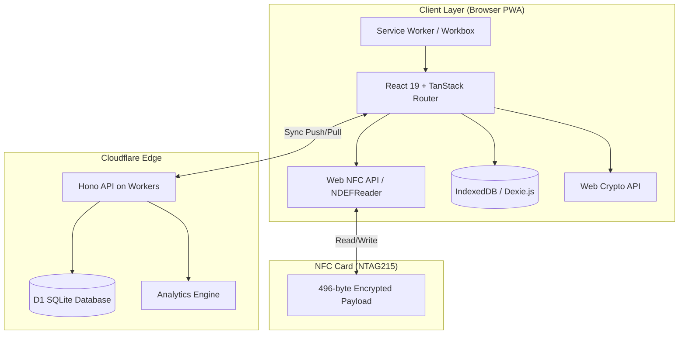
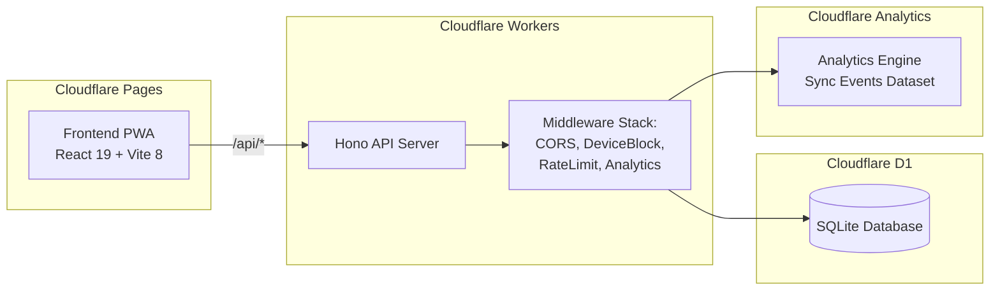
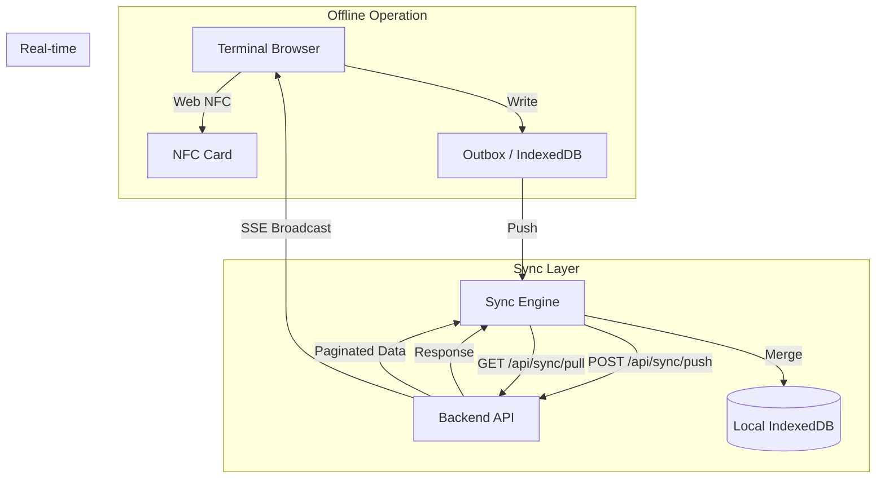
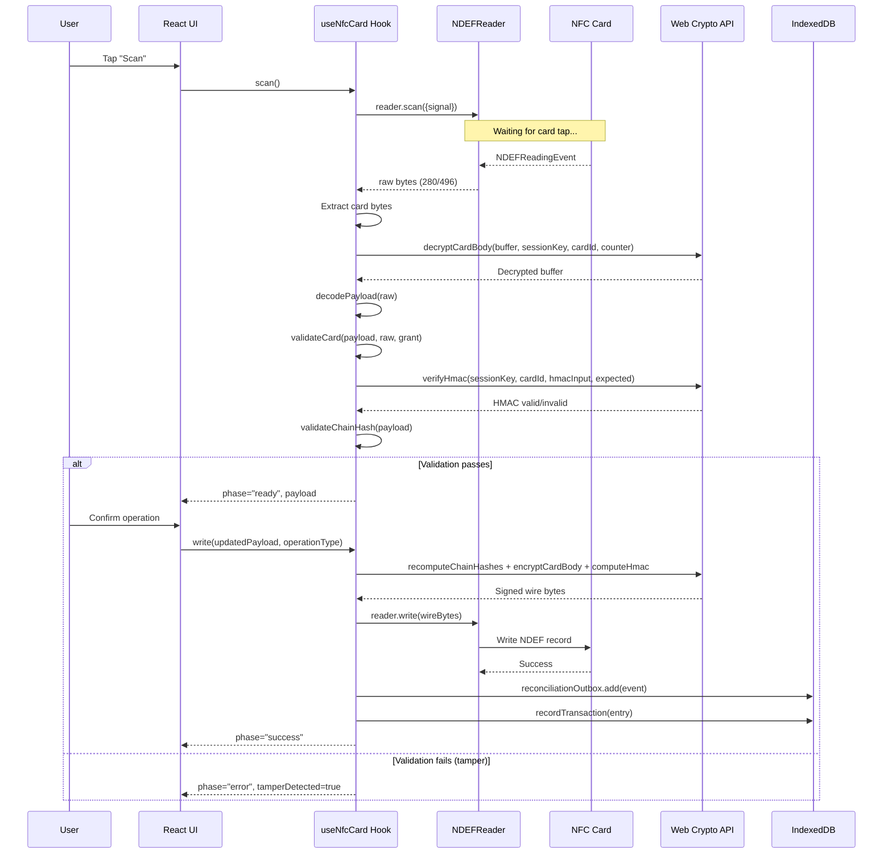
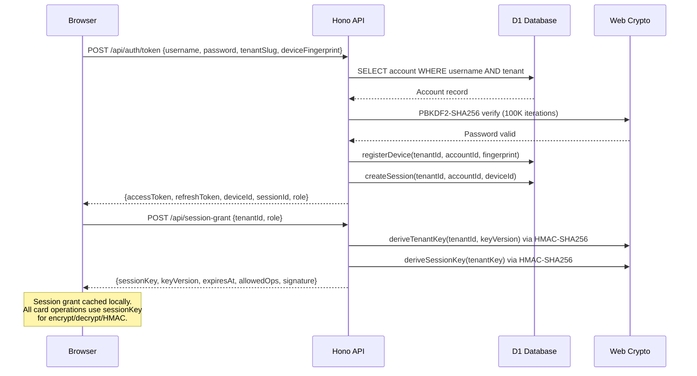
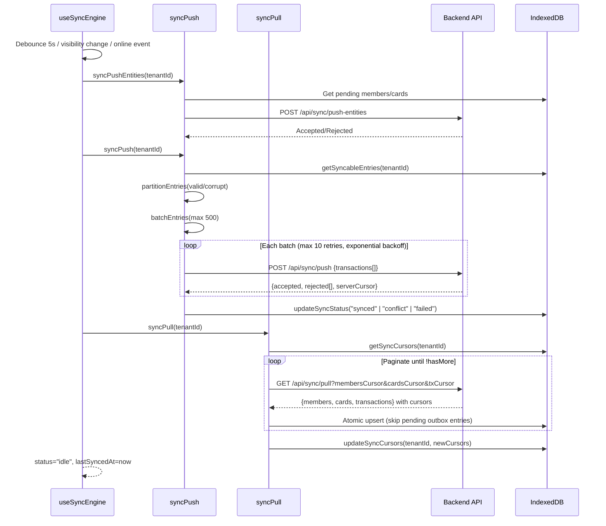

# Design Document: Koperasi Kegelapan — NFC Wallet System Architecture

## Overview

Koperasi Kegelapan is an offline-capable NFC wallet system designed for Indonesian cooperatives (koperasi). The system stores encrypted wallet state directly on NTAG215 NFC cards, enabling tap-based payments without real-time backend connectivity. The architecture follows a local-first / offline-first pattern where the NFC card is the single source of truth for financial state during offline periods, terminals operate fully offline using cached session grants, and the backend serves as an optional sync/orchestration layer.

The system is multi-tenant, supporting multiple cooperatives each with isolated data, cryptographic keys, and role-based access. The frontend is a Progressive Web App (PWA) built with React 19 and TanStack Router, deployed on Cloudflare Pages. The backend API runs on Cloudflare Workers using the Hono framework with Cloudflare D1 (SQLite) as the server database. Client-side persistence uses IndexedDB via Dexie.js, enabling full offline operation with bidirectional sync when connectivity is available.

## Architecture

### High-Level System Architecture



### Deployment Architecture



### Data Flow Architecture



## Sequence Diagrams

### NFC Card Read → Validate → Write Pipeline



### Authentication & Session Grant Flow



### Bidirectional Sync Cycle



## Components and Interfaces

### Component 1: Crypto Engine (`src/core/crypto/engine.ts`)

**Purpose**: Provides all cryptographic primitives for card encryption, authentication, and integrity verification using the Web Crypto API.

**Interface**:

```typescript
// Key derivation
function deriveEncryptionKey(sessionKey: Uint8Array, cardId: Uint8Array): Promise<CryptoKey>;
function deriveAuthKey(sessionKey: Uint8Array, cardId: Uint8Array): Promise<CryptoKey>;
function deriveNonce(
  sessionKey: Uint8Array,
  cardId: Uint8Array,
  counter: bigint,
): Promise<Uint8Array>;

// Encryption/Decryption (AES-256-GCM)
function encryptBuffer(
  sessionKey: Uint8Array,
  cardId: Uint8Array,
  counter: bigint,
  plaintext: Uint8Array,
): Promise<Uint8Array>;
function decryptBuffer(
  sessionKey: Uint8Array,
  cardId: Uint8Array,
  counter: bigint,
  ciphertext: Uint8Array,
): Promise<Uint8Array>;

// Authentication (HMAC-SHA256, truncated to 8 bytes)
function computeHmac(
  sessionKey: Uint8Array,
  cardId: Uint8Array,
  data: Uint8Array,
): Promise<Uint8Array>;
function verifyHmac(
  sessionKey: Uint8Array,
  cardId: Uint8Array,
  data: Uint8Array,
  expected: Uint8Array,
): Promise<boolean>;

// Hash chain (SHA-256, truncated to 6 bytes)
function computeChainHash(
  deltaTime: number,
  amount: number,
  balanceAfter: number,
  flags: number,
  prevHash: Uint8Array,
): Promise<Uint8Array>;

// General
function sha256(data: Uint8Array): Promise<Uint8Array>;
```

**Responsibilities**:

- Derive per-card encryption and authentication keys from session key via HKDF
- Derive deterministic nonces from session key + card ID + counter
- Encrypt/decrypt card buffer body using AES-256-GCM
- Compute and verify truncated HMAC-SHA256 for card authentication
- Compute SHA-256 chain hashes linking transaction log entries
- Constant-time comparison for HMAC verification (timing-attack resistant)

### Component 2: State Machine Engine (`src/core/state-machine/engine.ts`)

**Purpose**: Manages card state transitions, validates operations against the current card state, and applies financial operations (checkin, checkout, debit, topup, admin reset).

**Interface**:

```typescript
type TransitionTrigger =
  | "gate_checkin"
  | "terminal_start"
  | "terminal_end"
  | "gate_checkout"
  | "force_checkout"
  | "admin_reset";

function validateTransition(
  payload: CardPayload,
  trigger: TransitionTrigger,
  nowSeconds: number,
): TransitionResult;
function isSessionExpired(payload: CardPayload, nowSeconds: number): boolean;
function isWriteEligible(
  payload: CardPayload,
  grant: SessionGrant,
  requiredOp: string,
  nowSeconds: number,
): { eligible: boolean; reason?: string };

// Financial operations
function calculateCheckoutFee(payload: CardPayload, nowSeconds: number): number;
function validateCheckoutBalance(
  payload: CardPayload,
  nowSeconds: number,
): { sufficient: boolean; fee: number; deficit: number };

// State mutation functions (pure — return new CardPayload)
function applyCheckin(payload: CardPayload, terminalId: number, nowSeconds: number): CardPayload;
function applyCheckout(payload: CardPayload, nowSeconds: number): CardPayload;
function applyDebit(payload: CardPayload, amount: number, nowSeconds: number): CardPayload;
function applyTopup(payload: CardPayload, amount: number, nowSeconds: number): CardPayload;
function applyResetState(payload: CardPayload, nowSeconds: number): CardPayload;
```

**Responsibilities**:

- Enforce valid state transitions per the card state machine
- Validate card status (ACTIVE required for non-admin operations)
- Check session expiry (24h timeout + 1h clock drift tolerance)
- Verify session grant permissions before write operations
- Calculate parking fees (hours rounded up × 2,000 IDR/hour)
- Enforce minimum balance after checkout (10,000 IDR)
- Apply state mutations immutably (pure functions returning new payloads)
- Manage transaction log ring buffer (5 entries max)

### Component 3: NFC Engine (`src/core/nfc/engine.ts`)

**Purpose**: Low-level NFC hardware abstraction using the Web NFC API (NDEFReader). Handles card reading, writing, availability detection, and block enforcement.

**Interface**:

```typescript
type NfcReadResult =
  | { ok: true; raw: Uint8Array; serialNumber: string }
  | { ok: false; error: string };
type NfcWriteResult = { ok: true } | { ok: false; error: string };
type NfcAvailability = "available" | "unavailable" | "permission_denied" | "unknown";

function isNfcSupported(): boolean;
function checkNfcAvailability(): Promise<NfcAvailability>;
function readCard(signal: AbortSignal): Promise<NfcReadResult>;
function writeCard(raw: Uint8Array, signal: AbortSignal): Promise<NfcWriteResult>;
function extractCardBytes(message: NDEFMessage): Uint8Array | null;

// Block enforcement
function enforceBlockOnCheckin(
  tenantId: string,
  cardId: string,
  payload: CardPayload,
): Promise<BlockGuardResult>;
function enforceBlockOnCheckout(
  tenantId: string,
  cardId: string,
  payload: CardPayload,
): Promise<BlockGuardResult>;
function enforceBlockSync(payload: CardPayload, dbCard?: CardRecord): BlockGuardResult;
```

**Responsibilities**:

- Detect NFC hardware availability and permission state
- Read raw NDEF records from NFC cards (extract 280 or 496 byte payloads)
- Write NDEF records to NFC cards with abort signal support
- Validate wire size (WIRE_SIZE=280 or CARD_SIZE=496 bytes)
- Provide user-friendly Indonesian error messages for NFC failures
- Enforce card block status before check-in/check-out operations
- Support both async (IndexedDB lookup) and sync block checks

### Component 4: Payload Engine (`src/core/payload/engine.ts`)

**Purpose**: Binary codec for the 496-byte NFC card payload. Handles encoding/decoding of the dual-buffer card format with header, identity, wallet, session, log entries, and trailer sections.

**Interface**:

```typescript
function decodePayload(raw: Uint8Array): CardPayload;
function encodePayload(payload: CardPayload): Uint8Array; // Full 496-byte format
function encodePayloadWire(payload: CardPayload): Uint8Array; // Compact 280-byte wire format
function buildHmacInput(bufferBytes: Uint8Array, trailer: CardPayload["trailer"]): Uint8Array;
function validateMagic(raw: Uint8Array, bufOffset: number): boolean;
function getActiveBufferOffset(activePtr: number): number;
function getInactiveBufferOffset(activePtr: number): number;
```

**Responsibilities**:

- Decode binary card data into structured CardPayload objects
- Encode CardPayload back to binary for NFC writes
- Support dual-buffer A/B format (full 496 bytes) and compact wire format (280 bytes)
- Handle active buffer pointer selection from trailer
- Validate magic number (0x4B4F5057 = "KOPW")
- Build HMAC input by concatenating buffer + trailer anchor fields
- Read/write multi-byte integers in little-endian format
- Handle null-terminated UTF-8 strings for name/userId fields

### Component 5: Pipeline Engine (`src/core/nfc/pipelineEngine.ts`)

**Purpose**: Orchestrates the complete NFC read-validate-write pipeline, combining crypto, payload, and NFC engines into a cohesive workflow.

**Interface**:

```typescript
function readAndValidateCard(
  signal: AbortSignal,
  sessionGrant: SessionGrant,
): Promise<PipelineReadResult>;
function validateCard(
  payload: CardPayload,
  raw: Uint8Array,
  sessionGrant: SessionGrant,
): Promise<ValidationResult>;
function prepareWrite(
  currentPayload: CardPayload,
  updatedPayload: CardPayload,
  sessionGrant: SessionGrant,
): Promise<{ bytes: Uint8Array; payload: CardPayload }>;
function commitWrite(
  raw: Uint8Array,
  payload: CardPayload,
  signal: AbortSignal,
): Promise<PipelineWriteResult>;
function decryptCardBody(
  bufBytes: Uint8Array,
  sessionKey: Uint8Array,
  cardId: Uint8Array,
  counter: bigint,
): Promise<Uint8Array>;
function recoverFromIncompleteWrite(
  raw: Uint8Array,
  sessionGrant: SessionGrant,
): Promise<PipelineReadResult>;
```

**Responsibilities**:

- Orchestrate full read pipeline: NFC read → decrypt → decode → validate
- Validate card integrity: key version match, HMAC verification, counter bind, tenant bind, chain hash
- Prepare write pipeline: recompute chain hashes → encrypt body → compute HMAC → assemble wire bytes
- Handle v2+ encrypted card bodies (AES-256-GCM on identity+wallet+session+log region)
- Recover from incomplete writes using inactive buffer fallback
- Detect and report tamper conditions vs. non-tamper validation failures

### Component 6: Sync Engine (`src/hooks/useSyncEngine.ts`)

**Purpose**: React hook orchestrating bidirectional sync lifecycle with debouncing, queuing, retry logic, and reactive status exposure.

**Interface**:

```typescript
interface UseSyncEngineReturn {
  syncStatus: "idle" | "pushing" | "pulling" | "error" | "offline";
  lastSyncedAt: number | null;
  pendingCount: number;
  lastPushSucceeded: boolean;
  triggerSync: () => void;
  notifyMutation: () => void;
}

function useSyncEngine(tenantId: string | null | undefined, enabled?: boolean): UseSyncEngineReturn;
```

**Responsibilities**:

- Push-first bidirectional sync strategy (entities → transactions → pull)
- 5-second debounce after outbox writes before triggering sync
- Automatic sync on visibility change (hidden→visible) and online events
- Exponential backoff retry (max 5 attempts, 1s initial, 60s max)
- Queue sync requests during active sync cycles
- Track pending outbox count reactively
- Handle device block detection (abort sync if blocked)
- Separate push/pull success tracking for accurate UI status

### Component 7: Session Grant Service (`src/server/sessionGrant.ts`)

**Purpose**: Server-side issuance of time-limited cryptographic session grants that enable offline card operations.

**Interface**:

```typescript
interface GrantPayload {
  keyVersion: number;
  sessionKey: string; // base64-encoded
  expiresAt: number; // unix timestamp
  allowedOps: string[]; // role-based operation permissions
  tenantId: string;
  accountId: string;
  deviceId: string;
}

function issueSessionGrant(
  tenantId: string,
  accountId: string,
  deviceId: string,
  role: string,
  keyVersion?: number,
): GrantPayload & { signature: string };
```

**Responsibilities**:

- Derive tenant key from master key via HMAC-SHA256(`masterKey`, `{tenantId}:{keyVersion}`)
- Derive deterministic session key from tenant key via HMAC-SHA256(`tenantKey`, "session-key")
- Map roles to allowed operations (terminal→read/debit/checkout, gate→read/checkin, etc.)
- Issue grants with 24-hour lifetime
- Sign grant payload with tenant key for integrity verification
- Ensure all devices in same tenant derive identical session keys (shared card access)

### Component 8: Auth Session Service (`src/server/authSession.ts`)

**Purpose**: Manages authentication sessions with rotating refresh tokens, device binding, and session limits.

**Interface**:

```typescript
function createSession(
  db: DrizzleD1Database,
  input: CreateSessionInput,
): Promise<CreateSessionResult>;
function refreshSession(
  db: DrizzleD1Database,
  sessionId: string,
  currentRefreshToken: string,
): Promise<RefreshSessionResult>;
function revokeSession(db: DrizzleD1Database, sessionId: string): Promise<void>;
function revokeDeviceSessions(db: DrizzleD1Database, deviceId: string): Promise<number>;
function getActiveSessions(
  db: DrizzleD1Database,
  tenantId: string,
  accountId: string,
): Promise<AuthSession[]>;
```

**Responsibilities**:

- Create sessions with UUID session ID and 32-byte random refresh token
- Store SHA-256 hash of refresh token (never raw token)
- Enforce max 5 concurrent sessions per account (LRU eviction)
- Rotate refresh tokens on each refresh (generate new, update hash)
- Detect token reuse: revoke ALL device sessions on hash mismatch
- Default 30-day session duration
- Support session revocation (single or all device sessions)

## Data Models

### NFC Card Binary Payload (`CardPayload`)

```typescript
// Total card size: 496 bytes = 2 x 216-byte A/B buffers + 64-byte trailer
// Wire size (NFC write): 280 bytes = 1 x 216-byte active buffer + 64-byte trailer

interface CardPayload {
  header: {
    magic: number; // 0x4B4F5057 ("KOPW") — 4 bytes
    version: number; // Schema version (currently 3) — 1 byte
    type: number; // Card type — 1 byte
    cardId: Uint8Array; // 6 bytes (from NFC serial number)
    tenantBind: number; // FNV-32a hash of tenantId — 4 bytes
  };
  identity: {
    name: string; // Null-terminated UTF-8, max 24 bytes
    userId: string; // 8-char alphanumeric ID, stored as 8 bytes ASCII
    gender: number; // 1 byte
    status: CardStatus; // 1 byte (ACTIVE=0, BLOCKED_TAMPER=1, etc.)
    createdAt: number; // Unix timestamp — 4 bytes
  };
  wallet: {
    balance: number; // Current balance in IDR — 4 bytes (uint32)
    lastBalance: number; // Previous balance — 4 bytes
    counter: bigint; // Monotonic counter — 8 bytes (uint64)
    lastTimestamp: number; // Last operation timestamp — 4 bytes
    state: CardState; // IDLE=0, CHECKED_IN=1, STATION_OP=2, CHECKED_OUT=3
    flags: number; // Operation flags — 1 byte
  };
  session: {
    startTime: number; // Check-in timestamp — 4 bytes
    endTime: number; // Check-out timestamp — 4 bytes
    terminalId: number; // Terminal that started session — 4 bytes
  };
  logEntries: LogEntry[]; // Ring buffer, max 5 entries × 16 bytes each
  trailer: {
    expiresAt: number; // Card expiry timestamp — 4 bytes
    keyVersion: number; // Crypto key version — 1 byte
    rootHash: Uint8Array; // Latest chain hash — 6 bytes
    counterBind: number; // Lower 32 bits of counter — 4 bytes (tamper detection)
    hmac: Uint8Array; // Truncated HMAC-SHA256 — 8 bytes
    activePtr: number; // Active buffer pointer (0=A, 1=B) — 1 byte
  };
}

interface LogEntry {
  deltaTime: number; // Seconds since session start — 2 bytes (uint16)
  amount: number; // Transaction amount — 3 bytes (uint24 LE)
  balanceAfter: number; // Balance after transaction — 4 bytes (uint32)
  flags: number; // TxType enum — 1 byte
  hash: Uint8Array; // Chain hash (SHA-256 truncated) — 6 bytes
}

enum CardState {
  IDLE = 0,
  CHECKED_IN = 1,
  STATION_OPERATION = 2,
  CHECKED_OUT = 3,
}
enum CardStatus {
  ACTIVE = 0,
  BLOCKED_TAMPER = 1,
  BLOCKED_FRAUD = 2,
  BLOCKED_EXPIRED = 3,
  BLOCKED_ADMIN = 4,
}
enum TxType {
  DEBIT = 0,
  CREDIT = 1,
  CHECKIN = 2,
  CHECKOUT = 3,
  ADMIN = 4,
}
```

**Binary Layout (per 216-byte buffer)**:
| Offset | Size | Field |
|--------|------|-------|
| 0 | 16 | Header (magic + version + type + cardId + tenantBind) |
| 16 | 48 | Identity (name + userId + gender + status + createdAt) |
| 64 | 24 | Wallet (balance + lastBalance + counter + lastTimestamp + state + flags) |
| 88 | 16 | Session (startTime + endTime + terminalId) |
| 104 | 80 | Log entries (5 × 16 bytes) |
| 184 | 32 | Padding / AES-GCM auth tag overflow |

**Trailer Layout (64 bytes at offset 432)**:
| Offset | Size | Field |
|--------|------|-------|
| 0 | 4 | expiresAt (uint32 LE) |
| 4 | 1 | keyVersion (uint8) |
| 5 | 3 | reserved |
| 8 | 6 | rootHash |
| 14 | 2 | reserved |
| 16 | 4 | counterBind (uint32 LE) |
| 20 | 8 | hmac |
| 28 | 1 | activePtr (uint8) |
| 29 | 35 | reserved |

### Server Database Schema (D1/SQLite via Drizzle ORM)

```typescript
// Core tables with tenant isolation via composite primary keys

const tenants = sqliteTable("tenants", {
  tenantId: text("tenant_id").primaryKey(),
  slug: text("slug").unique().notNull(),
  name: text("name").notNull(),
  status: text("status", { enum: ["active", "suspended", "archived"] }).default("active"),
  timezone: text("timezone").default("Asia/Jakarta"),
  createdAt: integer("created_at", { mode: "timestamp" }),
  updatedAt: integer("updated_at", { mode: "timestamp" }),
});

const accounts = sqliteTable("accounts", {
  accountId: text("account_id").primaryKey(),
  tenantId: text("tenant_id").references(() => tenants.tenantId),
  username: text("username").unique().notNull(),
  passwordHash: text("password_hash").notNull(),
  role: text("role", {
    enum: ["admin", "station", "gate", "terminal", "scout", "superadmin", "kiosk"],
  }),
  status: text("status", { enum: ["active", "suspended"] }).default("active"),
});

const cards = sqliteTable(
  "cards",
  {
    tenantId: text("tenant_id").references(() => tenants.tenantId),
    cardId: blob("card_id").notNull(),
    userId: text("user_id"),
    status: text("status"), // ACTIVE, BLOCKED_TAMPER, BLOCKED_FRAUD, etc.
    balance: integer("balance").default(0),
    counter: integer("counter").default(0),
    keyVersion: integer("key_version").default(1),
    expiresAt: integer("expires_at", { mode: "timestamp" }),
  },
  (t) => [primaryKey({ columns: [t.tenantId, t.cardId] })],
);

const transactionLog = sqliteTable(
  "transaction_log",
  {
    id: integer("id").primaryKey({ autoIncrement: true }),
    tenantId: text("tenant_id").references(() => tenants.tenantId),
    cardId: text("card_id").notNull(),
    counter: integer("counter").notNull(),
    type: text("type", { enum: ["debit", "credit", "checkin", "checkout", "topup", "admin"] }),
    amount: integer("amount").notNull(),
    balanceAfter: integer("balance_after").notNull(),
    timestamp: integer("timestamp").notNull(),
    hash: text("hash").notNull(),
    deviceId: text("device_id").references(() => devices.deviceId),
    idempotencyKey: text("idempotency_key").unique(),
  },
  (t) => [
    uniqueIndex("transaction_log_tenant_card_counter_unique").on(t.tenantId, t.cardId, t.counter),
  ],
);

const devices = sqliteTable("devices", {
  deviceId: text("device_id").primaryKey(),
  tenantId: text("tenant_id").references(() => tenants.tenantId),
  accountId: text("account_id").references(() => accounts.accountId),
  fingerprintHash: text("fingerprint_hash").notNull(),
  blockedUntil: integer("blocked_until"),
});

const authSessions = sqliteTable("auth_sessions", {
  sessionId: text("session_id").primaryKey(),
  tenantId: text("tenant_id").references(() => tenants.tenantId),
  accountId: text("account_id").references(() => accounts.accountId),
  deviceId: text("device_id").references(() => devices.deviceId),
  refreshTokenHash: text("refresh_token_hash").notNull(),
  expiresAt: integer("expires_at").notNull(),
  revokedAt: integer("revoked_at"),
});

const sessionGrants = sqliteTable("session_grants", {
  grantId: text("grant_id").primaryKey(),
  tenantId: text("tenant_id").references(() => tenants.tenantId),
  accountId: text("account_id").references(() => accounts.accountId),
  deviceId: text("device_id").notNull(),
  keyVersion: integer("key_version").notNull(),
  allowedOps: text("allowed_ops").notNull(),
  expiresAt: integer("expires_at", { mode: "timestamp" }).notNull(),
});

const cardEvents = sqliteTable("card_events", {
  id: integer("id").primaryKey({ autoIncrement: true }),
  tenantId: text("tenant_id").references(() => tenants.tenantId),
  cardId: text("card_id").notNull(),
  eventType: text("event_type", {
    enum: ["card_status_change", "member_update", "transaction", "checkin", "checkout"],
  }),
  payload: text("payload").notNull(), // JSON
  sourceDeviceId: text("source_device_id"),
});

const syncCursors = sqliteTable(
  "sync_cursors",
  {
    tenantId: text("tenant_id").references(() => tenants.tenantId),
    deviceId: text("device_id").references(() => devices.deviceId),
    entityType: text("entity_type", { enum: ["members", "cards", "transactions"] }),
    lastCursor: text("last_cursor").notNull(),
  },
  (t) => [primaryKey({ columns: [t.tenantId, t.deviceId, t.entityType] })],
);
```

### Client Database Schema (IndexedDB via Dexie.js)

```typescript
// Local-first database with sync status tracking

class LocalDb extends Dexie {
  users!: Table<User>; // [tenantId+userId], tenantId, [tenantId+syncStatus]
  cards!: Table<Card>; // [tenantId+cardId], tenantId, userId, [tenantId+syncStatus]
  auditLog!: Table<AuditEntry>; // ++id, tenantId, cardId, [tenantId+timestamp]
  sessionGrants!: Table<SessionGrant>; // grantId, tenantId, accountId
  transactionLog!: Table<TransactionLog>; // ++id, [tenantId+cardId+counter], [tenantId+syncStatus], [tenantId+timestamp]
  syncCursors!: Table<SyncCursor>; // [tenantId+entityType]
  deviceInfo!: Table<DeviceInfo>; // deviceId, tenantId
}

// Additional IndexedDB stores (separate databases)
// - tenantContextStore: Stores active tenant context per tenantId
// - reconciliationOutbox: Queue for card operation events pending server reconciliation
// - authTokenCacheStore: Cached access tokens for API requests
```

**Validation Rules**:

- `transactionLog.syncStatus`: "pending" | "synced" | "conflict" | "failed"
- `users.syncStatus` / `cards.syncStatus`: "pending" | "synced"
- Composite key `[tenantId+cardId+counter]` ensures uniqueness per transaction
- Pending outbox entries are never overwritten during pull merge

## Algorithmic Pseudocode

### Card Read-Validate-Write Pipeline

```typescript
ALGORITHM readValidateWriteCard(signal, sessionGrant, operation)
INPUT: signal: AbortSignal, sessionGrant: SessionGrant, operation: (CardPayload) => CardPayload
OUTPUT: PipelineResult (success with updated payload, or error)

BEGIN
  // Phase 1: Read raw bytes from NFC card
  nfcResult ← NDEFReader.scan(signal)
  ASSERT nfcResult.raw.length >= WIRE_SIZE (280 bytes)

  // Phase 2: Decrypt if v2+ encrypted card
  version ← nfcResult.raw[4]
  IF version >= 2 THEN
    counterBind ← readUint32LE(raw, BUFFER_SIZE + TRAILER_COUNTER_BIND)
    cardId ← raw.slice(6, 12)
    decryptedBuffer ← AES_256_GCM_Decrypt(
      key: HKDF(sessionGrant.sessionKey, cardId, "enc", 32),
      nonce: HKDF(sessionGrant.sessionKey, cardId || counterBind, "nonce", 12),
      ciphertext: raw[16..200]  // identity + wallet + session + log + auth tag
    )
    raw ← decryptedBuffer || raw[BUFFER_SIZE..]
  END IF

  // Phase 3: Decode binary to structured payload
  payload ← decodePayload(raw)
  ASSERT payload.header.magic == 0x4B4F5057

  // Phase 4: Validate integrity
  ASSERT payload.trailer.keyVersion == sessionGrant.keyVersion
  hmacInput ← activeBuffer || (expiresAt, keyVersion, rootHash, counterBind)
  ASSERT HMAC_SHA256_Verify(sessionGrant.sessionKey, cardId, hmacInput, payload.trailer.hmac)
  ASSERT (payload.wallet.counter & 0xFFFFFFFF) == payload.trailer.counterBind
  ASSERT FNV32a(sessionGrant.tenantId) == payload.header.tenantBind
  ASSERT validateChainHash(payload.logEntries) == true

  // Phase 5: Apply operation (pure function)
  updatedPayload ← operation(payload)

  // Phase 6: Prepare write
  newLogEntries ← recomputeChainHashes(updatedPayload.logEntries)
  rootHash ← newLogEntries[last].hash
  newCounter ← updatedPayload.wallet.counter
  counterBind ← Number(newCounter & 0xFFFFFFFFn)

  IF version >= 2 THEN
    encryptedBuffer ← AES_256_GCM_Encrypt(sessionKey, cardId, newCounter, plainBuffer)
  END IF

  hmac ← HMAC_SHA256_Truncate8(sessionKey, cardId, encryptedBuffer || trailerAnchor)
  wireBytes ← encryptedBuffer || encodeTrailer(rootHash, counterBind, hmac, activePtr=0)

  // Phase 7: Write to card
  NDEFReader.write(wireBytes, signal)

  // Phase 8: Record to outbox
  reconciliationOutbox.add(event)
  transactionLog.add(entry with syncStatus="pending")

  RETURN { ok: true, payload: updatedPayload }
END
```

**Preconditions:**

- `sessionGrant` is non-null and not expired (`nowSeconds < grant.expiresAt`)
- `sessionGrant.allowedOps` includes the required operation type
- NFC hardware is available and permission granted
- Card is within NFC read range

**Postconditions:**

- Card binary payload is updated with new state
- Counter is monotonically incremented by exactly 1
- Chain hash integrity is maintained (each entry links to previous)
- HMAC covers the active buffer + trailer anchor fields
- Transaction is recorded in local outbox for eventual sync
- If write fails, card retains previous valid state (A/B buffer strategy)

**Loop Invariants:** N/A (single-pass pipeline)

### Key Derivation Hierarchy

```typescript
ALGORITHM deriveCardKeys(masterKey, tenantId, keyVersion, cardId)
INPUT: masterKey: 32 bytes, tenantId: string, keyVersion: number, cardId: 6 bytes
OUTPUT: { encryptionKey: CryptoKey, authKey: CryptoKey, sessionKey: 32 bytes }

BEGIN
  // Level 1: Master → Tenant Key
  tenantKey ← HMAC_SHA256(masterKey, "{tenantId}:{keyVersion}")
  // 32 bytes, deterministic per tenant+version

  // Level 2: Tenant → Session Key
  sessionKey ← HMAC_SHA256(tenantKey, "session-key")
  // 32 bytes, shared across all devices in tenant

  // Level 3: Session → Per-Card Encryption Key
  encKeyBytes ← HKDF_SHA256(
    keyMaterial: sessionKey,
    salt: cardId,
    info: "enc",
    length: 32
  )
  encryptionKey ← importKey(encKeyBytes, "AES-GCM")

  // Level 4: Session → Per-Card Auth Key
  authKeyBytes ← HKDF_SHA256(
    keyMaterial: sessionKey,
    salt: cardId,
    info: "auth",
    length: 32
  )
  authKey ← importKey(authKeyBytes, "HMAC-SHA256")

  RETURN { encryptionKey, authKey, sessionKey }
END
```

**Preconditions:**

- `masterKey` is exactly 32 bytes
- `tenantId` is a non-empty string
- `keyVersion` is a positive integer
- `cardId` is exactly 6 bytes

**Postconditions:**

- All derived keys are deterministic (same inputs → same outputs)
- All devices in the same tenant derive identical session keys
- Per-card keys are unique per card (different cardId → different keys)
- Key material is never exposed outside Web Crypto API (non-extractable)

### State Machine Transition Validation

```typescript
ALGORITHM validateTransition(payload, trigger, nowSeconds)
INPUT: payload: CardPayload, trigger: TransitionTrigger, nowSeconds: number
OUTPUT: { valid: boolean, nextState?: CardState, reason?: string }

BEGIN
  currentState ← payload.wallet.state
  cardStatus ← payload.identity.status

  // Rule 1: Card must be ACTIVE for all operations
  IF cardStatus != CardStatus.ACTIVE THEN
    RETURN { valid: false, reason: "Card is not active" }
  END IF

  // Rule 2: Check session expiry (24h + 1h drift tolerance)
  IF trigger != "admin_reset" THEN
    sessionTimeout ← 24 * 3600 + 3600  // 25 hours total
    IF currentState IN {CHECKED_IN, STATION_OPERATION} THEN
      IF nowSeconds > payload.wallet.lastTimestamp + sessionTimeout THEN
        IF trigger IN {"gate_checkout", "force_checkout"} THEN
          RETURN { valid: true, nextState: CHECKED_OUT }
        END IF
        RETURN { valid: false, reason: "Session expired" }
      END IF
    END IF
  END IF

  // Rule 3: Lookup valid transition
  nextState ← VALID_TRANSITIONS[currentState][trigger]
  IF nextState == undefined THEN
    RETURN { valid: false, reason: "Invalid transition from {state} via {trigger}" }
  END IF

  RETURN { valid: true, nextState }
END
```

**Valid Transition Table:**
| Current State | Trigger | Next State |
|---------------|---------|------------|
| IDLE | gate_checkin | CHECKED_IN |
| IDLE | force_checkout | CHECKED_OUT |
| CHECKED_IN | terminal_start | STATION_OPERATION |
| CHECKED_IN | gate_checkout | CHECKED_OUT |
| CHECKED_IN | force_checkout | CHECKED_OUT |
| STATION_OPERATION | terminal_end | CHECKED_IN |
| STATION_OPERATION | force_checkout | CHECKED_OUT |
| CHECKED_OUT | admin_reset | IDLE |
| CHECKED_OUT | gate_checkin | IDLE |

### Checkout Fee Calculation

```typescript
ALGORITHM calculateCheckoutFee(payload, nowSeconds)
INPUT: payload: CardPayload, nowSeconds: number
OUTPUT: { fee: number, sufficient: boolean, deficit: number }

BEGIN
  CONST RATE_PER_HOUR = 2000        // IDR
  CONST MIN_BALANCE_AFTER = 10000   // IDR

  durationSeconds ← nowSeconds - payload.session.startTime
  hours ← CEIL(durationSeconds / 3600)
  fee ← hours * RATE_PER_HOUR

  balanceAfter ← payload.wallet.balance - fee

  IF balanceAfter < MIN_BALANCE_AFTER THEN
    deficit ← MIN_BALANCE_AFTER - balanceAfter
    RETURN { fee, sufficient: false, deficit }
  END IF

  RETURN { fee, sufficient: true, deficit: 0 }
END
```

**Preconditions:**

- `payload.session.startTime > 0` (card is checked in)
- `nowSeconds >= payload.session.startTime`

**Postconditions:**

- `fee >= RATE_PER_HOUR` (minimum 1 hour)
- If `sufficient == true`: `payload.wallet.balance - fee >= MIN_BALANCE_AFTER`
- If `sufficient == false`: `deficit > 0` indicates top-up amount needed

### Sync Push with Retry

```typescript
ALGORITHM syncPush(tenantId)
INPUT: tenantId: string
OUTPUT: SyncPushResult { totalAccepted, totalRejected, pullNeeded, conflictCount, failedCount }

BEGIN
  ASSERT NOT isDeviceBlocked()
  ASSERT getAccessToken() != null

  // Step 1: Get pending entries from IndexedDB
  pendingEntries ← transactionLog.where([tenantId, "pending"]).toArray()
  IF pendingEntries.length == 0 THEN RETURN empty result

  // Step 2: Validate entries — isolate corrupt ones
  { valid, corrupt } ← partitionEntries(pendingEntries)
  FOR EACH entry IN corrupt DO
    updateSyncStatus(entry.id, "failed")
  END FOR

  // Step 3: Batch valid entries (max 500 per batch)
  batches ← splitIntoBatches(valid, MAX_BATCH_SIZE=500)

  // Step 4: Send each batch with retry
  FOR EACH batch IN batches DO
    ASSERT NOT isDeviceBlocked()

    FOR attempt ← 0 TO MAX_RETRY_ATTEMPTS-1 DO
      response ← POST /api/sync/push { tenantId, transactions: batch }

      IF response.status == 2xx THEN
        // Process accepted/rejected entries
        FOR EACH entry IN batch DO
          rejection ← response.rejected.find(entry.idempotencyKey)
          IF rejection.reason == "stale_counter" THEN
            updateSyncStatus(entry.id, "conflict")
            pullNeeded ← true
          ELSE IF rejection THEN
            updateSyncStatus(entry.id, "failed")
          ELSE
            updateSyncStatus(entry.id, "synced")
          END IF
        END FOR
        BREAK
      ELSE IF response.status == 401 THEN
        THROW AuthError
      ELSE IF response.status == 429 THEN
        SLEEP(Retry-After header * 1000)
      ELSE IF response.status >= 500 THEN
        SLEEP(min(1000 * 2^attempt, 60000))
      ELSE  // 4xx non-retryable
        markBatchFailed(batch)
        BREAK
      END IF
    END FOR
  END FOR

  RETURN { totalAccepted, totalRejected, pullNeeded, conflictCount, failedCount }
END
```

**Preconditions:**

- Device is not blocked (`isDeviceBlocked() == false`)
- Valid access token exists
- Network may or may not be available (handles offline gracefully)

**Postconditions:**

- All pending entries are moved to terminal state: "synced", "conflict", or "failed"
- `pullNeeded == true` if any stale_counter conflicts detected
- Corrupt entries are marked "failed" and never retried
- Idempotency keys prevent duplicate server-side processing

**Loop Invariants:**

- Each retry attempt uses exponential backoff: `delay = min(1000 * 2^attempt, 60000)`
- Device block is checked before each batch and each retry
- Entries already processed in previous batches retain their status

## Key Functions with Formal Specifications

### `encryptBuffer(sessionKey, cardId, counter, plaintext)`

```typescript
async function encryptBuffer(
  sessionKey: Uint8Array, // 32 bytes
  cardId: Uint8Array, // 6 bytes
  counter: bigint, // monotonic counter
  plaintext: Uint8Array, // variable length
): Promise<Uint8Array>; // ciphertext + 16-byte auth tag
```

**Preconditions:**

- `sessionKey.length == 32`
- `cardId.length == 6`
- `counter >= 0`
- `plaintext.length > 0`

**Postconditions:**

- Returns `Uint8Array` of length `plaintext.length + 16` (AES-GCM auth tag appended)
- Encryption uses deterministic nonce derived from `HKDF(sessionKey, cardId || counter, "nonce", 12)`
- Same inputs always produce same output (deterministic encryption via derived nonce)
- Output is indistinguishable from random without the session key

### `verifyHmac(sessionKey, cardId, data, expected)`

```typescript
async function verifyHmac(
  sessionKey: Uint8Array, // 32 bytes
  cardId: Uint8Array, // 6 bytes
  data: Uint8Array, // HMAC input (buffer + trailer anchor)
  expected: Uint8Array, // 8 bytes (truncated HMAC from card)
): Promise<boolean>;
```

**Preconditions:**

- `sessionKey.length == 32`
- `cardId.length == 6`
- `expected.length == 8`
- `data` contains the active buffer concatenated with trailer anchor fields

**Postconditions:**

- Returns `true` if and only if `HMAC_SHA256(authKey, data)[0..8] == expected`
- Comparison is constant-time (XOR accumulator, no early exit)
- `authKey` is derived via `HKDF(sessionKey, cardId, "auth", 32)`

### `computeChainHash(deltaTime, amount, balanceAfter, flags, prevHash)`

```typescript
async function computeChainHash(
  deltaTime: number, // uint16 — seconds since session start
  amount: number, // uint24 — transaction amount
  balanceAfter: number, // uint32 — balance after transaction
  flags: number, // uint8 — TxType enum
  prevHash: Uint8Array, // 6 bytes — previous entry's hash
): Promise<Uint8Array>; // 6 bytes — SHA-256 truncated
```

**Preconditions:**

- `0 <= deltaTime <= 0xFFFF`
- `0 <= amount <= 0xFFFFFF`
- `0 <= balanceAfter <= 0xFFFFFFFF`
- `0 <= flags <= 0xFF`
- `prevHash.length == 6` (or zeros for first entry)

**Postconditions:**

- Returns first 6 bytes of `SHA-256(deltaTime || amount || balanceAfter || flags || prevHash)`
- Input is packed into exactly 16 bytes in little-endian format
- Chain is tamper-evident: modifying any entry invalidates all subsequent hashes
- First entry uses `prevHash = [0,0,0,0,0,0]`

### `validateTransition(payload, trigger, nowSeconds)`

```typescript
function validateTransition(
  payload: CardPayload,
  trigger: TransitionTrigger,
  nowSeconds: number,
): TransitionResult;
```

**Preconditions:**

- `payload` is a valid decoded CardPayload
- `trigger` is one of the 6 defined transition triggers
- `nowSeconds` is a reasonable Unix timestamp (within clock drift tolerance)

**Postconditions:**

- If `valid == true`: `nextState` is defined and represents a legal state transition
- If `valid == false`: `reason` explains why the transition was rejected
- Card status must be ACTIVE for all non-admin operations
- Expired sessions allow checkout/force_checkout but reject other operations
- Session expiry threshold: `lastTimestamp + 24h + 1h`

### `syncPull(tenantId)`

```typescript
async function syncPull(tenantId: string): Promise<SyncPullResult>;
```

**Preconditions:**

- `tenantId` is a valid tenant identifier
- Device is not blocked
- Access token is available (otherwise returns empty result)

**Postconditions:**

- All server data newer than local cursors is merged into IndexedDB
- Entities with pending local changes (syncStatus="pending") are NOT overwritten
- Sync cursors are updated to reflect the latest pulled data
- Pagination continues until all entity types report `hasMore == false`
- On 401: throws `SyncPullAuthError` (caller must re-authenticate)
- On 5xx: retries with exponential backoff (max 5 attempts)

## Example Usage

### Complete Card Debit Operation

```typescript
// 1. Obtain session grant (cached from server)
const grant: SessionGrant = await getSessionGrant(tenantId);

// 2. Initialize NFC hook
const { state, scan, write, reset } = useNfcCard(grant, tenantId, terminalId);

// 3. Start scanning
await scan();
// User taps card → state.phase transitions: scanning → validating → ready

// 4. Validate state machine allows debit
if (state.phase === "ready" && state.payload) {
  const payload = state.payload;

  // Check card is in correct state for debit
  const transition = validateTransition(payload, "terminal_start", nowSeconds());
  if (!transition.valid) throw new Error(transition.reason);

  // Check write eligibility
  const eligibility = isWriteEligible(payload, grant, "debit", nowSeconds());
  if (!eligibility.eligible) throw new Error(eligibility.reason);

  // 5. Apply debit operation (pure function)
  const amount = 5000; // 5,000 IDR
  const updatedPayload = applyDebit(payload, amount, nowSeconds());

  // 6. Write to card (encrypt + sign + NFC write + outbox)
  const success = await write(updatedPayload, "debit");
  // state.phase transitions: ready → writing → success
}
```

### Sync Engine Integration

```typescript
function TenantDashboard({ tenantId }: { tenantId: string }) {
  const { syncStatus, lastSyncedAt, pendingCount, triggerSync, notifyMutation } =
    useSyncEngine(tenantId, /* enabled */ true);

  // After any card operation, notify sync engine
  async function handleCardOperation(updatedPayload: CardPayload) {
    await recordTransaction({ /* ... */ });
    notifyMutation(); // Triggers 5s debounce → push → pull
  }

  return (
    <div>
      <SyncStatusBadge status={syncStatus} pending={pendingCount} />
      <button onClick={triggerSync}>Force Sync</button>
      {lastSyncedAt && <span>Last sync: {formatRelative(lastSyncedAt)}</span>}
    </div>
  );
}
```

### Session Grant Issuance (Server-side)

```typescript
// Server: POST /api/session-grant
const grant = issueSessionGrant(
  tenantId, // "tenant-abc-123"
  accountId, // "acc-xyz-789"
  deviceId, // "device-fingerprint-hash"
  role, // "terminal"
  keyVersion, // 1
);

// Returns:
// {
//   keyVersion: 1,
//   sessionKey: "base64-encoded-32-bytes",
//   expiresAt: 1735689600,  // 24h from now
//   allowedOps: ["read", "debit", "checkout"],
//   tenantId: "tenant-abc-123",
//   accountId: "acc-xyz-789",
//   deviceId: "device-fingerprint-hash",
//   signature: "base64url-hmac-signature"
// }
```

## Correctness Properties

The following properties must hold for the system to be correct:

1. **Counter Monotonicity**: For any card, `counter(t+1) == counter(t) + 1` for every write operation. The counter never decreases and never skips values.

2. **Balance Conservation**: For any transaction, `balanceAfter == balanceBefore - amount` (debit/checkout) or `balanceAfter == balanceBefore + amount` (credit/topup). No value is created or destroyed.

3. **Chain Hash Integrity**: For all log entries `i > 0`: `entry[i].hash == SHA256_Truncate6(entry[i].data || entry[i-1].hash)`. Modifying any entry invalidates all subsequent hashes.

4. **HMAC Authenticity**: A valid HMAC on a card buffer proves the buffer was written by a device holding the correct session key. `verifyHmac(key, cardId, buffer || trailerAnchor, storedHmac) == true` implies the buffer has not been tampered with since last write.

5. **Encryption Confidentiality**: Card body (identity, wallet, session, log) is encrypted with AES-256-GCM using a per-card key derived from the session key. Without the session key, the encrypted region is indistinguishable from random data.

6. **State Machine Determinism**: Given the same `(currentState, trigger)` pair, the transition result is always the same. No valid transition leads to an undefined state.

7. **Tenant Isolation**: `FNV32a(tenantId) == payload.header.tenantBind` must hold for any card operation. A card bound to tenant A cannot be operated on by a device authenticated to tenant B.

8. **Idempotent Sync**: Pushing the same transaction twice (same idempotency key) results in exactly one server-side record. The second push is silently accepted without duplication.

9. **Outbox Preservation**: During sync pull, entries with `syncStatus == "pending"` in the local transaction log are never overwritten by server data. Local pending state takes precedence.

10. **Session Grant Determinism**: All devices in the same tenant with the same `keyVersion` derive identical session keys. This enables any authorized device to read/write any card in the tenant.

11. **A/B Buffer Safety**: If a write is interrupted (card removed mid-write), the inactive buffer retains the previous valid state. The `activePtr` in the trailer indicates which buffer is current.

12. **Refresh Token Rotation**: After each successful refresh, the old refresh token is invalidated. Reuse of an old token triggers revocation of ALL sessions for that device (compromise detection).

## Error Handling

### Error Scenario 1: NFC Write Interrupted (Card Removed Mid-Write)

**Condition**: User removes NFC card before write completes. The active buffer may be partially written (corrupted).
**Response**: The system uses A/B buffer write strategy. The `activePtr` in the trailer still points to the previous valid buffer. On next read, the system reads the buffer indicated by `activePtr`.
**Recovery**: `recoverFromIncompleteWrite()` checks both buffers for valid magic numbers. If the active buffer is corrupted, it falls back to the inactive buffer. The interrupted operation must be retried.

### Error Scenario 2: HMAC Verification Failure (Tamper Detection)

**Condition**: Card HMAC does not match computed HMAC. Indicates either tampering, key version mismatch, or data corruption.
**Response**: Set `tamperDetected = true` in UI state. Reject all operations on the card. Display Indonesian error message: "Kartu terdeteksi telah dimodifikasi".
**Recovery**: Admin must investigate. Card may need to be re-issued. If key version mismatch (not tamper), a new session grant with correct key version resolves the issue.

### Error Scenario 3: Stale Counter Conflict During Sync Push

**Condition**: Server rejects a transaction because the card's counter on the server is already >= the pushed counter value. Another device wrote to the same card.
**Response**: Mark the entry as `syncStatus = "conflict"`. Set `pullNeeded = true` to trigger a pull cycle that fetches the latest server state.
**Recovery**: Pull latest data from server. The conflict entry remains in local DB for audit. The card's physical state (on the NFC chip) is always authoritative — the server updates its record to match.

### Error Scenario 4: Device Blocked

**Condition**: Server sets `blockedUntil` on the device record (e.g., suspicious activity detected). Client checks `isDeviceBlocked()` before every API call and sync operation.
**Response**: All sync operations abort immediately. UI shows "offline" status. API requests are suppressed client-side (no network calls made).
**Recovery**: Block expires after `blockedUntil` timestamp. Admin can manually unblock via superadmin panel. Device must re-authenticate after unblock.

### Error Scenario 5: Session Grant Expired

**Condition**: `nowSeconds >= grant.expiresAt` (grant older than 24 hours).
**Response**: `isWriteEligible()` returns `{ eligible: false, reason: "Session grant expired" }`. All card write operations are rejected.
**Recovery**: Client must request a new session grant from `POST /api/session-grant`. Requires valid access token. If access token also expired, full re-authentication via `POST /api/auth/token`.

### Error Scenario 6: Insufficient Balance for Checkout

**Condition**: `balance - checkoutFee < MIN_BALANCE_AFTER_CHECKOUT (10,000 IDR)`.
**Response**: `validateCheckoutBalance()` returns `{ sufficient: false, deficit: N }` where N is the amount needed to top up.
**Recovery**: User must top up at a station terminal before checkout. The deficit amount is displayed to guide the top-up amount.

## Testing Strategy

### Unit Testing Approach

- **Framework**: Vitest (fast, Vite-native)
- **Coverage target**: Core modules (crypto, state-machine, payload, sync) at >90%
- **Key test areas**:
  - Crypto engine: Round-trip encrypt/decrypt, HMAC compute/verify, chain hash computation
  - State machine: All valid transitions, all invalid transitions, session expiry edge cases
  - Payload codec: Encode/decode round-trip for all field types, boundary values
  - Sync push/pull: Batch splitting, retry logic, conflict handling, corrupt entry detection

### Property-Based Testing Approach

- **Library**: fast-check v4
- **Key properties tested**:
  - Payload encode/decode round-trip: `∀ payload: decode(encode(payload)) == payload`
  - Counter monotonicity: `∀ operations: counter always increases by exactly 1`
  - Balance conservation: `∀ debit(amount): balanceAfter == balanceBefore - amount`
  - Chain hash linkage: `∀ entries: modifying entry[i] invalidates entry[i+1..n]`
  - State machine completeness: `∀ (state, trigger): result is deterministic`
  - HMAC tamper detection: `∀ mutation of buffer: verifyHmac returns false`
  - Sync idempotency: `∀ push(entries): pushing same entries twice yields same server state`

### Integration Testing Approach

- **Framework**: Vitest (for API integration) + Playwright (for E2E)
- **E2E scenarios**:
  - Full login → session grant → card scan → debit → sync cycle
  - Multi-device sync conflict resolution
  - Offline operation → reconnect → sync push/pull
  - Role-based access control enforcement across all terminal types
- **API integration**:
  - Auth flow: login → refresh → revoke
  - Sync endpoints: push with idempotency, pull with pagination, SSE broadcast
  - Tenant sync: registration, conflict detection, slug validation

## Performance Considerations

- **NFC operations**: Target <200ms for block enforcement check (requirement 6.1). Card read/validate/write pipeline should complete within 2 seconds total.
- **Crypto operations**: Web Crypto API is hardware-accelerated. HKDF + AES-GCM + HMAC pipeline benchmarks at ~5ms on modern mobile devices.
- **Sync batching**: Max 500 transactions per push request to stay within Cloudflare Workers CPU limits (50ms per request). Pagination on pull (500 entities per page).
- **IndexedDB**: Compound indexes on `[tenantId+syncStatus]` and `[tenantId+cardId+counter]` for efficient queries. Bulk operations via `bulkPut` for atomic merges.
- **Service Worker**: Workbox caches all static assets (5MB max). Critical wallet API routes use `NetworkOnly` strategy (never cached). Non-critical APIs use `NetworkFirst` with 24h cache.
- **Debouncing**: Sync engine uses 5s debounce to batch rapid mutations into single sync cycles, reducing API calls.

## Security Considerations

- **Key hierarchy**: Master key → tenant key → session key → per-card keys. Compromise of one card's key does not compromise other cards or the tenant key.
- **Constant-time comparison**: HMAC verification uses XOR accumulator to prevent timing attacks.
- **Refresh token rotation**: Each refresh generates a new token and invalidates the old one. Reuse of old token triggers full device session revocation (compromise detection).
- **PBKDF2**: 100,000 iterations for password hashing (Cloudflare Workers limit). Salt stored alongside hash.
- **Tenant isolation**: FNV-32a hash binding in card header prevents cross-tenant card usage. Token-level tenant scoping on all API endpoints.
- **Device fingerprinting**: Runtime fingerprint validation prevents session context copying between devices.
- **Rate limiting**: 60 requests/minute per device on sync endpoints. Prevents abuse of push/pull APIs.
- **Access token**: Currently unsigned (JWT-like with `alg: "none"`). Relies on HTTPS transport security. Production upgrade path: HMAC-SHA256 signing with SESSION_MASTER_KEY.

## Dependencies

| Dependency      | Purpose                               | Version          |
| --------------- | ------------------------------------- | ---------------- |
| React           | UI framework                          | ^19.2.0          |
| TanStack Router | File-based routing with type safety   | latest           |
| TanStack Query  | Server state management               | latest           |
| Hono            | Lightweight API framework for Workers | ^4.12.19         |
| Drizzle ORM     | Type-safe SQL for D1                  | ^0.45.1          |
| Dexie.js        | IndexedDB wrapper with transactions   | ^4.0.10          |
| Tailwind CSS v4 | Utility-first styling                 | ^4.1.18          |
| Radix UI        | Accessible component primitives       | ^1.4.3           |
| Vite            | Build tool                            | ^8.0.0           |
| vite-plugin-pwa | PWA/Service Worker generation         | ^1.3.0           |
| Vitest          | Test runner                           | ^4.1.5           |
| fast-check      | Property-based testing                | ^4.8.0           |
| Playwright      | E2E testing                           | ^1.60.0          |
| Zod             | Runtime schema validation             | ^4.3.6           |
| Wrangler        | Cloudflare Workers CLI                | ^4.70.0          |
| Web NFC API     | Browser NFC hardware access           | (browser native) |
| Web Crypto API  | Cryptographic operations              | (browser native) |
