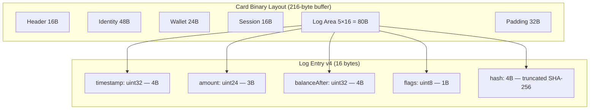
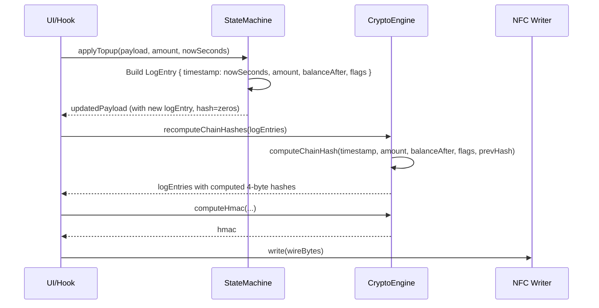
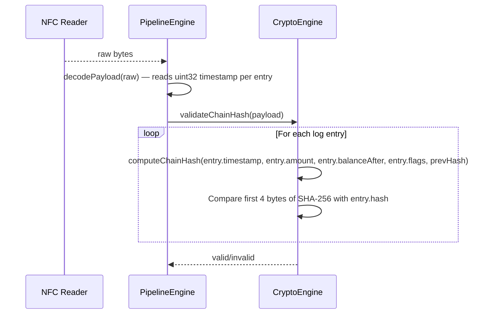

# Design Document: Log Entry Absolute Timestamp

## Overview

Replace the `deltaTime` (uint16, 2 bytes) field in the on-card NFC log entry with an absolute Unix timestamp (`timestamp`, uint32, 4 bytes). This eliminates the dependency on `session.startTime` for timestamp reconstruction, fixing the overflow problem for out-of-session operations (topup, admin reset) where `session.startTime = 0`.

The 16-byte log entry constraint is preserved by reducing the chain hash from 6 bytes to 4 bytes. The card schema version is bumped from 3 to 4. Backward compatibility with v3 cards is dropped per user request.

## Architecture



## Sequence Diagrams

### Write Flow (Topup — Out-of-Session)



### Validation Flow (Read & Verify)



## Components and Interfaces

### Component 1: LogEntry Type (`src/core/payload/types.ts`)

**Purpose**: Define the on-card log entry structure for schema v4.

**Interface**:

```typescript
export const CARD_SCHEMA_VERSION = 4;

export const LOG_ENTRY_SIZE = 16;
export const LOG_ENTRY_COUNT = 5;
export const LOG_HASH_SIZE = 4; // reduced from 6

export interface LogEntry {
  timestamp: number; // uint32 — absolute Unix seconds
  amount: number; // uint24 — transaction amount (max 16,777,215)
  balanceAfter: number; // uint32 — balance after transaction
  flags: number; // uint8  — TxType enum
  hash: Uint8Array; // 4 bytes — truncated SHA-256 chain hash
}
```

**Responsibilities**:

- Define the canonical in-memory representation of a log entry
- Export constants for binary layout sizes

### Component 2: Payload Engine (`src/core/payload/engine.ts`)

**Purpose**: Encode/decode log entries to/from the 16-byte binary wire format.

**Interface**:

```typescript
// Decode: read 16 bytes into LogEntry
function decodeLogEntry(view: DataView, base: number): LogEntry;

// Encode: write LogEntry into 16 bytes
function encodeLogEntry(view: DataView, base: number, entry: LogEntry): void;
```

**Responsibilities**:

- Read/write the new binary layout: `[timestamp:4][amount:3][balanceAfter:4][flags:1][hash:4]`
- Detect empty entries by checking if hash is all zeros (same sentinel as before)

### Component 3: Crypto Engine (`src/core/crypto/engine.ts`)

**Purpose**: Compute the chain hash for tamper detection.

**Interface**:

```typescript
export async function computeChainHash(
  timestamp: number, // uint32 (was deltaTime: uint16)
  amount: number, // uint24
  balanceAfter: number, // uint32
  flags: number, // uint8
  prevHash: Uint8Array, // 4 bytes (was 6 bytes)
): Promise<Uint8Array>; // returns 4 bytes (was 6 bytes)
```

**Responsibilities**:

- Hash all entry fields + previous hash into a 4-byte chain link
- Use SHA-256 truncated to 4 bytes

### Component 4: State Machine Engine (`src/core/state-machine/engine.ts`)

**Purpose**: Build log entries during state transitions.

**Interface**:

```typescript
// All apply* functions now pass nowSeconds as the timestamp field directly
function applyCheckin(payload: CardPayload, terminalId: number, nowSeconds: number): CardPayload;
function applyCheckout(payload: CardPayload, nowSeconds: number): CardPayload;
function applyDebit(payload: CardPayload, amount: number, nowSeconds: number): CardPayload;
function applyTopup(payload: CardPayload, amount: number, nowSeconds: number): CardPayload;
function applyResetState(payload: CardPayload, nowSeconds: number): CardPayload;
```

**Responsibilities**:

- Set `timestamp: nowSeconds` on every log entry (replaces deltaTime logic)
- No more `Math.min(nowSeconds - sessionStart, 0xFFFF)` clamping needed

### Component 5: Pipeline Engine (`src/core/nfc/pipelineEngine.ts`)

**Purpose**: Validate and recompute chain hashes during read/write pipeline.

**Responsibilities**:

- `validateChainHash`: iterate entries, compute expected 4-byte hash, compare
- `recomputeChainHashes`: recompute all hashes before write
- Update `rootHash` in trailer (still 6 bytes — only log chain hashes are 4 bytes)

## Data Models

### Binary Layout v4 — Log Entry (16 bytes)

| Offset | Size | Type   | Field        | Description                          |
| ------ | ---- | ------ | ------------ | ------------------------------------ |
| 0      | 4    | uint32 | timestamp    | Absolute Unix seconds                |
| 4      | 3    | uint24 | amount       | Transaction amount (max 16,777,215)  |
| 8      | 4    | uint32 | balanceAfter | Balance after this transaction       |
| 12     | 1    | uint8  | flags        | TxType enum value                    |
| 13     | 3    | bytes  | hash         | Chain hash (SHA-256 truncated to 3B) |

Wait — let me recalculate: 4 + 3 + 4 + 1 + 4 = 16. That works with a 4-byte hash.

**Final layout**:

| Offset | Size | Type   | Field        | Description                          |
| ------ | ---- | ------ | ------------ | ------------------------------------ |
| 0      | 4    | uint32 | timestamp    | Absolute Unix seconds                |
| 4      | 3    | uint24 | amount       | Transaction amount (max 16,777,215)  |
| 7      | 4    | uint32 | balanceAfter | Balance after this transaction       |
| 11     | 1    | uint8  | flags        | TxType enum value                    |
| 12     | 4    | bytes  | hash         | Chain hash (SHA-256 truncated to 4B) |

**Total: 4 + 3 + 4 + 1 + 4 = 16 bytes** ✓

### Comparison: v3 vs v4

| Field        | v3 (current)         | v4 (new)             | Change       |
| ------------ | -------------------- | -------------------- | ------------ |
| time field   | deltaTime: uint16 2B | timestamp: uint32 4B | +2 bytes     |
| amount       | uint24 3B            | uint24 3B            | unchanged    |
| balanceAfter | uint32 4B            | uint32 4B            | unchanged    |
| flags        | uint8 1B             | uint8 1B             | unchanged    |
| hash         | 6B                   | 4B                   | −2 bytes     |
| **Total**    | **16B**              | **16B**              | **net zero** |

### Chain Hash Input Layout (for `computeChainHash`)

```typescript
// 16 bytes input to SHA-256
const data = new Uint8Array(16);
// [0..3]  timestamp  (uint32 LE)
// [4..6]  amount     (uint24 LE)
// [7..10] balanceAfter (uint32 LE)
// [11]    flags      (uint8)
// [12..15] prevHash  (4 bytes)
```

## Key Functions with Formal Specifications

### Function 1: `computeChainHash()`

```typescript
async function computeChainHash(
  timestamp: number,
  amount: number,
  balanceAfter: number,
  flags: number,
  prevHash: Uint8Array, // 4 bytes
): Promise<Uint8Array>; // 4 bytes
```

**Preconditions:**

- `timestamp` is a valid uint32 (0 ≤ timestamp ≤ 0xFFFFFFFF)
- `amount` is a valid uint24 (0 ≤ amount ≤ 0xFFFFFF)
- `balanceAfter` is a valid uint32 (0 ≤ balanceAfter ≤ 0xFFFFFFFF)
- `flags` is a valid uint8 (0 ≤ flags ≤ 0xFF)
- `prevHash.length >= 4`

**Postconditions:**

- Returns exactly 4 bytes (Uint8Array of length 4)
- Output is deterministic: same inputs always produce same output
- Output changes if any input field changes (avalanche property of SHA-256)
- No side effects

**Loop Invariants:** N/A

### Function 2: `decodeLogEntry()`

```typescript
function decodeLogEntry(view: DataView, base: number): LogEntry | null;
```

**Preconditions:**

- `view` has at least `base + 16` bytes accessible
- `base` is aligned to a 16-byte log entry boundary

**Postconditions:**

- Returns `null` if hash bytes [base+12..base+16) are all zero (empty sentinel)
- Otherwise returns a valid `LogEntry` with all fields populated
- `entry.hash.length === 4`
- `entry.timestamp` is the raw uint32 at offset 0 (no interpretation)

**Loop Invariants:** N/A

### Function 3: `encodeLogEntry()`

```typescript
function encodeLogEntry(buf: Uint8Array, view: DataView, base: number, entry: LogEntry): void;
```

**Preconditions:**

- `buf` has at least `base + 16` bytes writable
- `entry.hash.length >= 4`
- `entry.amount <= 0xFFFFFF`

**Postconditions:**

- Bytes `[base..base+16)` contain the encoded entry
- `view.getUint32(base, true) === entry.timestamp`
- `readUint24LE(view, base + 4) === entry.amount`
- `view.getUint32(base + 7, true) === entry.balanceAfter`
- `view.getUint8(base + 11) === entry.flags`
- `buf.slice(base + 12, base + 16)` equals `entry.hash.slice(0, 4)`

**Loop Invariants:** N/A

### Function 4: `applyTopup()` (representative of all apply\* functions)

```typescript
function applyTopup(payload: CardPayload, amount: number, nowSeconds: number): CardPayload;
```

**Preconditions:**

- `amount > 0`
- `nowSeconds` is a valid Unix timestamp (uint32 range)
- `payload` is a valid CardPayload

**Postconditions:**

- `result.wallet.balance === payload.wallet.balance + amount`
- `result.wallet.counter === payload.wallet.counter + 1n`
- `result.wallet.lastTimestamp === nowSeconds`
- Last log entry has `timestamp === nowSeconds` (not deltaTime)
- Last log entry has `flags === TxType.CREDIT`
- Last log entry has `balanceAfter === result.wallet.balance`
- `result.logEntries.length <= LOG_ENTRY_COUNT`

**Loop Invariants:** N/A

## Algorithmic Pseudocode

### Chain Hash Computation

```typescript
async function computeChainHash(
  timestamp: number,
  amount: number,
  balanceAfter: number,
  flags: number,
  prevHash: Uint8Array,
): Promise<Uint8Array> {
  const data = new Uint8Array(16);
  const view = new DataView(data.buffer);

  // Pack fields into 16-byte input buffer
  view.setUint32(0, timestamp, true); // bytes 0-3
  data[4] = amount & 0xff; // bytes 4-6 (uint24 LE)
  data[5] = (amount >> 8) & 0xff;
  data[6] = (amount >> 16) & 0xff;
  view.setUint32(7, balanceAfter, true); // bytes 7-10
  data[11] = flags; // byte 11
  data.set(prevHash.slice(0, 4), 12); // bytes 12-15

  const hash = await crypto.subtle.digest("SHA-256", data.buffer);
  return new Uint8Array(hash).slice(0, 4); // truncate to 4 bytes
}
```

### Log Entry Decode

```typescript
function decodeLogEntries(view: DataView, buf: Uint8Array, logOffset: number): LogEntry[] {
  const entries: LogEntry[] = [];

  for (let i = 0; i < LOG_ENTRY_COUNT; i++) {
    const base = logOffset + i * LOG_ENTRY_SIZE;
    const hash = buf.slice(base + 12, base + 16);

    // Sentinel: all-zero hash means empty slot
    if (hash.every((b) => b === 0)) break;

    entries.push({
      timestamp: view.getUint32(base, true),
      amount: readUint24LE(view, base + 4),
      balanceAfter: view.getUint32(base + 7, true),
      flags: view.getUint8(base + 11),
      hash,
    });
  }

  return entries;
}
```

### Log Entry Encode

```typescript
function encodeLogEntries(
  buf: Uint8Array,
  view: DataView,
  logOffset: number,
  entries: LogEntry[],
): void {
  for (let i = 0; i < Math.min(entries.length, LOG_ENTRY_COUNT); i++) {
    const base = logOffset + i * LOG_ENTRY_SIZE;
    const entry = entries[i];

    view.setUint32(base, entry.timestamp, true);
    writeUint24LE(view, base + 4, entry.amount);
    view.setUint32(base + 7, entry.balanceAfter, true);
    view.setUint8(base + 11, entry.flags);
    buf.set(entry.hash.slice(0, 4), base + 12);
  }
}
```

### State Machine — Building Log Entries (all apply\* functions)

```typescript
// Before (v3): deltaTime depended on session context
logEntry = { deltaTime: Math.min(nowSeconds - session.startTime, 0xFFFF), ... }

// After (v4): absolute timestamp, always correct
logEntry = { timestamp: nowSeconds, ... }
```

## Example Usage

```typescript
// Example 1: Topup outside session (the bug case)
// Card is IDLE, session.startTime = 0
const nowSeconds = 1719849600; // 2024-07-01 12:00:00 UTC
const payload = applyTopup(idlePayload, 50000, nowSeconds);
// payload.logEntries.at(-1).timestamp === 1719849600 ✓
// No overflow, no dependency on session.startTime

// Example 2: Debit during session
const nowSeconds2 = 1719850200; // 10 minutes after checkin
const payload2 = applyDebit(checkedInPayload, 15000, nowSeconds2);
// payload2.logEntries.at(-1).timestamp === 1719850200 ✓
// Absolute — can reconstruct exact time without session context

// Example 3: Chain hash validation
const entries = payload.logEntries;
let prevHash = new Uint8Array(4); // genesis = zeros
for (const entry of entries) {
  const expected = await computeChainHash(
    entry.timestamp,
    entry.amount,
    entry.balanceAfter,
    entry.flags,
    prevHash,
  );
  assert(arraysEqual(expected, entry.hash)); // 4-byte comparison
  prevHash = entry.hash;
}

// Example 4: Encoding a log entry to wire format
const entry: LogEntry = {
  timestamp: 1719849600,
  amount: 50000,
  balanceAfter: 200000,
  flags: TxType.CREDIT,
  hash: new Uint8Array([0xab, 0xcd, 0xef, 0x12]),
};
// Wire bytes: [00 A8 5B 66] [50 C3 00] [40 0D 03 00] [01] [AB CD EF 12]
//              timestamp      amount     balanceAfter  flags  hash
```

## Correctness Properties

_A property is a characteristic or behavior that should hold true across all valid executions of a system — essentially, a formal statement about what the system should do. Properties serve as the bridge between human-readable specifications and machine-verifiable correctness guarantees._

### Property 1: Timestamp independence

_For any_ operation type (checkin, checkout, debit, topup, admin reset) and _for any_ card state (idle, checked_in, station_operation, checked_out), the resulting log entry SHALL have `timestamp === nowSeconds` — the timestamp is always the wall-clock time passed to the apply function, independent of session state.

**Validates: Requirements 1.1, 1.2**

### Property 2: Layout size invariant

_For any_ valid LogEntry, encoding it to wire format SHALL produce exactly 16 bytes. The sum of field sizes (4 + 3 + 4 + 1 + 4) equals exactly 16.

**Validates: Requirements 2.1**

### Property 3: Encode-decode roundtrip

_For any_ valid LogEntry `e` (with non-zero hash), `decode(encode(e))` SHALL produce a LogEntry equal to `e`. All fields (timestamp, amount, balanceAfter, flags, hash) survive a roundtrip through the binary format without loss.

**Validates: Requirements 3.1, 2.2, 2.3, 2.4, 2.5, 2.6, 3.2, 3.3, 8.1, 8.2, 8.3**

### Property 4: Chain hash determinism

_For any_ set of inputs (timestamp, amount, balanceAfter, flags, prevHash), calling `computeChainHash` twice with identical inputs SHALL produce the same 4-byte output.

**Validates: Requirements 4.2, 4.3**

### Property 5: Chain hash sensitivity

_For any_ set of valid inputs, changing any single input field (timestamp, amount, balanceAfter, flags, or prevHash) SHALL produce a different hash output with overwhelming probability due to SHA-256 avalanche.

**Validates: Requirements 4.4**

### Property 6: Empty sentinel preservation

_For any_ sequence of log entry bytes where the hash field (bytes 12-15) is all zeros, the decoder SHALL treat the entry as empty and exclude it from the decoded log entries list.

**Validates: Requirements 5.1**

### Property 7: Schema version rejection

_For any_ card payload with `header.version < 4`, the pipeline SHALL reject the card with an error indicating schema version mismatch.

**Validates: Requirements 6.1, 6.2**

### Property 8: Chain validation detects corruption

_For any_ valid log entry chain, corrupting any single entry's hash SHALL cause the chain validation to report a failure.

**Validates: Requirements 7.1, 7.2**

## Error Handling

### Error Scenario 1: Legacy v3 Card Read

**Condition**: Card presents `header.version === 3` (old deltaTime format)
**Response**: Reject the card with a clear error message indicating schema mismatch
**Recovery**: User must re-provision the card (write fresh v4 payload)

### Error Scenario 2: Timestamp Zero

**Condition**: `nowSeconds === 0` passed to an apply function
**Response**: This is a programming error. The log entry will have `timestamp = 0`.
**Recovery**: Defensive check in apply functions: if `nowSeconds === 0`, use `Math.floor(Date.now() / 1000)` as fallback (same pattern as `recordCardWrite.ts`)

### Error Scenario 3: Chain Hash Mismatch After Migration

**Condition**: After updating `computeChainHash` signature, existing test fixtures break
**Response**: All test fixtures must be regenerated with the new 4-byte hash format
**Recovery**: Update test mocks to return `new Uint8Array(4)` instead of `new Uint8Array(6)`

## Testing Strategy

### Unit Testing Approach

- **computeChainHash**: Verify determinism, sensitivity to each field, correct output length (4 bytes)
- **encode/decode roundtrip**: Property test — generate random LogEntry values, encode, decode, assert equality
- **State machine apply functions**: Verify `timestamp === nowSeconds` for all operation types (checkin, checkout, debit, topup, admin)
- **Empty sentinel detection**: Verify entries with all-zero hash are treated as empty

### Property-Based Testing Approach

**Property Test Library**: fast-check

```typescript
// Property: encode-decode roundtrip
fc.assert(
  fc.asyncProperty(
    fc.record({
      timestamp: fc.integer({ min: 0, max: 0xffffffff }),
      amount: fc.integer({ min: 0, max: 0xffffff }),
      balanceAfter: fc.integer({ min: 0, max: 0xffffffff }),
      flags: fc.integer({ min: 0, max: 0xff }),
      hash: fc.uint8Array({ minLength: 4, maxLength: 4 }).filter((h) => !h.every((b) => b === 0)),
    }),
    async (entry) => {
      const buf = new Uint8Array(16);
      const view = new DataView(buf.buffer);
      encodeLogEntry(buf, view, 0, entry);
      const decoded = decodeLogEntry(view, buf, 0);
      expect(decoded).toEqual(entry);
    },
  ),
);

// Property: chain hash is always 4 bytes
fc.assert(
  fc.asyncProperty(
    fc.integer({ min: 0, max: 0xffffffff }),
    fc.integer({ min: 0, max: 0xffffff }),
    fc.integer({ min: 0, max: 0xffffffff }),
    fc.integer({ min: 0, max: 0xff }),
    fc.uint8Array({ minLength: 4, maxLength: 4 }),
    async (timestamp, amount, balanceAfter, flags, prevHash) => {
      const hash = await computeChainHash(timestamp, amount, balanceAfter, flags, prevHash);
      expect(hash.length).toBe(4);
    },
  ),
);
```

### Integration Testing Approach

- Full pipeline test: build payload → apply operation → recompute hashes → encode → decode → validate chain
- Verify `recordCardWrite` correctly reads `timestamp` from log entries for outbox records

## Security Considerations

### Hash Truncation from 6 to 4 Bytes

Reducing the chain hash from 6 bytes (48 bits) to 4 bytes (32 bits) decreases collision resistance:

- **6-byte hash**: Birthday bound at ~2^24 ≈ 16.7M entries before 50% collision probability
- **4-byte hash**: Birthday bound at ~2^16 ≈ 65K entries before 50% collision probability

However, with only 5 log entries per card and the HMAC covering the entire buffer, the practical security impact is negligible:

- An attacker cannot forge a single entry without also forging the HMAC
- The chain hash primarily detects accidental corruption and provides ordering proof
- The HMAC (8 bytes, keyed) remains the primary tamper-detection mechanism

### Timestamp Exposure

Absolute timestamps reveal when transactions occurred. This is already exposed via `wallet.lastTimestamp` and the reconciliation outbox, so no new information leakage.

## Dependencies

- No new external dependencies required
- Existing dependency: Web Crypto API (`crypto.subtle.digest`) — already in use
- Test dependency: `fast-check` — already available in the project (used for property tests)
