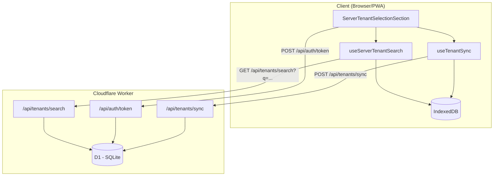
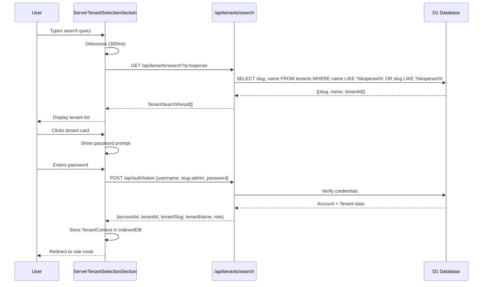
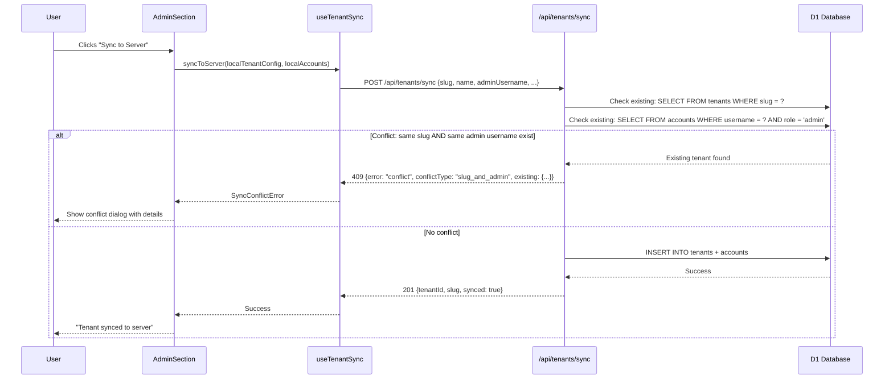

# Design Document: Server Tenant Selection

## Overview

This feature adds server-mode tenant selection to the cooperative management app. When a device connects to a server, users can search for available tenants, select one, and authenticate with a password to establish a session. Additionally, the feature introduces strict sync conflict detection: when a local tenant attempts to push/sync to the server, the server blocks the operation if a tenant with the same admin username AND slug already exists — preventing accidental overwrites or duplicates. Local push remains freely available (no conflict checks), but server sync enforces uniqueness constraints.

The design covers three main flows: (1) server tenant search & selection UI, (2) password-based authentication against a server tenant, and (3) sync conflict detection with clear error messaging when a name collision is detected.

## Architecture



## Sequence Diagrams

### Flow 1: Server Tenant Search & Selection



### Flow 2: Tenant Sync Conflict Detection



## Components and Interfaces

### Component 1: ServerTenantSelectionSection

**Purpose**: UI section that allows users to search for server tenants, select one, and authenticate.

```typescript
interface ServerTenantSelectionProps {
  onComplete: (tenantId: string, role: string) => void;
  onBack: () => void;
}
```

**Responsibilities**:

- Render search input with debounced query
- Display list of matching tenants from server
- Show password prompt on tenant selection
- Handle authentication and store TenantContext
- Display error states (network, auth failure)

### Component 2: useServerTenantSearch Hook

**Purpose**: Manages server tenant search state with debouncing and caching.

```typescript
interface TenantSearchResult {
  tenantId: string;
  slug: string;
  name: string;
}

interface UseServerTenantSearchReturn {
  query: string;
  setQuery: (q: string) => void;
  results: TenantSearchResult[];
  loading: boolean;
  error: string | null;
}
```

**Responsibilities**:

- Debounce search input (300ms)
- Call server search API
- Cache recent results
- Handle network errors gracefully

### Component 3: useTenantSync Hook

**Purpose**: Handles pushing a local tenant to the server with conflict detection.

```typescript
type SyncStatus = "idle" | "syncing" | "success" | "conflict" | "error";

interface SyncConflict {
  conflictType: "slug_and_admin" | "slug_only" | "admin_only";
  existingTenantName: string;
  existingSlug: string;
}

interface UseTenantSyncReturn {
  status: SyncStatus;
  conflict: SyncConflict | null;
  error: string | null;
  syncToServer: (config: LocalTenantConfig, adminPassword: string) => Promise<void>;
  reset: () => void;
}
```

**Responsibilities**:

- Package local tenant data for server push
- Call sync API endpoint
- Parse conflict responses (409)
- Expose conflict details for UI display

### Component 4: Server API — /api/tenants/search

**Purpose**: Search active tenants by name or slug.

```typescript
// GET /api/tenants/search?q=<query>&limit=<number>
interface SearchResponse {
  tenants: TenantSearchResult[];
  total: number;
}
```

**Responsibilities**:

- Validate query parameter (min 2 chars)
- Search tenants table with LIKE matching
- Return only active tenants
- Limit results (default 10)

### Component 5: Server API — /api/tenants/sync

**Purpose**: Accept a local tenant push to server, enforcing uniqueness constraints.

```typescript
// POST /api/tenants/sync
interface SyncRequest {
  slug: string;
  name: string;
  timezone: string;
  adminUsername: string;
  adminPasswordHash: string;
}

// Success: 201
interface SyncSuccessResponse {
  tenantId: string;
  slug: string;
  synced: true;
}

// Conflict: 409
interface SyncConflictResponse {
  error: "conflict";
  conflictType: "slug_and_admin" | "slug_only" | "admin_only";
  existingTenantName: string;
  existingSlug: string;
}
```

**Responsibilities**:

- Check if slug already exists in tenants table
- Check if admin username already exists in accounts table
- If BOTH slug AND admin username exist → block with 409 (strict server rule)
- If only one conflicts → still block with 409 but different conflictType
- If no conflict → create tenant + admin account in D1

## Data Models

### Model: TenantSearchResult

```typescript
interface TenantSearchResult {
  tenantId: string;
  slug: string;
  name: string;
}
```

**Validation Rules**:

- `tenantId` is a valid UUID
- `slug` is non-empty, lowercase, hyphen-separated
- `name` is non-empty string

### Model: SyncRequest

```typescript
interface SyncRequest {
  slug: string;
  name: string;
  timezone: string;
  adminUsername: string;
  adminPasswordHash: string;
}
```

**Validation Rules**:

- `slug` must be 3-50 chars, lowercase alphanumeric + hyphens only
- `name` must be 2-100 chars
- `timezone` must be a valid IANA timezone string
- `adminUsername` must be 3-50 chars, no spaces
- `adminPasswordHash` must be in format `iterations:saltHex:hashHex`

### Model: Extended LocalTenantConfig (IndexedDB)

```typescript
interface LocalTenantConfig {
  tenantId: string;
  slug: string;
  name: string;
  timezone: string;
  mode: "local" | "synced"; // updated to "synced" after successful push
  serverUrl?: string;
  createdAt: number;
  exportedAt?: number;
  syncedAt?: number; // NEW: timestamp of last successful sync
  serverTenantId?: string; // NEW: server-assigned tenant ID (may differ from local)
}
```

## Algorithmic Pseudocode

### Algorithm: Server Tenant Search

```typescript
async function searchServerTenants(
  query: string,
  limit: number = 10,
): Promise<TenantSearchResult[]> {
  // Precondition: query.length >= 2
  // Postcondition: results.length <= limit, all results are active tenants

  const db = await getDb();
  const pattern = `%${query}%`;

  const results = await db
    .select({ tenantId: tenants.tenantId, slug: tenants.slug, name: tenants.name })
    .from(tenants)
    .where(
      and(
        eq(tenants.status, "active"),
        or(like(tenants.name, pattern), like(tenants.slug, pattern)),
      ),
    )
    .limit(limit);

  return results;
}
```

**Preconditions:**

- `query` is a non-empty string with length >= 2
- Database connection is available

**Postconditions:**

- Returns array of at most `limit` results
- All returned tenants have status = "active"
- Results match query against name OR slug

### Algorithm: Sync Conflict Detection

```typescript
async function processTenantSync(
  request: SyncRequest,
): Promise<SyncSuccessResponse | SyncConflictResponse> {
  // Precondition: request fields are validated
  // Postcondition: either tenant is created OR conflict is returned

  const db = await getDb();

  // Step 1: Check slug uniqueness
  const existingBySlug = await db
    .select()
    .from(tenants)
    .where(eq(tenants.slug, request.slug))
    .get();

  // Step 2: Check admin username uniqueness
  const existingByAdmin = await db
    .select()
    .from(accounts)
    .where(and(eq(accounts.username, request.adminUsername), eq(accounts.role, "admin")))
    .get();

  // Step 3: Determine conflict type
  const hasSlugConflict = existingBySlug !== undefined;
  const hasAdminConflict = existingByAdmin !== undefined;

  if (hasSlugConflict && hasAdminConflict) {
    return {
      error: "conflict",
      conflictType: "slug_and_admin",
      existingTenantName: existingBySlug.name,
      existingSlug: existingBySlug.slug,
    };
  }

  if (hasSlugConflict) {
    return {
      error: "conflict",
      conflictType: "slug_only",
      existingTenantName: existingBySlug.name,
      existingSlug: existingBySlug.slug,
    };
  }

  if (hasAdminConflict) {
    const conflictTenant = await db
      .select()
      .from(tenants)
      .where(eq(tenants.tenantId, existingByAdmin.tenantId))
      .get();

    return {
      error: "conflict",
      conflictType: "admin_only",
      existingTenantName: conflictTenant?.name ?? "Unknown",
      existingSlug: conflictTenant?.slug ?? "",
    };
  }

  // Step 4: No conflict — create tenant and admin account
  const tenantId = crypto.randomUUID();
  const accountId = crypto.randomUUID();

  await db.insert(tenants).values({
    tenantId,
    slug: request.slug,
    name: request.name,
    timezone: request.timezone,
    status: "active",
  });

  await db.insert(accounts).values({
    accountId,
    tenantId,
    username: request.adminUsername,
    passwordHash: request.adminPasswordHash,
    role: "admin",
    status: "active",
  });

  return { tenantId, slug: request.slug, synced: true };
}
```

**Preconditions:**

- `request.slug` is validated (3-50 chars, lowercase, hyphens)
- `request.adminUsername` is validated (3-50 chars, no spaces)
- `request.adminPasswordHash` is in valid PBKDF2 format
- Database connection is available

**Postconditions:**

- If conflict detected: returns 409 with conflict details, no DB mutations
- If no conflict: tenant + account created in DB, returns 201 with new tenantId
- Conflict detection is atomic (both checks happen before any write)

**Loop Invariants:** N/A (no loops in this algorithm)

### Algorithm: Debounced Search with Client-Side Caching

```typescript
function useServerTenantSearch(): UseServerTenantSearchReturn {
  const [query, setQuery] = useState("");
  const [results, setResults] = useState<TenantSearchResult[]>([]);
  const [loading, setLoading] = useState(false);
  const [error, setError] = useState<string | null>(null);
  const cacheRef = useRef<Map<string, TenantSearchResult[]>>(new Map());
  const debounceRef = useRef<ReturnType<typeof setTimeout> | null>(null);

  useEffect(() => {
    if (query.length < 2) {
      setResults([]);
      setLoading(false);
      return;
    }

    // Check cache first
    const cached = cacheRef.current.get(query);
    if (cached) {
      setResults(cached);
      setLoading(false);
      return;
    }

    setLoading(true);
    if (debounceRef.current) clearTimeout(debounceRef.current);

    debounceRef.current = setTimeout(async () => {
      try {
        const res = await fetch(`/api/tenants/search?q=${encodeURIComponent(query)}&limit=10`);
        if (!res.ok) throw new Error(`Search failed: ${res.status}`);
        const data = await res.json();
        cacheRef.current.set(query, data.tenants);
        setResults(data.tenants);
        setError(null);
      } catch (e) {
        setError(String(e));
        setResults([]);
      } finally {
        setLoading(false);
      }
    }, 300);

    return () => {
      if (debounceRef.current) clearTimeout(debounceRef.current);
    };
  }, [query]);

  return { query, setQuery, results, loading, error };
}
```

**Preconditions:**

- Component is mounted in a browser environment with fetch available
- Server is reachable at /api/tenants/search

**Postconditions:**

- Results are always from the most recent query (stale responses discarded via debounce)
- Cache prevents redundant network calls for repeated queries
- Loading state accurately reflects pending requests

## Key Functions with Formal Specifications

### Function: searchServerTenants

```typescript
async function searchServerTenants(query: string, limit?: number): Promise<TenantSearchResult[]>;
```

**Preconditions:**

- `query.length >= 2`
- `limit` is undefined or positive integer <= 50

**Postconditions:**

- Returns array where `result.length <= (limit ?? 10)`
- Every item in result has `status === "active"` in the database
- Results match `query` against either `name` or `slug` (case-insensitive)

### Function: processTenantSync

```typescript
async function processTenantSync(
  request: SyncRequest,
): Promise<SyncSuccessResponse | SyncConflictResponse>;
```

**Preconditions:**

- All fields in `request` pass validation rules
- Database is writable

**Postconditions:**

- If returns `SyncConflictResponse`: no rows were inserted into any table
- If returns `SyncSuccessResponse`: exactly 1 row in `tenants` and 1 row in `accounts` were created
- `conflictType === "slug_and_admin"` iff both slug AND admin username already exist

### Function: authenticateServerTenant

```typescript
async function authenticateServerTenant(
  tenantSlug: string,
  password: string,
): Promise<{ success: true; context: TenantContext } | { success: false; error: string }>;
```

**Preconditions:**

- `tenantSlug` is non-empty
- `password` is non-empty

**Postconditions:**

- If success: TenantContext is stored in IndexedDB, device fingerprint is captured
- If failure: no side effects, error message describes the failure reason

## Example Usage

```typescript
// Example 1: Server tenant search in UI
function ServerTenantSelectionSection({ onComplete, onBack }: ServerTenantSelectionProps) {
  const { query, setQuery, results, loading, error } = useServerTenantSearch();
  const [selectedTenant, setSelectedTenant] = useState<TenantSearchResult | null>(null);
  const [password, setPassword] = useState("");

  async function handleAuthenticate() {
    if (!selectedTenant) return;
    const result = await authenticateServerTenant(selectedTenant.slug, password);
    if (result.success) {
      onComplete(result.context.tenantId, result.context.role);
    }
  }

  return (
    <AuthLayout>
      <Input value={query} onChange={(e) => setQuery(e.target.value)} placeholder="Cari koperasi..." />
      {results.map((t) => (
        <TenantCard key={t.tenantId} tenant={t} onClick={() => setSelectedTenant(t)} />
      ))}
      {selectedTenant && (
        <PasswordPrompt tenant={selectedTenant} onSubmit={handleAuthenticate} />
      )}
    </AuthLayout>
  );
}

// Example 2: Sync conflict handling
function SyncButton({ tenantId }: { tenantId: string }) {
  const { status, conflict, syncToServer, reset } = useTenantSync();

  if (status === "conflict" && conflict) {
    return (
      <ConflictDialog
        conflict={conflict}
        onDismiss={reset}
        message={`Tenant "${conflict.existingSlug}" sudah ada di server dengan admin yang sama.`}
      />
    );
  }

  return <Button onClick={() => syncToServer(tenantId)}>Sync ke Server</Button>;
}

// Example 3: API route handler for search
export const Route = createFileRoute("/api/tenants/search")({
  server: {
    handlers: {
      GET: async ({ request }) => {
        const url = new URL(request.url);
        const q = url.searchParams.get("q") ?? "";
        const limit = Math.min(parseInt(url.searchParams.get("limit") ?? "10"), 50);

        if (q.length < 2) return errJson(400, "Query must be at least 2 characters");

        const results = await searchServerTenants(q, limit);
        return jsonOk({ tenants: results, total: results.length });
      },
    },
  },
});
```

## Correctness Properties

_A property is a characteristic or behavior that should hold true across all valid executions of a system — essentially, a formal statement about what the system should do. Properties serve as the bridge between human-readable specifications and machine-verifiable correctness guarantees._

### Property 1: Search Correctness

_For any_ query string of 2+ characters and any database of tenants, the search results SHALL contain only tenants that are active AND whose name or slug matches the query (case-insensitive), and the result count SHALL never exceed the specified limit.

**Validates: Requirements 1.1, 1.3, 1.4**

### Property 2: Short Query Rejection

_For any_ query string shorter than 2 characters, the Search_API SHALL reject the request with a 400 error, and the Search_Hook SHALL not make an API call.

**Validates: Requirements 1.2, 2.2**

### Property 3: Cache Consistency

_For any_ query that has been previously searched, searching the same query again SHALL return the same cached result without making an additional API call.

**Validates: Requirements 2.3**

### Property 4: Conflict Type Correctness

_For any_ sync request and any database state, the conflict type returned SHALL be "slug_and_admin" if both slug and admin username exist, "slug_only" if only the slug exists, "admin_only" if only the admin username exists, and success if neither exists.

**Validates: Requirements 4.1, 4.2, 4.3, 4.4**

### Property 5: No Partial Writes on Conflict

_For any_ sync request that results in a conflict response, the database state SHALL be unchanged — no tenant or account rows are inserted.

**Validates: Requirements 4.6**

### Property 6: Sync Request Validation

_For any_ sync request with invalid fields (slug outside 3-50 chars or containing invalid characters, name outside 2-100 chars, invalid timezone, adminUsername with spaces or outside 3-50 chars, or malformed passwordHash), the Sync_API SHALL reject the request with a 400 error.

**Validates: Requirements 5.1, 5.2, 5.3, 5.4, 5.5**

### Property 7: Authentication Error Opacity

_For any_ failed authentication attempt (whether due to wrong username, wrong password, or non-existent account), the error response SHALL be identical and generic — never revealing which specific field was incorrect.

**Validates: Requirements 3.4**

### Property 8: Conflict Detection Soundness

_For any_ sync request that returns success, it SHALL be the case that no tenant with the same slug existed AND no admin account with the same username existed in the database before the operation.

**Validates: Requirements 4.4**

## Error Handling

### Error Scenario 1: Network Unreachable During Search

**Condition**: Server is unreachable when user types a search query
**Response**: Set error state with user-friendly message ("Tidak dapat terhubung ke server")
**Recovery**: User can retry by modifying query; cached results remain available

### Error Scenario 2: Authentication Failure

**Condition**: User enters wrong password for selected tenant
**Response**: Display "Username atau password salah" error, keep tenant selected
**Recovery**: User can re-enter password without re-searching

### Error Scenario 3: Sync Conflict (slug + admin)

**Condition**: Local tenant's slug AND admin username already exist on server
**Response**: Return 409 with conflict details, display dialog explaining the conflict
**Recovery**: User must either rename their local tenant/admin OR contact server admin to resolve

### Error Scenario 4: Tenant Became Inactive

**Condition**: Tenant was active during search but became inactive before auth
**Response**: Return 401 "Tenant inactive" from auth endpoint
**Recovery**: User returns to search, tenant no longer appears in results

### Error Scenario 5: Race Condition on Sync

**Condition**: Two devices attempt to sync the same slug simultaneously
**Response**: First succeeds, second gets 409 conflict (DB unique constraint on slug)
**Recovery**: Second device sees conflict error, must choose different slug

## Testing Strategy

### Unit Testing Approach

- Test `searchServerTenants` with various query patterns (partial match, exact match, no match)
- Test `processTenantSync` conflict detection logic with all conflict type combinations
- Test debounce behavior in `useServerTenantSearch` hook
- Test password verification flow in authentication

### Property-Based Testing Approach

**Property Test Library**: fast-check

- **Search idempotency**: Searching the same query twice returns the same results (given no DB changes)
- **Conflict symmetry**: If sync(A) succeeds, then sync(B) where B.slug === A.slug must return conflict
- **No false conflicts**: If slug and admin are unique, sync always succeeds
- **Result bounds**: Search results never exceed the specified limit

### Integration Testing Approach

- End-to-end flow: search → select → authenticate → redirect
- Sync conflict: create tenant on server → attempt sync with same slug/admin → verify 409
- Concurrent sync: two simultaneous sync requests with same slug → one succeeds, one conflicts

## Performance Considerations

- **Debounce**: 300ms debounce on search input prevents excessive API calls
- **Client-side cache**: Recent search results cached in memory to avoid redundant fetches
- **LIKE query optimization**: Consider adding a full-text search index on `tenants.name` if tenant count grows large (>1000)
- **Limit cap**: Server enforces max 50 results per search to prevent large payloads
- **Conflict check before write**: Both uniqueness checks happen before any INSERT, avoiding partial rollbacks

## Security Considerations

- **Password never sent in plaintext to search**: Search endpoint returns only public tenant info (slug, name)
- **Authentication uses existing /api/auth/token**: Reuses proven auth flow with PBKDF2 verification
- **Sync sends password hash, not plaintext**: The PBKDF2 hash is transferred during sync (already hashed client-side)
- **Rate limiting**: Search and sync endpoints should be rate-limited to prevent enumeration attacks
- **No tenant enumeration**: Search requires minimum 2 characters, preventing full tenant list dumps
- **Device fingerprint validation**: After authentication, device fingerprint is stored and validated on subsequent access

## Dependencies

- **Existing**: TanStack Router, Drizzle ORM, Cloudflare D1, IndexedDB (via `src/lib/indexeddb.ts`)
- **Existing**: `src/lib/localTenant.ts` (PBKDF2 hashing, export/import)
- **Existing**: `src/server/auth.ts` (password verification)
- **Existing**: `src/components/layout/AuthLayout.tsx` (UI layout)
- **Existing**: `src/components/ui/*` (Button, Input, Label from shadcn)
- **New**: No new external dependencies required
