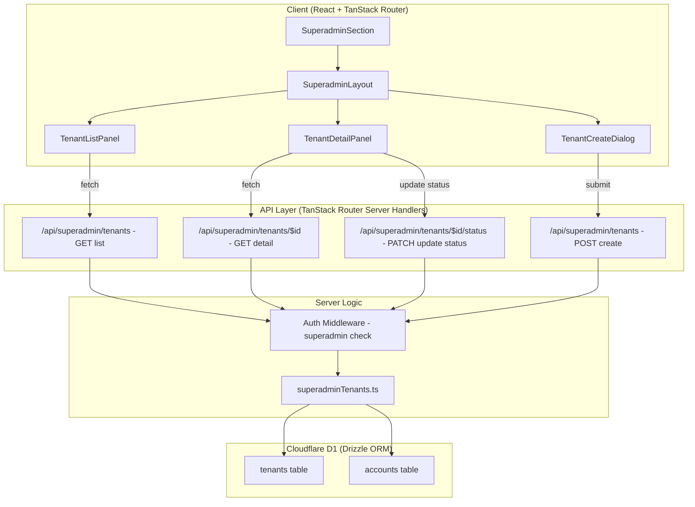

# Design Document: Superadmin Tenant Management

## Overview

This feature introduces a dedicated superadmin page for managing all server tenants in the koperasi application. Unlike the existing per-tenant admin panel (which manages cards, members, and audit within a single tenant), the superadmin page provides a global view across all tenants — enabling listing, viewing details, activating/deactivating, and creating new tenants directly on the server.

The superadmin role is a new privileged role that operates outside the tenant context. Authentication is handled via the existing server-side auth flow (`/api/auth/token`), but with a new `superadmin` role check. The page is accessible at a dedicated route (`/superadmin`) and uses the existing shadcn UI component library with a layout similar to the AdminLayout but scoped to global operations.

## Architecture



## Components and Interfaces

### Component 1: SuperadminLayout

**Purpose**: Provides the page shell for the superadmin area — sidebar navigation, header, and content area. Similar to `AdminLayout` but without tenant-specific context.

**Interface**:

```typescript
interface SuperadminLayoutProps {
  activeSection: SuperadminView;
  onSectionChange: (section: SuperadminView) => void;
  children: React.ReactNode;
}

type SuperadminView = "tenants" | "accounts";
```

**Responsibilities**:

- Render sidebar with navigation items (Tenants, Accounts)
- Display superadmin branding and logout action
- Responsive layout (desktop sidebar, mobile bottom nav + drawer)

### Component 2: TenantListPanel

**Purpose**: Displays a paginated, searchable list of all tenants with status indicators and quick actions.

**Interface**:

```typescript
interface TenantListPanelProps {
  tenants: TenantListItem[];
  isLoading: boolean;
  error: string | null;
  searchQuery: string;
  onSearchChange: (query: string) => void;
  onSelectTenant: (tenantId: string) => void;
  onCreateTenant: () => void;
  onStatusChange: (tenantId: string, newStatus: TenantStatus) => void;
  pagination: PaginationState;
  onPageChange: (page: number) => void;
}

interface TenantListItem {
  tenantId: string;
  slug: string;
  name: string;
  status: TenantStatus;
  timezone: string;
  accountCount: number;
  createdAt: string;
}

interface PaginationState {
  page: number;
  pageSize: number;
  total: number;
}
```

**Responsibilities**:

- Render tenant table/list with columns: name, slug, status, timezone, accounts, created date
- Provide search/filter input
- Show status badges (active = green, suspended = yellow, archived = red)
- Quick action buttons for activate/suspend/archive
- Pagination controls

### Component 3: TenantDetailPanel

**Purpose**: Shows full details of a selected tenant including its accounts and allows status management.

**Interface**:

```typescript
interface TenantDetailPanelProps {
  tenant: TenantDetail | null;
  isLoading: boolean;
  error: string | null;
  onStatusChange: (newStatus: TenantStatus) => void;
  onBack: () => void;
  isUpdating: boolean;
}

interface TenantDetail {
  tenantId: string;
  slug: string;
  name: string;
  status: TenantStatus;
  timezone: string;
  createdAt: string;
  updatedAt: string;
  accounts: TenantAccount[];
}

interface TenantAccount {
  accountId: string;
  username: string;
  role: AccountRole;
  status: "active" | "suspended";
  createdAt: string;
}
```

**Responsibilities**:

- Display tenant metadata (name, slug, timezone, status, dates)
- List all accounts belonging to the tenant
- Provide status change actions with confirmation dialog
- Back navigation to tenant list

### Component 4: TenantCreateDialog

**Purpose**: Modal dialog for creating a new tenant with an initial admin account.

**Interface**:

```typescript
interface TenantCreateDialogProps {
  open: boolean;
  onOpenChange: (open: boolean) => void;
  onSubmit: (data: CreateTenantRequest) => void;
  isSubmitting: boolean;
  error: string | null;
}

interface CreateTenantRequest {
  slug: string;
  name: string;
  timezone: string;
  adminUsername: string;
  adminPassword: string;
}
```

**Responsibilities**:

- Form with fields: tenant name, slug (auto-generated from name), timezone picker, admin username, admin password
- Client-side validation matching existing `validateSlug`, `validateName`, `validateTimezone` rules
- Submit to server API
- Display validation errors and server errors

### Component 5: SuperadminSection

**Purpose**: Top-level orchestrator component that manages state and coordinates between panels.

**Interface**:

```typescript
interface SuperadminSectionProps {
  accountId: string;
}
```

**Responsibilities**:

- Manage active view state (list vs detail)
- Coordinate data fetching via TanStack Query
- Handle mutations (create, status change)
- Route between list and detail views

## Data Models

### Model 1: Tenant (existing — no schema changes)

```typescript
// From src/db/schema.ts — already exists
interface Tenant {
  tenantId: string; // UUID primary key
  slug: string; // unique, 3-50 chars, lowercase alphanumeric + hyphens
  name: string; // 2-100 chars
  status: TenantStatus; // "active" | "suspended" | "archived"
  timezone: string; // IANA timezone string
  createdAt: Date; // unix timestamp
  updatedAt: Date; // unix timestamp
}

type TenantStatus = "active" | "suspended" | "archived";
```

**Validation Rules**:

- `slug`: 3-50 chars, lowercase alphanumeric + hyphens, no consecutive hyphens, starts/ends with letter or digit
- `name`: 2-100 chars, at least one non-whitespace character
- `timezone`: valid IANA timezone string
- `status`: one of "active", "suspended", "archived"

### Model 2: Account (existing — extended with superadmin role)

```typescript
// Extended from src/db/schema.ts
interface Account {
  accountId: string; // UUID primary key
  tenantId: string; // FK to tenants (nullable for superadmin)
  username: string; // unique, 3-50 chars
  passwordHash: string; // iterations:saltHex:hashHex format
  role: AccountRole; // extended with "superadmin"
  status: "active" | "suspended";
  createdAt: Date;
  updatedAt: Date;
}

type AccountRole = "admin" | "station" | "gate" | "terminal" | "scout" | "kiosk" | "superadmin";
```

**Validation Rules**:

- `username`: 3-50 chars, lowercase letters/digits/underscores/hyphens, no spaces
- `role`: must be one of the valid AccountRole values
- Superadmin accounts may have a special `tenantId` value (e.g., `"__system__"`) since they operate globally

### Model 3: API Response Types

```typescript
// GET /api/superadmin/tenants
interface TenantListResponse {
  tenants: TenantListItem[];
  total: number;
  page: number;
  pageSize: number;
}

// GET /api/superadmin/tenants/:tenantId
interface TenantDetailResponse {
  tenant: TenantDetail;
}

// POST /api/superadmin/tenants
interface CreateTenantResponse {
  tenantId: string;
  slug: string;
  name: string;
  adminAccountId: string;
}

// PATCH /api/superadmin/tenants/:tenantId/status
interface UpdateTenantStatusRequest {
  status: TenantStatus;
}

interface UpdateTenantStatusResponse {
  tenantId: string;
  status: TenantStatus;
  updatedAt: string;
}
```

## Correctness Properties

_A property is a characteristic or behavior that should hold true across all valid executions of a system — essentially, a formal statement about what the system should do. Properties serve as the bridge between human-readable specifications and machine-verifiable correctness guarantees._

### Property 1: Authorization Invariant

_For any_ API request to `/api/superadmin/*` endpoints and _for any_ account, the request is allowed if and only if the account has `role = "superadmin"`. Non-superadmin accounts receive HTTP 403 Forbidden.

**Validates: Requirements 1.1, 1.2**

### Property 2: Slug Uniqueness

_For any_ two tenants T1 and T2 in the database where T1.tenantId ≠ T2.tenantId, it must hold that `lower(T1.slug) ≠ lower(T2.slug)`. Creating a tenant with a slug that already exists (case-insensitive) results in a 409 Conflict response.

**Validates: Requirements 4.3, 8.1, 8.2**

### Property 3: Status Transition Validity

_For any_ tenant with a current status and _for any_ target status, the status update succeeds if and only if the transition is in the allowed set: {active → suspended, suspended → active, active → archived, suspended → archived}. All other transitions return HTTP 422.

**Validates: Requirements 5.2, 5.3**

### Property 4: Pagination Completeness

_For any_ tenant list query with pagination parameters (page, pageSize), the returned count satisfies `(page - 1) * pageSize + returnedCount <= total`, and iterating through all pages yields exactly `total` unique tenants with no duplicates or omissions.

**Validates: Requirements 2.2**

### Property 5: Create Tenant Atomicity

_For any_ valid tenant creation request, either both the tenant record AND the admin account are created successfully, or neither is created. After successful creation, querying the database yields both the tenant and its admin account.

**Validates: Requirements 4.1, 4.5**

### Property 6: Tenant Detail Consistency

_For any_ tenant in the system, the tenant detail response includes at least one account (the initial admin account created during tenant creation).

**Validates: Requirements 3.4**

### Property 7: Validation Consistency

_For any_ input to the tenant creation form, the client-side validation and server-side validation produce equivalent acceptance/rejection decisions. Valid inputs pass both; invalid inputs are rejected by both with matching error semantics.

**Validates: Requirements 4.2, 4.7**

## Error Handling

### Error Scenario 1: Unauthorized Access

**Condition**: Non-superadmin user attempts to access `/superadmin` route or API endpoints
**Response**: API returns 403 Forbidden; client redirects to login page
**Recovery**: User must log in with superadmin credentials

### Error Scenario 2: Tenant Creation Conflict

**Condition**: Slug or admin username already exists when creating a new tenant
**Response**: API returns 409 Conflict with details about which field conflicts (reuses existing `SyncConflictResponse` pattern)
**Recovery**: User modifies the conflicting field and resubmits

### Error Scenario 3: Invalid Status Transition

**Condition**: Attempting to activate an archived tenant or archive an already-archived tenant
**Response**: API returns 422 Unprocessable Entity with explanation
**Recovery**: User selects a valid status transition

### Error Scenario 4: Network/Server Error

**Condition**: D1 database unavailable or network timeout
**Response**: API returns 500; client shows error toast via Sonner
**Recovery**: User retries the operation; stale data shown from TanStack Query cache

## Testing Strategy

### Unit Testing Approach

- Test validation functions (reuse existing `validateSlug`, `validateName`, `validateTimezone` tests)
- Test authorization guard logic (superadmin role check)
- Test status transition logic (valid/invalid transitions)
- Test pagination calculation

### Property-Based Testing Approach

**Property Test Library**: fast-check

- Property: Any valid slug accepted by `validateSlug` should be creatable as a tenant
- Property: Status transitions follow the allowed state machine (active ↔ suspended, active → archived, suspended → archived)
- Property: Pagination invariant — `page * pageSize + results.length <= total`

### Integration Testing Approach

- Test full API flow: authenticate as superadmin → list tenants → create tenant → view detail → change status
- Test authorization: verify non-superadmin accounts receive 403 on all superadmin endpoints
- Test conflict detection: create tenant, attempt duplicate, verify 409 response

## Security Considerations

- **Authorization**: All `/api/superadmin/*` endpoints must verify the requesting account has `role = "superadmin"`. This check happens before any business logic.
- **Authentication**: Reuses existing `/api/auth/token` flow. Superadmin credentials are stored in the same `accounts` table with `role = "superadmin"`.
- **Tenant Isolation**: Superadmin operates outside tenant context. The superadmin account uses a system-level `tenantId` (e.g., `"__system__"`) to distinguish it from regular tenant accounts.
- **Password Handling**: New tenant admin passwords are hashed server-side using the existing `hashPassword` utility before storage. Passwords are never logged or returned in API responses.
- **Rate Limiting**: Consider rate limiting tenant creation to prevent abuse (future enhancement).

## Performance Considerations

- **Pagination**: Tenant list uses server-side pagination (default 20 per page) to avoid loading all tenants at once
- **Search**: Server-side LIKE query with index on `slug` and `name` columns
- **Caching**: TanStack Query caches tenant list with `staleTime: 30s` to reduce redundant fetches
- **Account Count**: Aggregated via a subquery/join rather than N+1 queries

## Dependencies

- **Existing**: TanStack Router, TanStack Query, Drizzle ORM, shadcn/ui, Cloudflare D1
- **No new dependencies required** — this feature builds entirely on the existing stack
- **Reused modules**: `validateSlug`, `validateName`, `validateTimezone`, `validateAdminUsername` from `tenantSync.ts`; `hashPassword`/`verifyPassword` from `server/auth.ts`
