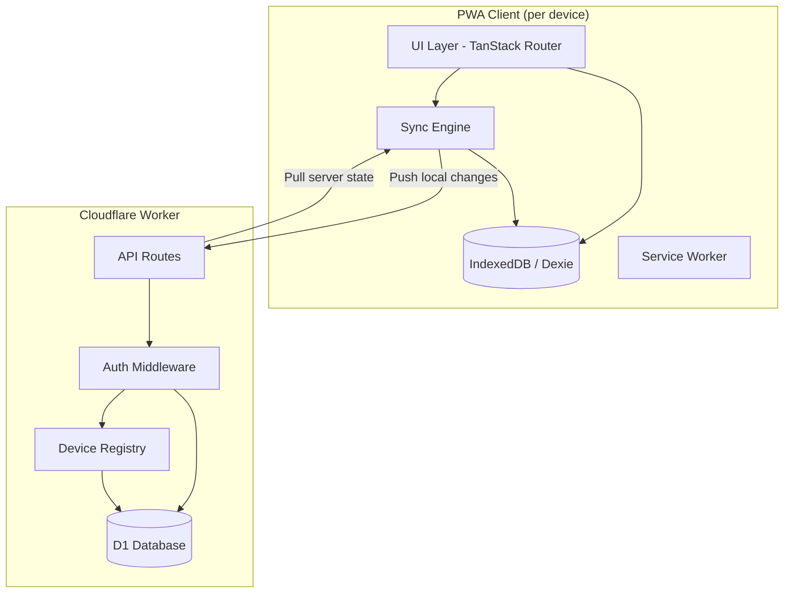
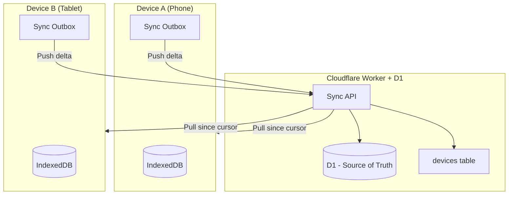
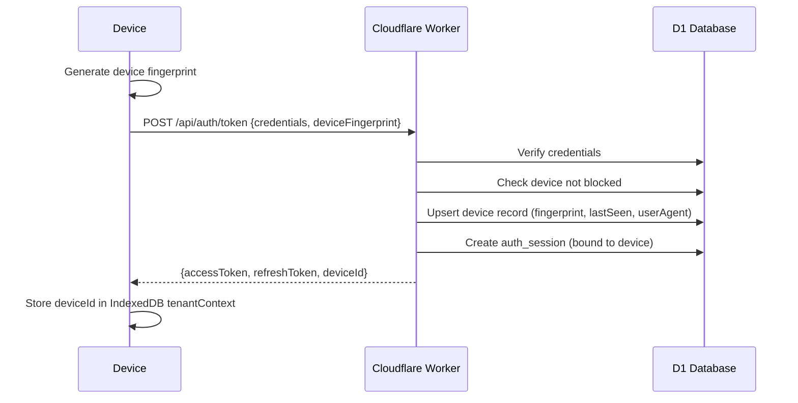
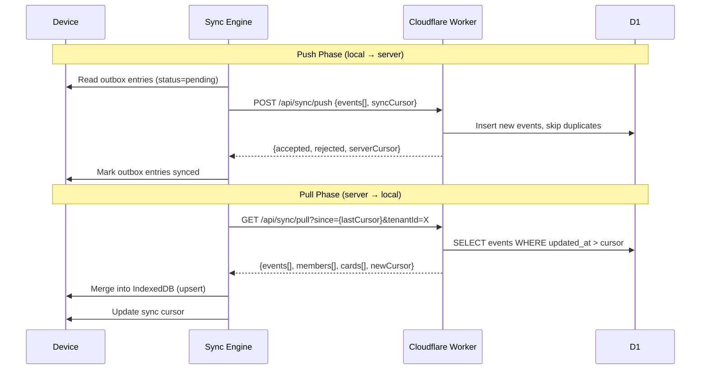
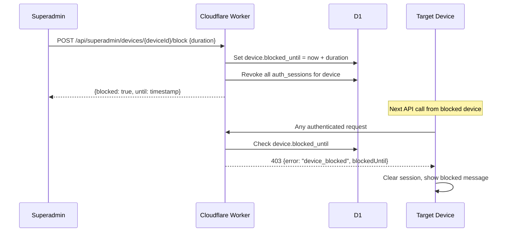

# Design Document: Tenant Management Enhanced

## Overview

This design enhances the multitenancy system for the koperasi parking management PWA. The current system has a minimal server-side tenant model (name, slug, timezone, status) with local-first IndexedDB stores handling members, cards, and transaction logs independently. Sync is limited to a one-shot tenant registration (`/api/tenants/sync`) and reconciliation of card events (`/api/reconcile`).

The enhanced system expands the server DB tenant model to include members, cards, and full transaction logs as first-class synced entities. It introduces bidirectional transaction log sync between IndexedDB and D1, a new "Transactions" UI section, multi-device login with device fingerprinting, and superadmin remote invalidation capabilities. The architecture maintains the local-first offline-capable design while adding robust server-side state for cross-device consistency and administrative control.

## Architecture



### Multi-Device Sync Architecture



## Sequence Diagrams

### Multi-Device Login Flow



### Bidirectional Transaction Sync



### Superadmin Remote Invalidation



## Components and Interfaces

### Component 1: Enhanced Sync Engine

**Purpose**: Manages bidirectional sync between IndexedDB and D1, handling conflict resolution, cursor tracking, and retry logic.

```typescript
interface SyncEngine {
  pushChanges(tenantId: string): Promise<PushResult>;
  pullChanges(tenantId: string): Promise<PullResult>;
  fullSync(tenantId: string): Promise<SyncResult>;
  getSyncStatus(tenantId: string): SyncStatus;
}

interface PushResult {
  accepted: number;
  rejected: number;
  conflicts: SyncConflict[];
}

interface PullResult {
  members: MemberDelta[];
  cards: CardDelta[];
  transactions: TransactionDelta[];
  newCursor: string;
}

interface SyncResult {
  push: PushResult;
  pull: PullResult;
  syncedAt: number;
}

type SyncStatus = "idle" | "pushing" | "pulling" | "error" | "offline";
```

**Responsibilities**:
- Track sync cursors per tenant per entity type
- Queue local mutations in outbox for push
- Apply server deltas to local IndexedDB on pull
- Handle conflict resolution (server-wins for admin actions, last-write-wins for data)
- Retry with exponential backoff on network failure

### Component 2: Device Registry

**Purpose**: Tracks device fingerprints, manages device lifecycle, and enforces blocking rules.

```typescript
interface DeviceRegistry {
  registerDevice(tenantId: string, fingerprint: DeviceFingerprint): Promise<DeviceRecord>;
  getDevicesByAccount(tenantId: string, accountId: string): Promise<DeviceRecord[]>;
  blockDevice(deviceId: string, duration: number): Promise<void>;
  unblockDevice(deviceId: string): Promise<void>;
  isDeviceBlocked(deviceId: string): Promise<boolean>;
  revokeDeviceSessions(deviceId: string): Promise<number>;
}

interface DeviceFingerprint {
  userAgent: string;
  screenResolution: string;
  timezone: string;
  language: string;
  platform: string;
  /** SHA-256 hash of combined fingerprint attributes */
  hash: string;
}

interface DeviceRecord {
  deviceId: string;
  tenantId: string;
  accountId: string;
  fingerprint: DeviceFingerprint;
  lastSeenAt: number;
  blockedUntil: number | null;
  createdAt: number;
}
```

**Responsibilities**:
- Generate stable device IDs from fingerprint attributes
- Track last-seen timestamps on each authenticated request
- Enforce device blocking with configurable duration
- Cascade session revocation on device block
- Expose device list only to superadmin role

### Component 3: Transaction Log Service

**Purpose**: Manages transaction log persistence, querying, and sync between local and server.

```typescript
interface TransactionLogService {
  recordTransaction(entry: TransactionEntry): Promise<void>;
  getTransactions(query: TransactionQuery): Promise<PaginatedTransactions>;
  getTransactionsByCard(tenantId: string, cardId: string): Promise<TransactionEntry[]>;
  getSyncableEntries(tenantId: string, since: number): Promise<TransactionEntry[]>;
}

interface TransactionEntry {
  id?: number;
  tenantId: string;
  cardId: string;
  counter: number;
  type: "debit" | "credit" | "checkin" | "checkout" | "topup" | "admin";
  amount: number;
  balanceAfter: number;
  timestamp: number;
  hash: string;
  terminalId: number | null;
  deviceId: string | null;
  syncStatus: "local" | "synced" | "conflict";
  syncedAt: number | null;
}

interface TransactionQuery {
  tenantId: string;
  cardId?: string;
  userId?: number;
  type?: string;
  dateFrom?: number;
  dateTo?: number;
  page: number;
  pageSize: number;
}

interface PaginatedTransactions {
  entries: TransactionEntry[];
  total: number;
  page: number;
  pageSize: number;
}
```

**Responsibilities**:
- Record transactions locally with sync metadata
- Provide paginated queries for the Transactions UI
- Track sync status per entry (local-only, synced, conflict)
- Support filtering by card, member, type, and date range

## Data Models

### Server-Side Schema Extensions (D1)

```typescript
// New table: devices
interface DevicesTable {
  device_id: string;          // PK, UUID
  tenant_id: string;          // FK → tenants
  account_id: string;         // FK → accounts
  fingerprint_hash: string;   // SHA-256 of device attributes
  user_agent: string;
  platform: string;
  last_seen_at: number;       // unix timestamp
  blocked_until: number | null; // unix timestamp, null = not blocked
  created_at: number;
}

// New table: auth_sessions (replaces implicit session tracking)
interface AuthSessionsTable {
  session_id: string;         // PK, UUID
  tenant_id: string;          // FK → tenants
  account_id: string;         // FK → accounts
  device_id: string;          // FK → devices
  refresh_token_hash: string; // SHA-256 of refresh token
  expires_at: number;         // unix timestamp
  revoked_at: number | null;  // null = active
  created_at: number;
}

// New table: transaction_log (server-side, replaces audit_log)
interface TransactionLogTable {
  id: number;                 // PK, auto-increment
  tenant_id: string;          // FK → tenants
  card_id: string;            // hex string (normalized from blob)
  user_id: number | null;     // FK → users (denormalized for query perf)
  counter: number;
  type: string;               // debit, credit, checkin, checkout, topup, admin
  amount: number;
  balance_after: number;
  timestamp: number;          // unix timestamp of transaction
  hash: string;               // hex string
  terminal_id: number | null;
  device_id: string | null;   // FK → devices
  idempotency_key: string;    // UNIQUE, for dedup
  flagged: boolean;
  created_at: number;         // server receipt time
}

// Extended: sync_cursors (track per-device sync state)
interface SyncCursorsTable {
  tenant_id: string;
  device_id: string;
  entity_type: string;        // 'members' | 'cards' | 'transactions'
  last_cursor: string;        // ISO timestamp or sequence number
  updated_at: number;
}
```

**Validation Rules**:
- `devices.fingerprint_hash` must be a valid 64-char hex string
- `devices.blocked_until` when set must be > current time (enforced at query time)
- `auth_sessions.revoked_at` once set is immutable
- `transaction_log.idempotency_key` format: `{tenantId}:{cardId}:{counter}`
- `sync_cursors` composite PK: `(tenant_id, device_id, entity_type)`

### Client-Side Schema Extensions (IndexedDB/Dexie)

```typescript
// Extended local-db.ts
export interface TransactionLog {
  id?: number;              // auto-increment
  tenantId: string;
  cardId: string;
  userId: number | null;
  counter: number;
  type: "debit" | "credit" | "checkin" | "checkout" | "topup" | "admin";
  amount: number;
  balanceAfter: number;
  timestamp: number;
  hash: string;
  terminalId: number | null;
  deviceId: string | null;
  syncStatus: "pending" | "synced" | "conflict";
  syncedAt: number | null;
  createdAt: number;
}

export interface SyncCursor {
  tenantId: string;
  entityType: "members" | "cards" | "transactions";
  lastCursor: string;
  updatedAt: number;
}

export interface DeviceInfo {
  deviceId: string;
  tenantId: string;
  fingerprintHash: string;
  registeredAt: number;
}
```

## Algorithmic Pseudocode

### Bidirectional Sync Algorithm

```typescript
async function bidirectionalSync(tenantId: string, deviceId: string): Promise<SyncResult> {
  // PRECONDITION: tenantId is valid, device is authenticated and not blocked
  // POSTCONDITION: local and server state are consistent up to returned cursor

  // Phase 1: Push local changes to server
  const pendingMembers = await localDb.users
    .where("tenantId").equals(tenantId)
    .filter(u => u.updatedAt > lastSyncCursor("members"))
    .toArray();

  const pendingTransactions = await localDb.transactionLog
    .where({ tenantId, syncStatus: "pending" })
    .toArray();

  const pushResult = await fetch("/api/sync/push", {
    method: "POST",
    body: JSON.stringify({
      tenantId,
      deviceId,
      members: pendingMembers,
      transactions: pendingTransactions,
      cursors: await getSyncCursors(tenantId),
    }),
  });

  // Phase 2: Pull server changes
  const cursors = await getSyncCursors(tenantId);
  const pullResult = await fetch(
    `/api/sync/pull?tenantId=${tenantId}&membersCursor=${cursors.members}&cardsCursor=${cursors.cards}&txCursor=${cursors.transactions}`
  );

  const serverData = await pullResult.json();

  // Phase 3: Merge server data into local (server-wins for conflicts)
  await localDb.transaction("rw", [localDb.users, localDb.cards, localDb.transactionLog], async () => {
    for (const member of serverData.members) {
      await localDb.users.put({ ...member, tenantId });
    }
    for (const card of serverData.cards) {
      await localDb.cards.put({ ...card, tenantId });
    }
    for (const tx of serverData.transactions) {
      await localDb.transactionLog.put({ ...tx, tenantId, syncStatus: "synced", syncedAt: Date.now() });
    }
  });

  // Phase 4: Update cursors
  await updateSyncCursors(tenantId, serverData.newCursors);

  return { push: pushResult, pull: serverData, syncedAt: Date.now() };
}
```

**Preconditions:**
- Device is authenticated with valid access token
- Device is not blocked (`blocked_until` is null or in the past)
- Network connectivity is available

**Postconditions:**
- All pending local transactions are submitted to server
- Local state reflects server state up to the returned cursor
- Sync cursors are updated for next incremental sync

**Loop Invariants:**
- Each entity is processed exactly once per sync cycle
- Idempotency keys prevent duplicate server-side insertions

### Device Fingerprint Generation

```typescript
async function generateDeviceFingerprint(): Promise<DeviceFingerprint> {
  // PRECONDITION: Running in browser context with Web Crypto available
  // POSTCONDITION: Returns stable fingerprint that identifies this device

  const attributes = {
    userAgent: navigator.userAgent,
    screenResolution: `${screen.width}x${screen.height}`,
    timezone: Intl.DateTimeFormat().resolvedOptions().timeZone,
    language: navigator.language,
    platform: navigator.platform,
    colorDepth: screen.colorDepth.toString(),
    hardwareConcurrency: navigator.hardwareConcurrency.toString(),
  };

  const raw = Object.values(attributes).join("|");
  const encoder = new TextEncoder();
  const hashBuffer = await crypto.subtle.digest("SHA-256", encoder.encode(raw));
  const hashHex = Array.from(new Uint8Array(hashBuffer))
    .map(b => b.toString(16).padStart(2, "0"))
    .join("");

  return {
    userAgent: attributes.userAgent,
    screenResolution: attributes.screenResolution,
    timezone: attributes.timezone,
    language: attributes.language,
    platform: attributes.platform,
    hash: hashHex,
  };
}
```

**Preconditions:**
- Browser environment with `navigator`, `screen`, and `crypto.subtle` available

**Postconditions:**
- Returns a deterministic fingerprint for the same device/browser combination
- Hash is a valid 64-character hex string

### Remote Device Invalidation

```typescript
async function blockDeviceAndRevokeSessions(
  deviceId: string,
  durationSeconds: number
): Promise<{ sessionsRevoked: number; blockedUntil: number }> {
  // PRECONDITION: caller has superadmin role, deviceId exists
  // POSTCONDITION: device is blocked, all its sessions are revoked

  const db = getDb();
  const now = Math.floor(Date.now() / 1000);
  const blockedUntil = now + durationSeconds;

  // Atomic: block device + revoke all sessions
  await db.transaction(async (tx) => {
    // Block the device
    await tx.update(devices)
      .set({ blockedUntil })
      .where(eq(devices.deviceId, deviceId));

    // Revoke all active sessions for this device
    await tx.update(authSessions)
      .set({ revokedAt: now })
      .where(
        and(
          eq(authSessions.deviceId, deviceId),
          isNull(authSessions.revokedAt)
        )
      );
  });

  const revoked = await db.select({ count: count() })
    .from(authSessions)
    .where(
      and(
        eq(authSessions.deviceId, deviceId),
        eq(authSessions.revokedAt, now)
      )
    ).get();

  return {
    sessionsRevoked: revoked?.count ?? 0,
    blockedUntil,
  };
}
```

**Preconditions:**
- Caller authenticated as superadmin
- `deviceId` references an existing device record
- `durationSeconds` is a positive integer

**Postconditions:**
- `devices.blocked_until` is set to `now + durationSeconds`
- All active `auth_sessions` for the device have `revoked_at` set
- Subsequent requests from the device receive 403

## Key Functions with Formal Specifications

### Function: syncPushHandler

```typescript
async function syncPushHandler(
  tenantId: string,
  deviceId: string,
  payload: SyncPushPayload
): Promise<SyncPushResponse>
```

**Preconditions:**
- `tenantId` matches the authenticated token's tenant
- `deviceId` is registered and not blocked
- `payload.transactions` each have valid `idempotency_key`

**Postconditions:**
- All valid transactions are inserted into `transaction_log`
- Duplicate idempotency keys are silently skipped (not errors)
- `cards` table balance/counter updated for newer counters
- Returns count of accepted/rejected with reasons

### Function: syncPullHandler

```typescript
async function syncPullHandler(
  tenantId: string,
  cursors: { members: string; cards: string; transactions: string }
): Promise<SyncPullResponse>
```

**Preconditions:**
- `tenantId` is valid and caller has read access
- Cursors are valid ISO timestamps or "0" for initial sync

**Postconditions:**
- Returns all entities modified after the given cursors
- Response size is bounded (max 500 entities per type per request)
- New cursor values are included for next incremental pull
- No data from other tenants is leaked

### Function: checkDeviceAccess

```typescript
async function checkDeviceAccess(deviceId: string): Promise<DeviceAccessResult>
```

**Preconditions:**
- `deviceId` is a valid UUID string

**Postconditions:**
- Returns `{ allowed: true }` if device is not blocked
- Returns `{ allowed: false, blockedUntil }` if device is blocked and `blocked_until > now`
- Automatically unblocks expired blocks (returns allowed)

## Example Usage

```typescript
// Example 1: Full sync on app resume
const { tenantId, deviceId } = await getTenantContext();
const syncEngine = useSyncEngine(tenantId, deviceId);

useEffect(() => {
  if (isOnline) {
    syncEngine.fullSync().then(result => {
      console.log(`Synced: ${result.push.accepted} pushed, ${result.pull.transactions.length} pulled`);
    });
  }
}, [isOnline]);

// Example 2: Device fingerprint on login
const fingerprint = await generateDeviceFingerprint();
const { accessToken, deviceId } = await login(username, password, fingerprint);

// Example 3: Superadmin blocks a device for 24 hours
const result = await fetch(`/api/superadmin/devices/${deviceId}/block`, {
  method: "POST",
  headers: { Authorization: `Bearer ${superadminToken}` },
  body: JSON.stringify({ durationSeconds: 86400 }),
});
// { blocked: true, sessionsRevoked: 3, blockedUntil: 1750000000 }

// Example 4: Transaction list in UI
const { data } = useQuery({
  queryKey: ["transactions", tenantId, { page: 1 }],
  queryFn: () => transactionLogService.getTransactions({
    tenantId,
    page: 1,
    pageSize: 20,
  }),
});
```

## Correctness Properties

1. **Tenant Isolation**: ∀ request R, response D: D.tenantId === R.token.tenantId — no cross-tenant data leakage
2. **Idempotent Sync**: ∀ transaction T pushed N times: server stores exactly 1 copy (enforced by idempotency_key UNIQUE constraint)
3. **Device Block Enforcement**: ∀ device D where D.blocked_until > now: all API requests from D return 403
4. **Session Cascade**: ∀ device D blocked: count(active_sessions for D) === 0 after block operation
5. **Cursor Monotonicity**: ∀ sync pull with cursor C: returned entities have updated_at > C
6. **Balance Consistency**: ∀ card C: server C.balance === balanceAfter of highest-counter transaction for C
7. **Offline Durability**: ∀ transaction recorded locally: entry persists in IndexedDB outbox until confirmed synced

## Error Handling

### Error Scenario 1: Sync Push Conflict (Stale Counter)

**Condition**: Device pushes a transaction with counter ≤ server's known counter for that card
**Response**: Reject the event with reason `stale_counter`, do not update card state
**Recovery**: Client marks entry as `conflict`, pulls latest server state, reconciles locally

### Error Scenario 2: Device Blocked Mid-Session

**Condition**: Superadmin blocks a device while it has an active session
**Response**: Next API call returns 403 `device_blocked` with `blockedUntil` timestamp
**Recovery**: Client clears local session, shows "Device blocked" message with unblock time, falls back to offline-only mode

### Error Scenario 3: Network Failure During Sync

**Condition**: Network drops during push or pull phase
**Response**: Sync engine catches the error, marks sync as failed
**Recovery**: Exponential backoff retry (1s, 2s, 4s, 8s, max 60s). Outbox entries remain `pending`. No data loss.

### Error Scenario 4: Concurrent Multi-Device Edit

**Condition**: Two devices edit the same member record simultaneously
**Response**: Server accepts both writes; last-write-wins based on `updated_at` timestamp
**Recovery**: On next pull, both devices receive the latest version. UI shows toast if local edit was overwritten.

## Testing Strategy

### Unit Testing Approach

- Test device fingerprint generation produces stable hashes
- Test sync cursor tracking advances correctly
- Test transaction idempotency key generation format
- Test device block/unblock logic with time boundaries
- Test conflict resolution (server-wins vs last-write-wins)

### Property-Based Testing Approach

**Property Test Library**: fast-check

- **Sync Idempotency**: For any sequence of push operations with the same events, server state is identical to a single push
- **Cursor Ordering**: For any pull with cursor C, all returned entities have timestamps > C
- **Device Block Duration**: For any block with duration D, device is blocked for exactly D seconds (±1s clock skew)
- **Tenant Isolation**: For any two tenants T1, T2 and any sync operation on T1, no T2 data is modified or returned

### Integration Testing Approach

- End-to-end sync flow: create transaction locally → push → pull from second device → verify consistency
- Device blocking: login → block device → verify 403 → wait for expiry → verify access restored
- Multi-device login: same account logs in from 2 devices → both get independent sessions → both can sync

## Performance Considerations

- **Sync Batching**: Push/pull operations batch up to 500 entities per request to avoid timeout on Cloudflare Workers (30s CPU limit)
- **Cursor-Based Pagination**: Avoids OFFSET-based queries; uses indexed `updated_at` columns for efficient range scans
- **IndexedDB Transactions**: Group related writes in single Dexie transactions to minimize IDB overhead
- **Debounced Sync**: Auto-sync triggers are debounced (5s after last local mutation) to avoid excessive API calls
- **Selective Pull**: Only pull entity types that have changed (server returns 304 if cursor is current)

## Security Considerations

- **Device Fingerprint Privacy**: Fingerprint hash is stored, not raw attributes (except user_agent for admin display)
- **Superadmin-Only Device View**: Device list and block operations restricted to superadmin role; tenant admins cannot see device details
- **Session Revocation Cascade**: Blocking a device immediately invalidates all refresh tokens, preventing token reuse
- **Sync Authentication**: Every sync request requires valid access token bound to tenant + device
- **Rate Limiting**: Sync endpoints rate-limited to 60 requests/minute per device to prevent abuse
- **No Cross-Tenant Sync**: Sync cursors and data are strictly partitioned by tenant_id

## Dependencies

- **Existing**: Drizzle ORM, Cloudflare D1, Dexie.js, TanStack Query, TanStack Router
- **New**: None required — all functionality built on existing stack
- **Optional**: `@fingerprintjs/fingerprintjs` for more robust device fingerprinting (currently using custom Web Crypto approach)

---

## Gap Analysis

### Current System Gaps Identified

| # | Gap | Impact | Priority |
|---|-----|--------|----------|
| 1 | **No `devices` table on server** — device tracking is implicit via `session_grants.device_id` with no metadata | Cannot identify or manage devices, no fingerprinting | High |
| 2 | **No `auth_sessions` table** — session lifecycle not tracked server-side | Cannot revoke sessions, no audit trail of logins | High |
| 3 | **No bidirectional sync for members/cards** — only one-shot tenant registration and reconciliation exist | Multi-device setups see stale data, no cross-device consistency | High |
| 4 | **Transaction log only in `audit_log`** — no sync status tracking, no pull mechanism | Devices cannot pull transaction history from server | High |
| 5 | **No device blocking mechanism** — superadmin cannot remotely invalidate a compromised device | Security risk: stolen devices retain access until token expiry | High |
| 6 | **No Transactions UI section** — admin can only see cards and members | No visibility into transaction history, no filtering/search | Medium |
| 7 | **`audit_log` uses BLOB for card_id** — inconsistent with local DB (hex string) | Sync requires conversion, potential bugs | Medium |
| 8 | **No sync cursor tracking** — no way to do incremental pulls | Full data reload on every sync, poor performance at scale | Medium |
| 9 | **Local `AuditEntry` has no `syncStatus` field** — cannot track what's been synced | Risk of duplicate pushes or missed entries | Medium |
| 10 | **No `user_id` denormalization in transaction log** — requires JOIN for member-based queries | Slow transaction queries by member | Low |
| 11 | **No multi-device session awareness** — login doesn't track which device is which | Cannot show "logged in devices" to admin | Medium |
| 12 | **Reconciliation endpoint doesn't validate device** — any authenticated request can reconcile | Blocked devices could still push reconciliation events | Medium |
| 13 | **No configurable block duration** — if blocking existed, no way to set time-limited blocks | Superadmin would need manual unblock process | Low |
| 14 | **`cards` table `card_id` is BLOB on server but hex string locally** — type mismatch | Sync layer needs bidirectional conversion | Medium |
| 15 | **No `updated_at` on `cards` or `audit_log`** — cannot do cursor-based incremental sync | Must track changes via separate mechanism | Medium |
