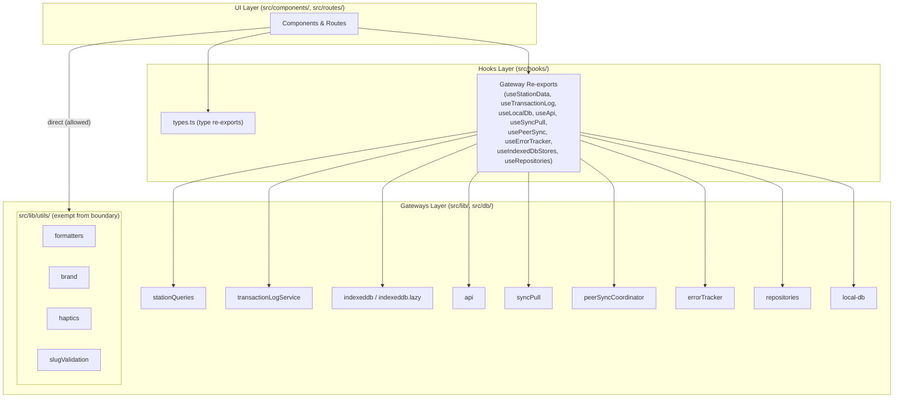

# Design Document: UI→Gateways Boundary Isolation

## Overview

This design specifies the resolution of all 38 UI→Gateways boundary violations detected by `pnpm check:boundaries`. The strategy uses two complementary approaches:

1. **Pure utility file relocation** — Move pure, side-effect-free modules (`formatters`, `brand`, `haptics`, `slugValidation`) from `src/lib/` to `src/lib/utils/`, which is exempt from the boundary rule via the regex `/["']#\/lib\/(?!utils)/`
2. **Gateway hooks** — Wrap data-fetching/I/O gateway modules in custom React hooks that encapsulate infrastructure access behind the hooks layer

The migration produces zero observable behavior changes. Pure utility imports become `#/lib/utils/*` (naturally allowed), and data-fetching imports switch from `#/lib/*` and `#/db/*` to `#/hooks/*` equivalents.

## Architecture



**Dependency Rule**: UI components import exclusively from the Hooks layer. The Hooks layer is the only layer permitted to import from Gateways. This is enforced by `scripts/check-boundaries.ts`.

## Components and Interfaces

### Component 1: Pure Utility File Relocation (`src/lib/utils/`)

**Purpose**: Move pure utility modules from `src/lib/` to `src/lib/utils/` so they are naturally exempt from the boundary rule. The boundary checker regex `/["']#\/lib\/(?!utils)/` allows any import starting with `#/lib/utils`.

**File relocations:**

| Source                      | Destination                       |
| --------------------------- | --------------------------------- |
| `src/lib/formatters.ts`     | `src/lib/utils/formatters.ts`     |
| `src/lib/brand.ts`          | `src/lib/utils/brand.ts`          |
| `src/lib/haptics.ts`        | `src/lib/utils/haptics.ts`        |
| `src/lib/slugValidation.ts` | `src/lib/utils/slugValidation.ts` |

**Rationale**: These modules contain only pure functions or constant values. They have no infrastructure dependencies (no IndexedDB, no network). Moving them under `src/lib/utils/` leverages the existing boundary rule exemption — UI components can import directly from `#/lib/utils/formatters`, `#/lib/utils/brand`, etc. without violating the boundary. This eliminates the need for re-exports in `src/hooks/domain.ts` and keeps the import graph simpler.

**Post-relocation behavior**:

- `smartRelocate` automatically updates all existing import paths across the codebase
- UI components import from `#/lib/utils/formatters` (allowed by boundary regex)
- Hooks, server code, and other consumers also get their imports auto-updated
- No re-export barrel entries needed for these modules

**Affected violations (resolved by relocation)**:

- `CheckoutConfirmCard.tsx` → `formatTime`, `formatDuration`
- `TerminalSection.tsx` → `formatDuration`
- `AdminLayout.tsx` → `BRAND`
- `AuthLayout.tsx` → `BRAND`
- `KioskLayout.tsx` → `BRAND`
- `SuperadminLayout.tsx` → `BRAND`
- `LocalSetupSection.tsx` → `BRAND`, `createSlug`
- `LoginSection.tsx` → `BRAND`
- `NfcTapArea.tsx` → `triggerHaptic`
- `SyncConflictDialog.tsx` → `validateSlugFormat`
- `TenantCreateDialog.tsx` → `createSlug`, `SLUG_MIN_LENGTH`, `SLUG_MAX_LENGTH`

### Component 2: Station Data Gateway Hook (`src/hooks/useStationData.ts`)

**Purpose**: Wrap `getCardsWithUsers` and `getUserRows` from `#/lib/stationQueries` in a hook that UI components can call.

```typescript
// src/hooks/useStationData.ts
import { getCardsWithUsers, getUserRows } from "#/lib/stationQueries";
import type { StationCardRow, StationUserRow } from "#/lib/stationQueries";

export type { StationCardRow, StationUserRow };

export function useStationData(tenantId: string) {
  // Returns query functions that components can use with TanStack Query
  return {
    getCardsWithUsers: () => getCardsWithUsers(tenantId),
    getUserRows: () => getUserRows(tenantId),
  };
}

// Direct re-export for components that call getCardsWithUsers as a queryFn
export { getCardsWithUsers, getUserRows } from "#/lib/stationQueries";
```

**Design decision**: Since `CardSection.tsx` uses `getCardsWithUsers` as a TanStack Query `queryFn`, we also re-export the function directly. The hook provides a convenience wrapper for components that want tenant-scoped access.

**Affected violations (2)**:

- `StationCardsPanel.tsx` → type imports `StationCardRow`, `StationUserRow`
- `CardSection.tsx` → `getCardsWithUsers`

### Component 3: Transaction Log Gateway Hook (`src/hooks/useTransactionLog.ts`)

**Purpose**: Wrap `getTransactions` and `recordTransaction` from `#/lib/transactionLogService`.

```typescript
// src/hooks/useTransactionLog.ts
import { getTransactions, recordTransaction } from "#/lib/transactionLogService";
import type {
  TransactionQuery,
  PaginatedTransactions,
  TransactionInput,
} from "#/lib/transactionLogService";

export type { TransactionQuery, PaginatedTransactions, TransactionInput };
export { getTransactions, recordTransaction };
```

**Design decision**: Simple re-export since `TransactionsSection.tsx` uses `getTransactions` as a TanStack Query `queryFn`. No hook wrapper needed — the re-export through the hooks layer satisfies the boundary rule.

**Affected violations (1)**:

- `TransactionsSection.tsx` → `getTransactions`, `TransactionQuery`

### Component 4: IndexedDB Lazy Store Re-exports (`src/hooks/useIndexedDbStores.ts`)

**Purpose**: Re-export lazy-loaded IndexedDB store accessors for UI consumption.

```typescript
// src/hooks/useIndexedDbStores.ts
export {
  getTenantContextStore,
  getCardSnapshotStore,
  getWriteJournalStore,
  getPolicyCacheStore,
  getReconciliationOutbox,
  getLocalTenantConfigStore,
  getLocalAccountStore,
  getSessionGrantCacheStore,
  getAuthTokenCacheStore,
  getMakeIdempotencyKey,
  getIndexedDb,
} from "#/lib/indexeddb.lazy";
```

**Design decision**: These are async factory functions that return store objects. They preserve lazy-loading behavior naturally since the dynamic `import()` inside `indexeddb.lazy.ts` is unchanged. A simple re-export through the hooks layer is sufficient.

**Affected violations (5)**:

- `AdminLayout.tsx` → `getTenantContextStore`
- `KioskLayout.tsx` → `getTenantContextStore`
- `DevicesSection.tsx` → `getIndexedDb`
- `SettingsSection.tsx` → `getIndexedDb`
- `TransactionsSection.tsx` → `getLocalAccountStore`
- `tenant.$tenantId.tsx` → `getTenantContextStore`

### Component 5: IndexedDB Types Re-export (`src/hooks/types.ts` extension)

**Purpose**: Extend the existing `src/hooks/types.ts` to re-export IndexedDB types needed by UI components.

```typescript
// src/hooks/types.ts — additions for IndexedDB and gateway types

// IndexedDB types used by UI components
export type { TenantContext, LocalTenantConfig, LocalAccount } from "#/lib/indexeddb";

// Database types used by UI components
export type { TransactionLog, Card, User } from "#/db/local-db";

// Transaction log service types
export type {
  TransactionQuery,
  PaginatedTransactions,
  TransactionInput,
} from "#/lib/transactionLogService";

// Station query types
export type { StationCardRow, StationUserRow } from "#/lib/stationQueries";

// Error tracker types
export type { ErrorEvent } from "#/lib/errorTracker";
```

**Affected violations**: Resolves type-only imports from `#/lib/indexeddb` and `#/db/local-db` in:

- `ScoutBrowsePanel.tsx` → `LocalTenantConfig`
- `DevicesSection.tsx` → `TenantContext`, `LocalTenantConfig`
- `SettingsSection.tsx` → `LocalTenantConfig`, `TenantContext`
- `TransactionsSection.tsx` → `TransactionLog`

### Component 6: API Gateway Re-exports (`src/hooks/useApi.ts`)

**Purpose**: Re-export API utilities for UI consumption.

```typescript
// src/hooks/useApi.ts
export { apiFetch, API_BASE_URL, getAccessToken, DeviceBlockedError } from "#/lib/api";
```

**Design decision**: `apiFetch` is used directly in component callbacks and TanStack Query `queryFn`s. A hook wrapper would add unnecessary indirection. Re-exporting through the hooks layer satisfies the boundary rule while preserving the existing call patterns.

**Affected violations (5)**:

- `DevicesSection.tsx` → `API_BASE_URL`
- `IssuanceTestSection.tsx` → `API_BASE_URL`
- `SettingsSection.tsx` → `API_BASE_URL`, `apiFetch`, `getAccessToken`
- `SuperadminSection.tsx` → `API_BASE_URL`
- `dev.nfc-test.tsx` → `API_BASE_URL`

### Component 7: Sync Pull Re-export (`src/hooks/useSyncPull.ts`)

**Purpose**: Re-export `syncPull` for UI consumption.

```typescript
// src/hooks/useSyncPull.ts
export { syncPull } from "#/lib/syncPull";
export type { SyncPullResult } from "#/lib/syncPull";
```

**Affected violations (1)**:

- `CardSection.tsx` → `syncPull`

### Component 8: Peer Sync Coordinator Re-export (`src/hooks/usePeerSync.ts`)

**Purpose**: Re-export peer sync coordinator functions for UI consumption.

```typescript
// src/hooks/usePeerSync.ts
export {
  notifyCheckin,
  verifyCheckinSynced,
  forcePushBeforeRead,
  setActiveTenantId,
  registerTriggerSync,
  peerSyncCoordinator,
} from "#/lib/peerSyncCoordinator";
export type { PeerSyncStatus, PeerSyncCoordinator } from "#/lib/peerSyncCoordinator";
```

**Affected violations (1)**:

- `GateSection.tsx` → `notifyCheckin`

### Component 9: Error Tracker Re-export (`src/hooks/useErrorTracker.ts`)

**Purpose**: Re-export error tracking for UI consumption.

```typescript
// src/hooks/useErrorTracker.ts
export { trackError } from "#/lib/errorTracker";
export type { ErrorEvent } from "#/lib/errorTracker";
```

**Affected violations (1)**:

- `CardSection.tsx` → `trackError`

### Component 10: Local Database Re-export (`src/hooks/useLocalDb.ts`)

**Purpose**: Re-export `localDb` and its types for UI components that perform direct Dexie queries.

```typescript
// src/hooks/useLocalDb.ts
export { localDb } from "#/db/local-db";
export type { Card, User, TransactionLog } from "#/db/local-db";
```

**Design decision**: Several components (`CardSection`, `KioskSection`, `MemberSection`, `SettingsSection`, `TransactionsSection`) use `localDb` directly for Dexie queries inside TanStack Query `queryFn`s. Wrapping each query in a dedicated hook would be a larger refactor beyond the scope of this boundary-fix migration. Re-exporting `localDb` through the hooks layer satisfies the boundary rule while deferring deeper query abstraction to a future iteration.

**Affected violations (5)**:

- `CardSection.tsx` → `localDb`, `Card`
- `KioskSection.tsx` → `localDb`
- `MemberSection.tsx` → `localDb`, `User`
- `SettingsSection.tsx` → `localDb`
- `TransactionsSection.tsx` → `TransactionLog`

### Component 11: Repository Re-export (`src/hooks/useRepositories.ts`)

**Purpose**: Re-export repository singleton instances for UI components that inject them into domain functions.

```typescript
// src/hooks/useRepositories.ts
export { cardRepo, userRepo, uidRemoteValidator, onlineStatus } from "#/lib/repositories";
```

**Affected violations (1)**:

- `CardSection.tsx` → `cardRepo`, `userRepo`, `uidRemoteValidator`, `onlineStatus`

## Violation Resolution Map

| #   | File                    | Import                        | Resolution                                              |
| --- | ----------------------- | ----------------------------- | ------------------------------------------------------- |
| 1   | CheckoutConfirmCard.tsx | `#/lib/formatters`            | → `#/lib/utils/formatters` (auto via smartRelocate)     |
| 2   | SyncConflictDialog.tsx  | `#/lib/slugValidation`        | → `#/lib/utils/slugValidation` (auto via smartRelocate) |
| 3   | TenantCreateDialog.tsx  | `#/lib/slugValidation.ts`     | → `#/lib/utils/slugValidation` (auto via smartRelocate) |
| 4   | ScoutBrowsePanel.tsx    | `#/lib/indexeddb`             | → `#/hooks/types` (type-only)                           |
| 5   | NfcTapArea.tsx          | `#/lib/haptics`               | → `#/lib/utils/haptics` (auto via smartRelocate)        |
| 6   | StationCardsPanel.tsx   | `#/lib/stationQueries`        | → `#/hooks/useStationData` (types)                      |
| 7   | AdminLayout.tsx         | `#/lib/brand`                 | → `#/lib/utils/brand` (auto via smartRelocate)          |
| 8   | AdminLayout.tsx         | `#/lib/indexeddb.lazy`        | → `#/hooks/useIndexedDbStores`                          |
| 9   | AuthLayout.tsx          | `#/lib/brand`                 | → `#/lib/utils/brand` (auto via smartRelocate)          |
| 10  | KioskLayout.tsx         | `#/lib/brand`                 | → `#/lib/utils/brand` (auto via smartRelocate)          |
| 11  | KioskLayout.tsx         | `#/lib/indexeddb.lazy`        | → `#/hooks/useIndexedDbStores`                          |
| 12  | SuperadminLayout.tsx    | `#/lib/brand`                 | → `#/lib/utils/brand` (auto via smartRelocate)          |
| 13  | CardSection.tsx         | `#/db/local-db`               | → `#/hooks/useLocalDb`                                  |
| 14  | CardSection.tsx         | `#/lib/syncPull`              | → `#/hooks/useSyncPull`                                 |
| 15  | CardSection.tsx         | `#/lib/repositories`          | → `#/hooks/useRepositories`                             |
| 16  | CardSection.tsx         | `#/lib/errorTracker`          | → `#/hooks/useErrorTracker`                             |
| 17  | CardSection.tsx         | `#/lib/stationQueries`        | → `#/hooks/useStationData`                              |
| 18  | DevicesSection.tsx      | `#/lib/indexeddb`             | → `#/hooks/types` (type-only)                           |
| 19  | DevicesSection.tsx      | `#/lib/indexeddb.lazy`        | → `#/hooks/useIndexedDbStores`                          |
| 20  | DevicesSection.tsx      | `#/lib/api`                   | → `#/hooks/useApi`                                      |
| 21  | GateSection.tsx         | `#/lib/peerSyncCoordinator`   | → `#/hooks/usePeerSync`                                 |
| 22  | IssuanceTestSection.tsx | `#/lib/api`                   | → `#/hooks/useApi`                                      |
| 23  | KioskSection.tsx        | `#/db/local-db`               | → `#/hooks/useLocalDb`                                  |
| 24  | LocalSetupSection.tsx   | `#/lib/brand`                 | → `#/lib/utils/brand` (auto via smartRelocate)          |
| 25  | LocalSetupSection.tsx   | `#/lib/slugValidation`        | → `#/lib/utils/slugValidation` (auto via smartRelocate) |
| 26  | LoginSection.tsx        | `#/lib/brand`                 | → `#/lib/utils/brand` (auto via smartRelocate)          |
| 27  | MemberSection.tsx       | `#/db/local-db`               | → `#/hooks/useLocalDb`                                  |
| 28  | SettingsSection.tsx     | `#/db/local-db`               | → `#/hooks/useLocalDb`                                  |
| 29  | SettingsSection.tsx     | `#/lib/api`                   | → `#/hooks/useApi`                                      |
| 30  | SettingsSection.tsx     | `#/lib/indexeddb`             | → `#/hooks/types` (type-only)                           |
| 31  | SettingsSection.tsx     | `#/lib/indexeddb.lazy`        | → `#/hooks/useIndexedDbStores`                          |
| 32  | SuperadminSection.tsx   | `#/lib/api`                   | → `#/hooks/useApi`                                      |
| 33  | TerminalSection.tsx     | `#/lib/formatters`            | → `#/lib/utils/formatters` (auto via smartRelocate)     |
| 34  | TransactionsSection.tsx | `#/lib/transactionLogService` | → `#/hooks/useTransactionLog`                           |
| 35  | TransactionsSection.tsx | `#/lib/indexeddb.lazy`        | → `#/hooks/useIndexedDbStores`                          |
| 36  | TransactionsSection.tsx | `#/db/local-db`               | → `#/hooks/types` (type-only)                           |
| 37  | dev.nfc-test.tsx        | `#/lib/api`                   | → `#/hooks/useApi`                                      |
| 38  | tenant.$tenantId.tsx    | `#/lib/indexeddb.lazy`        | → `#/hooks/useIndexedDbStores`                          |

## Data Models

No new data models are introduced. This migration only changes import paths — no runtime data structures, database schemas, or API contracts are modified.

## Error Handling

All gateway hooks and re-exports preserve the original error propagation behavior:

- **Re-exported functions** (`formatTime`, `createSlug`, `apiFetch`, etc.) throw/return errors identically since they are the same function references
- **`DeviceBlockedError`** is re-exported from `useApi.ts` so UI components can still catch and handle it
- **`DuplicateTransactionError`** and `TransactionWriteError` propagate unchanged through `useTransactionLog.ts`
- **IndexedDB errors** from `localDb` operations propagate unchanged through `useLocalDb.ts`
- **Network errors** from `syncPull` propagate unchanged through `useSyncPull.ts`

No error wrapping, transformation, or swallowing occurs in any re-export or hook.

## Testing Strategy

### Unit Tests (Example-Based)

- Verify each new re-export module (`useApi.ts`, `useLocalDb.ts`, `useStationData.ts`, etc.) exports the expected symbols
- Verify type re-exports compile correctly (TypeScript compilation check)
- Verify `DeviceBlockedError` is instanceof-compatible when imported from `#/hooks/useApi`

### Property Tests (fast-check)

- **Re-export equivalence**: For random inputs to pure utility functions, verify barrel re-exports produce identical results to direct imports
- **Boundary violation detection**: The existing `ui-gateway-isolation.property.test.ts` validates that no UI file imports from gateways — this test must pass after migration
- **Slug consistency**: For random strings, verify `createSlug` output is consistent with `validateSlugFormat` expectations

### Integration Tests

- Run `pnpm check:boundaries` and verify zero violations (the definitive acceptance test)
- Run `pnpm tsc --noEmit` and verify zero type errors
- Run the full test suite (`pnpm test`) and verify all existing tests pass without assertion changes

### Smoke Tests

- Application builds successfully (`pnpm build`)
- No runtime errors on page load (manual verification)

## Correctness Properties

_A property is a characteristic or behavior that should hold true across all valid executions of a system — essentially, a formal statement about what the system should do. Properties serve as the bridge between human-readable specifications and machine-verifiable correctness guarantees._

### Property 1: Re-export behavioral equivalence

_For any_ valid input to a re-exported pure utility function (formatTime, formatDuration, createSlug, validateSlugFormat, triggerHaptic), calling the function via the `#/hooks/domain` barrel SHALL produce an identical return value to calling the function via its original `#/lib/*` module path.

**Validates: Requirements 1.5, 12.1**

### Property 2: Gateway hook data equivalence

_For any_ valid arguments to a re-exported gateway function (getCardsWithUsers, getTransactions, syncPull, apiFetch, trackError), calling the function via its hooks-layer re-export module SHALL produce an identical result (return value or thrown error) to calling the function via its original `#/lib/*` or `#/db/*` module path.

**Validates: Requirements 2.3, 3.2, 12.3**

### Property 3: Zero UI→Gateways boundary violations

_For any_ TypeScript source file within `src/components/` or `src/routes/` (excluding test files), scanning all import statements SHALL yield zero matches against patterns `#/db/*` or `#/lib/*` (except the exempted `#/lib/utils` path).

**Validates: Requirements 11.1, 11.2, 11.3, 11.4, 13.2**

### Property 4: Slug validation round-trip consistency

_For any_ non-empty string input, `createSlug(input)` accessed via `#/hooks/domain` SHALL produce a slug that either passes `validateSlugFormat` (also via `#/hooks/domain`) or is shorter than `SLUG_MIN_LENGTH` — demonstrating that the re-exported functions maintain their internal consistency contract.

**Validates: Requirements 1.4, 1.5**
