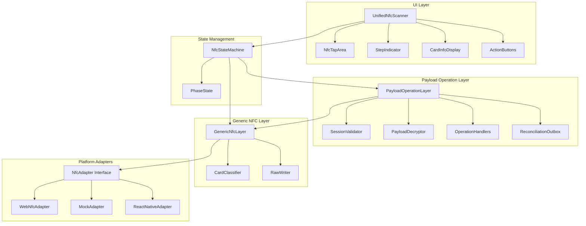
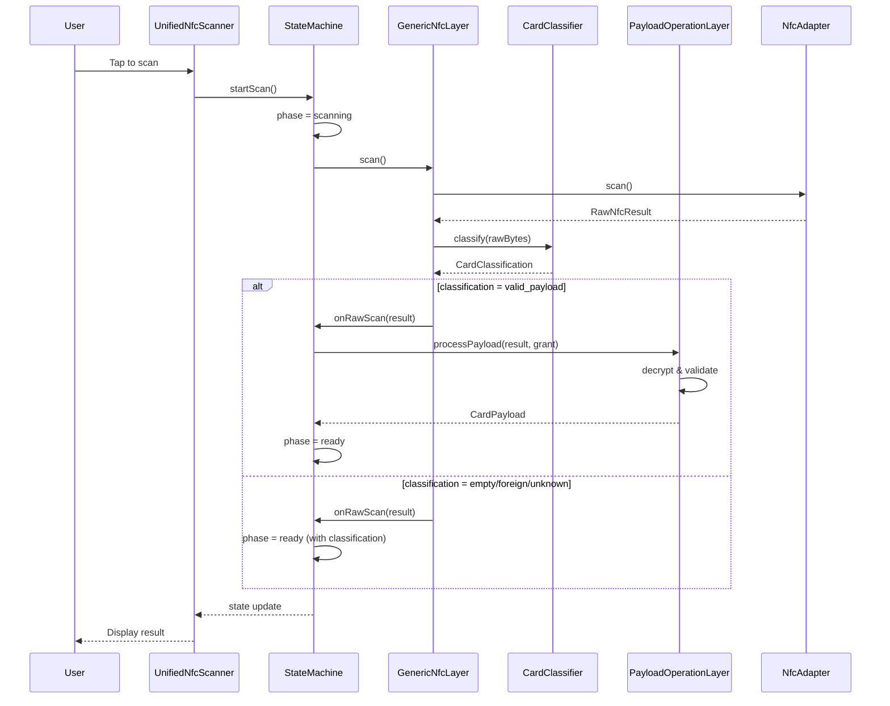
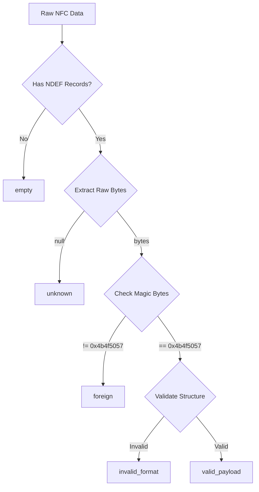
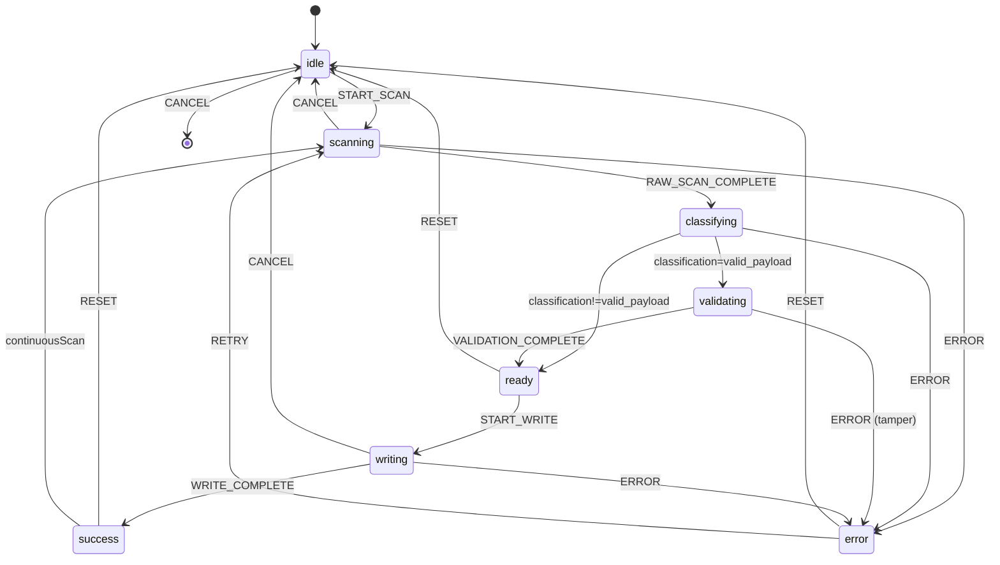
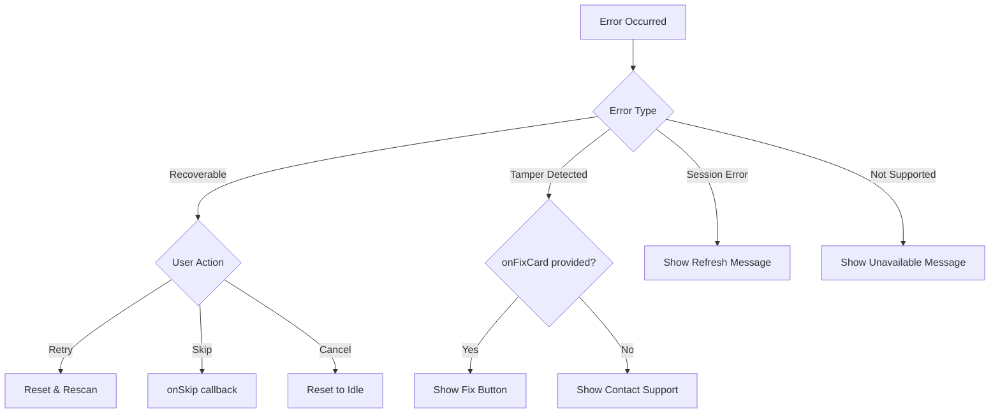

# Technical Design Document: Unified NFC Scanner

## Overview

The Unified NFC Scanner is a comprehensive NFC scanning system designed with a two-layer architecture that separates raw NFC operations from application-specific payload processing. This design enables:

1. **Platform Independence**: The Generic NFC Layer abstracts platform-specific NFC APIs behind a common adapter interface
2. **Format Flexibility**: Cards can be scanned and classified before attempting payload-specific operations
3. **Extensibility**: New card formats, operations, and platform adapters can be added without modifying core logic
4. **Consistent UX**: A single component replaces multiple existing implementations (NfcScanDrawer, NfcTapArea, StationFixCardPanel, etc.)

### Design Goals

- Consolidate 5+ existing NFC implementations into one unified component
- Support both drawer (modal) and inline display modes
- Enable raw NFC operations without requiring session authentication
- Provide clear visual feedback for all NFC operation phases
- Support extensible operation handlers for business transactions
- Maintain backward compatibility with existing CardPayload format

### Key Design Decisions

| Decision                  | Rationale                                                                                                    |
| ------------------------- | ------------------------------------------------------------------------------------------------------------ |
| Two-layer architecture    | Separates concerns: raw NFC ops vs. business logic. Enables scanning unknown cards before payload processing |
| Adapter pattern for NFC   | Enables Web NFC, React Native NFC, and mock adapters for testing                                             |
| State machine for phases  | Provides predictable state transitions and clear UI feedback                                                 |
| Callback-based API        | Aligns with React patterns and existing codebase conventions                                                 |
| Indonesian default labels | Matches existing app localization                                                                            |

## Architecture

The system follows a layered architecture with clear separation of concerns:



### Layer Responsibilities



## Components and Interfaces

### Generic NFC Layer

#### NfcAdapter Interface

```typescript
interface NfcAdapter {
  /** Check if NFC is available on this platform */
  isSupported(): boolean;

  /** Get adapter capabilities */
  getCapabilities(): NfcCapabilities;

  /** Start scanning for NFC tags */
  scan(options: NfcScanOptions): Promise<void>;

  /** Write data to an NFC tag */
  write(data: Uint8Array, options: NfcWriteOptions): Promise<void>;

  /** Abort any ongoing operation */
  abort(): void;

  /** Event handlers */
  onReading: ((event: NfcReadingEvent) => void) | null;
  onError: ((event: NfcErrorEvent) => void) | null;
}

interface NfcCapabilities {
  canRead: boolean;
  canWrite: boolean;
  supportedRecordTypes: string[];
}

interface NfcScanOptions {
  signal?: AbortSignal;
}

interface NfcWriteOptions {
  signal?: AbortSignal;
  overwrite?: boolean;
}

interface NfcReadingEvent {
  serialNumber: string;
  message: NfcMessage;
}

interface NfcMessage {
  records: NfcRecord[];
}

interface NfcRecord {
  recordType: string;
  data: Uint8Array | null;
}

interface NfcErrorEvent {
  error: Error;
}
```

#### RawNfcResult

```typescript
interface RawNfcResult {
  /** Card serial number (UID) */
  serialNumber: string;

  /** Raw bytes from the first valid NDEF record */
  rawBytes: Uint8Array | null;

  /** All NDEF records from the tag */
  records: NfcRecord[];

  /** Card classification based on data analysis */
  classification: CardClassification;

  /** Tag metadata */
  metadata: {
    recordCount: number;
    totalBytes: number;
    hasNdef: boolean;
  };
}

type CardClassification =
  | "empty" // No NDEF data
  | "foreign" // NDEF data but wrong magic bytes
  | "invalid_format" // Correct magic but structural validation failed
  | "valid_payload" // Valid CardPayload structure
  | "unknown"; // Unrecognized data format
```

#### GenericNfcLayer

```typescript
interface GenericNfcLayerOptions {
  adapter?: NfcAdapter;
  onRawScan?: (result: RawNfcResult) => void;
  onError?: (error: NfcError) => void;
  onWriteProgress?: (phase: WritePhase) => void;
}

type WritePhase = "preparing" | "waiting" | "writing" | "complete";

interface NfcError {
  code: NfcErrorCode;
  message: string;
  recoverable: boolean;
}

type NfcErrorCode =
  | "NOT_SUPPORTED"
  | "PERMISSION_DENIED"
  | "SCAN_FAILED"
  | "WRITE_FAILED"
  | "ABORTED"
  | "TIMEOUT";

class GenericNfcLayer {
  constructor(options?: GenericNfcLayerOptions);

  /** Check if NFC is available */
  isSupported(): boolean;

  /** Start scanning for NFC tags */
  scan(signal?: AbortSignal): Promise<RawNfcResult>;

  /** Write raw bytes to an NFC tag */
  writeRaw(data: Uint8Array, options?: NfcWriteOptions): Promise<void>;

  /** Write NDEF text record (for testing) */
  writeText(text: string, options?: NfcWriteOptions): Promise<void>;

  /** Abort current operation */
  abort(): void;

  /** Classify card data */
  classify(rawBytes: Uint8Array | null, records: NfcRecord[]): CardClassification;
}
```

### Payload Operation Layer

```typescript
interface PayloadOperationLayerOptions {
  sessionGrant: SessionGrant | null;
  tenantId: string;
  terminalId: number;
  onCardRead?: (payload: CardPayload, result: RawNfcResult) => void;
  onWriteSuccess?: (payload: CardPayload) => void;
  onError?: (error: PayloadError) => void;
}

interface PayloadError {
  code: PayloadErrorCode;
  message: string;
  tamperDetected: boolean;
  recoverable: boolean;
}

type PayloadErrorCode =
  | "NO_SESSION"
  | "SESSION_EXPIRED"
  | "TENANT_MISMATCH"
  | "PERMISSION_DENIED"
  | "DECRYPTION_FAILED"
  | "VALIDATION_FAILED"
  | "WRITE_FAILED";

type OperationType = "check-in" | "check-out" | "debit" | "topup" | "card-issuance" | "card-repair";

interface OperationHandler {
  name: OperationType | string;
  label: string;
  icon?: React.ReactNode;
  isEnabled: (payload: CardPayload) => boolean;
  execute: (payload: CardPayload) => Promise<CardPayload>;
}

class PayloadOperationLayer {
  constructor(genericLayer: GenericNfcLayer, options: PayloadOperationLayerOptions);

  /** Process a raw scan result into a CardPayload */
  processPayload(result: RawNfcResult): Promise<CardPayload>;

  /** Execute an operation on the current card */
  executeOperation(
    operation: OperationType | string,
    currentPayload: CardPayload,
  ): Promise<CardPayload>;

  /** Prepare and write an updated payload */
  writePayload(currentPayload: CardPayload, updatedPayload: CardPayload): Promise<void>;

  /** Validate session grant */
  validateSession(): SessionValidationResult;

  /** Register custom operation handler */
  registerOperation(handler: OperationHandler): void;
}

interface SessionValidationResult {
  valid: boolean;
  error?: string;
  errorCode?: "NO_SESSION" | "SESSION_EXPIRED" | "TENANT_MISMATCH";
}
```

### State Machine

```typescript
type NfcPhase =
  | "idle"
  | "scanning"
  | "classifying"
  | "validating"
  | "ready"
  | "writing"
  | "success"
  | "error";

interface NfcState {
  phase: NfcPhase;
  rawResult: RawNfcResult | null;
  payload: CardPayload | null;
  classification: CardClassification | null;
  error: NfcError | PayloadError | null;
  tamperDetected: boolean;
  isCheckedIn: boolean;
}

type NfcAction =
  | { type: "START_SCAN" }
  | { type: "RAW_SCAN_COMPLETE"; result: RawNfcResult }
  | { type: "CLASSIFICATION_COMPLETE"; classification: CardClassification }
  | { type: "VALIDATION_COMPLETE"; payload: CardPayload }
  | { type: "START_WRITE" }
  | { type: "WRITE_COMPLETE"; payload: CardPayload }
  | { type: "ERROR"; error: NfcError | PayloadError }
  | { type: "RESET" }
  | { type: "CANCEL" };

function nfcReducer(state: NfcState, action: NfcAction): NfcState;
```

### UnifiedNfcScanner Component

```typescript
interface UnifiedNfcScannerProps {
  // Display configuration
  displayMode: "drawer" | "inline";
  open?: boolean;
  onOpenChange?: (open: boolean) => void;

  // Scan configuration
  scanMode?: "raw" | "payload";
  autoScan?: boolean;
  continuousScan?: boolean;
  continuousScanDelay?: number;

  // Session and context
  sessionGrant?: SessionGrant | null;
  tenantId?: string;
  terminalId?: number;

  // Feature flags
  showSteps?: boolean;
  showRawData?: boolean;
  showCheckInStatus?: boolean;
  allowSkip?: boolean;
  autoCloseOnSuccess?: boolean;
  autoCloseDelay?: number;

  // Callbacks
  onRawScan?: (result: RawNfcResult) => void;
  onCardRead?: (payload: CardPayload, result: RawNfcResult) => void;
  onWriteSuccess?: (payload: CardPayload) => void;
  onError?: (error: NfcError | PayloadError) => void;
  onSkip?: (error: NfcError | PayloadError) => void;
  onClose?: () => void;

  // Card actions
  onCheckin?: (payload: CardPayload) => Promise<CardPayload>;
  onCheckout?: (payload: CardPayload) => Promise<CardPayload>;
  onInitializeCard?: (result: RawNfcResult) => Promise<void>;
  onFixCard?: (result: RawNfcResult, payload?: CardPayload) => Promise<void>;

  // Custom operations
  operations?: OperationHandler[];

  // Custom rendering
  renderActions?: (props: ActionRenderProps) => React.ReactNode;

  // Labels customization
  labels?: Partial<NfcLabels>;
}

interface ActionRenderProps {
  phase: NfcPhase;
  classification: CardClassification | null;
  payload: CardPayload | null;
  isCheckedIn: boolean;
  onCheckin: () => void;
  onCheckout: () => void;
}

interface NfcLabels {
  // Phase labels
  idle: string;
  scanning: string;
  classifying: string;
  validating: string;
  ready: string;
  writing: string;
  success: string;
  error: string;

  // Classification labels
  empty: string;
  foreign: string;
  invalidFormat: string;
  unknown: string;

  // Action labels
  checkin: string;
  checkout: string;
  retry: string;
  skip: string;
  cancel: string;
  close: string;
  initializeCard: string;
  fixCard: string;
  viewRawData: string;

  // Status labels
  checkedIn: string;
  notCheckedIn: string;
  tamperDetected: string;
  nfcNotSupported: string;
  sessionExpired: string;
}

const DEFAULT_LABELS: NfcLabels = {
  idle: "Tempelkan Kartu",
  scanning: "Menunggu kartu...",
  classifying: "Mengidentifikasi kartu...",
  validating: "Memvalidasi kartu...",
  ready: "Kartu Siap",
  writing: "Menulis kartu...",
  success: "Berhasil!",
  error: "Gagal",

  empty: "Kartu Kosong",
  foreign: "Kartu Tidak Dikenal",
  invalidFormat: "Format Kartu Rusak",
  unknown: "Kartu Tidak Dikenal",

  checkin: "Masuk",
  checkout: "Keluar",
  retry: "Coba Lagi",
  skip: "Lewati",
  cancel: "Batalkan",
  close: "Tutup",
  initializeCard: "Inisialisasi Kartu",
  fixCard: "Perbaiki Kartu",
  viewRawData: "Lihat Data Mentah",

  checkedIn: "Sudah Masuk",
  notCheckedIn: "Belum Masuk",
  tamperDetected: "Kartu Terdeteksi Rusak",
  nfcNotSupported: "NFC tidak tersedia di perangkat ini",
  sessionExpired: "Sesi telah berakhir",
};
```

### Hook: useUnifiedNfc

```typescript
interface UseUnifiedNfcOptions {
  sessionGrant: SessionGrant | null;
  tenantId: string;
  terminalId: number;
  scanMode?: "raw" | "payload";
  adapter?: NfcAdapter;
  onRawScan?: (result: RawNfcResult) => void;
  onCardRead?: (payload: CardPayload, result: RawNfcResult) => void;
  onWriteSuccess?: (payload: CardPayload) => void;
  onError?: (error: NfcError | PayloadError) => void;
}

interface UseUnifiedNfcReturn {
  // State
  state: NfcState;
  isNfcSupported: boolean;

  // Actions
  scan: () => Promise<void>;
  write: (updatedPayload: CardPayload) => Promise<boolean>;
  reset: () => void;
  cancel: () => void;

  // Layers (for advanced usage)
  genericLayer: GenericNfcLayer;
  payloadLayer: PayloadOperationLayer | null;
}

function useUnifiedNfc(options: UseUnifiedNfcOptions): UseUnifiedNfcReturn;
```

## Data Models

### Card Classification Flow



### State Transitions



### Integration with Existing Types

The system integrates with existing types from `src/core/payload/types.ts`:

- `CardPayload`: The decrypted card data structure
- `SessionGrant`: Authentication and encryption keys
- `CardStatus`: Card status enum (ACTIVE, BLOCKED\_\*, etc.)
- `CardState`: Card state enum (IDLE, CHECKED_IN, etc.)
- `LogEntry`: Transaction log entry structure

## Correctness Properties

_A property is a characteristic or behavior that should hold true across all valid executions of a system—essentially, a formal statement about what the system should do. Properties serve as the bridge between human-readable specifications and machine-verifiable correctness guarantees._

### Property 1: Classification Completeness and Correctness

_For any_ NFC tag data, the classification SHALL be exactly one of: "empty", "invalid_format", "valid_payload", "unknown", or "foreign". Furthermore:

- _For any_ tag with zero NDEF records, classification SHALL be "empty"
- _For any_ tag with NDEF data where first 4 bytes ≠ MAGIC (0x4b4f5057), classification SHALL be "foreign"
- _For any_ tag with valid magic but invalid structure, classification SHALL be "invalid_format"
- _For any_ tag with valid magic and valid structure, classification SHALL be "valid_payload"

**Validates: Requirements 1.3, 1.4, 2.1, 2.2, 2.3, 2.4, 2.5**

### Property 2: Payload Encryption Round-Trip

_For any_ valid CardPayload and valid SessionGrant, encrypting the payload body with AES-256-GCM and then decrypting with the same session key SHALL produce a byte-identical payload body.

**Validates: Requirements 5.2, 5.3**

### Property 3: Validation Integrity

_For any_ card data:

- If HMAC verification passes AND counter binding matches AND chain hash is valid, validation SHALL pass
- If any of HMAC, counter binding, or chain hash fails, validation SHALL fail with `tamperDetected = true`

**Validates: Requirements 5.4, 5.5**

### Property 4: Session Grant Validation

_For any_ payload operation:

- If SessionGrant is null, operation SHALL fail with error code "NO_SESSION"
- If SessionGrant.expiresAt < current time, operation SHALL fail with error code "SESSION_EXPIRED"
- If SessionGrant.tenantId ≠ card tenant, operation SHALL fail with error code "TENANT_MISMATCH"

**Validates: Requirements 7.1, 7.2, 7.3, 7.4**

### Property 5: Operation Permission Enforcement

_For any_ operation type and SessionGrant, if the operation type is not included in SessionGrant.allowedOps, the operation SHALL be rejected with error code "PERMISSION_DENIED".

**Validates: Requirements 6.2, 7.5**

### Property 6: State Machine Integrity

_For any_ NFC operation sequence:

- State transitions SHALL follow the defined phase sequence (idle → scanning → classifying → validating/ready → writing → success)
- Cancel action from any active phase SHALL return to idle state
- Reset action SHALL return to idle state and clear all stored data

**Validates: Requirements 4.3, 19.1, 19.2, 19.3, 19.4**

### Property 7: Write Progress Feedback

_For any_ write operation, the state SHALL transition through phases in order: "preparing" → "waiting" → "writing" → "complete" (or "error" on failure).

**Validates: Requirements 4.3**

## Error Handling

### Error Categories

| Category   | Error Codes                                  | Recovery Strategy                    |
| ---------- | -------------------------------------------- | ------------------------------------ |
| Platform   | NOT_SUPPORTED, PERMISSION_DENIED             | Display message, no retry            |
| Scan       | SCAN_FAILED, TIMEOUT                         | Retry available                      |
| Write      | WRITE_FAILED                                 | Retry available, check card position |
| Session    | NO_SESSION, SESSION_EXPIRED, TENANT_MISMATCH | Refresh session                      |
| Validation | DECRYPTION_FAILED, VALIDATION_FAILED         | Tamper detected, offer fix           |
| User       | ABORTED                                      | Reset to idle                        |

### Error Messages (Indonesian)

```typescript
const ERROR_MESSAGES: Record<string, string> = {
  NOT_SUPPORTED: "NFC tidak tersedia di perangkat ini",
  PERMISSION_DENIED: "Izin NFC ditolak. Aktifkan NFC di pengaturan.",
  SCAN_FAILED: "Gagal membaca kartu. Coba lagi.",
  WRITE_FAILED: "Gagal menulis kartu. Tahan kartu sampai selesai.",
  TIMEOUT: "Waktu habis. Coba lagi.",
  NO_SESSION: "Sesi tidak aktif. Muat ulang halaman.",
  SESSION_EXPIRED: "Sesi telah berakhir. Muat ulang halaman.",
  TENANT_MISMATCH: "Kartu tidak terdaftar di tenant ini.",
  DECRYPTION_FAILED: "Gagal mendekripsi kartu.",
  VALIDATION_FAILED: "Validasi kartu gagal.",
  ABORTED: "Operasi dibatalkan.",
};
```

### Recovery Flow



## Testing Strategy

### Unit Tests

Unit tests focus on specific examples and edge cases:

1. **Card Classification**
   - Empty tag (no NDEF records)
   - Foreign tag (wrong magic bytes)
   - Invalid format (correct magic, bad structure)
   - Valid payload (correct magic and structure)

2. **Session Validation**
   - Null session grant
   - Expired session grant
   - Tenant mismatch
   - Valid session grant

3. **State Transitions**
   - Each phase transition
   - Cancel from each active phase
   - Reset behavior

4. **Component Rendering**
   - Drawer mode open/close
   - Inline mode rendering
   - Phase-specific UI elements
   - Custom labels

### Property-Based Tests

Property-based tests verify universal properties across generated inputs. Each test runs minimum 100 iterations.

```typescript
// Example: Classification completeness
// Feature: unified-nfc-scanner, Property 1: Classification Completeness
describe("Card Classification", () => {
  it("should always return a valid classification", () => {
    fc.assert(
      fc.property(
        fc.option(fc.uint8Array({ minLength: 0, maxLength: 500 })),
        fc.array(fc.record({ recordType: fc.string(), data: fc.option(fc.uint8Array()) })),
        (rawBytes, records) => {
          const classification = classifier.classify(rawBytes ?? null, records);
          expect(["empty", "foreign", "invalid_format", "valid_payload", "unknown"]).toContain(
            classification,
          );
        },
      ),
      { numRuns: 100 },
    );
  });
});

// Example: Encryption round-trip
// Feature: unified-nfc-scanner, Property 2: Payload Encryption Round-Trip
describe("Payload Encryption", () => {
  it("should preserve payload through encrypt/decrypt cycle", () => {
    fc.assert(
      fc.property(arbitraryCardPayload(), arbitrarySessionGrant(), async (payload, grant) => {
        const encrypted = await encryptCardBody(payload, grant.sessionKey);
        const decrypted = await decryptCardBody(encrypted, grant.sessionKey);
        expect(decrypted).toEqual(payload);
      }),
      { numRuns: 100 },
    );
  });
});
```

### Integration Tests

1. **WebNfcAdapter Integration**
   - Real NDEFReader interaction (requires NFC-enabled device)
   - Permission handling
   - Abort signal handling

2. **Full Scan Flow**
   - Scan → Classify → Validate → Ready
   - Scan → Classify → Ready (non-payload)
   - Scan → Error → Retry → Success

3. **Write Flow**
   - Read → Modify → Write → Verify
   - Write failure recovery

### Test File Structure

```
src/
├── core/
│   └── nfc/
│       ├── __tests__/
│       │   ├── genericNfcLayer.test.ts
│       │   ├── cardClassifier.test.ts
│       │   ├── payloadOperationLayer.test.ts
│       │   └── properties/
│       │       ├── classification.property.test.ts
│       │       ├── encryption.property.test.ts
│       │       └── validation.property.test.ts
│       └── __mocks__/
│           └── mockNfcAdapter.ts
├── hooks/
│   └── __tests__/
│       └── useUnifiedNfc.test.ts
└── components/
    └── block/
        └── __tests__/
            └── UnifiedNfcScanner.test.tsx
```

### Test Configuration

```typescript
// vitest.config.ts additions
export default defineConfig({
  test: {
    // Property-based test timeout (longer due to iterations)
    testTimeout: 30000,

    // Coverage thresholds
    coverage: {
      thresholds: {
        statements: 80,
        branches: 75,
        functions: 80,
        lines: 80,
      },
    },
  },
});
```

## File Structure

```
src/
├── core/
│   └── nfc/
│       ├── adapters/
│       │   ├── index.ts
│       │   ├── types.ts
│       │   ├── webNfcAdapter.ts
│       │   └── mockNfcAdapter.ts
│       ├── genericNfcLayer.ts
│       ├── cardClassifier.ts
│       ├── payloadOperationLayer.ts
│       └── index.ts
├── hooks/
│   └── useUnifiedNfc.ts
└── components/
    └── block/
        ├── UnifiedNfcScanner.tsx
        ├── UnifiedNfcScanner/
        │   ├── NfcTapArea.tsx
        │   ├── StepIndicator.tsx
        │   ├── CardInfoDisplay.tsx
        │   ├── ActionButtons.tsx
        │   ├── RawDataInspector.tsx
        │   └── index.ts
        └── index.ts
```

## Migration Path

### Phase 1: Core Layer Implementation

1. Implement NfcAdapter interface and WebNfcAdapter
2. Implement GenericNfcLayer with classification
3. Implement PayloadOperationLayer
4. Create useUnifiedNfc hook

### Phase 2: Component Implementation

1. Create UnifiedNfcScanner component
2. Implement all display modes and phases
3. Add accessibility features
4. Implement custom labels support

### Phase 3: Migration

1. Update StationSection to use UnifiedNfcScanner
2. Update AdminSection to use UnifiedNfcScanner
3. Update KioskSection, TerminalSection, ScoutSection
4. Deprecate old components (NfcScanDrawer, NfcTapArea)

### Phase 4: Cleanup

1. Remove deprecated components
2. Update documentation
3. Add migration guide for external consumers
