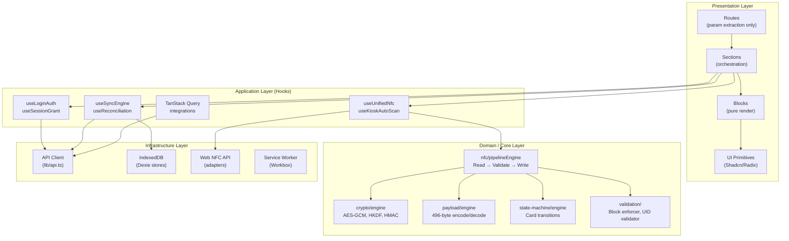
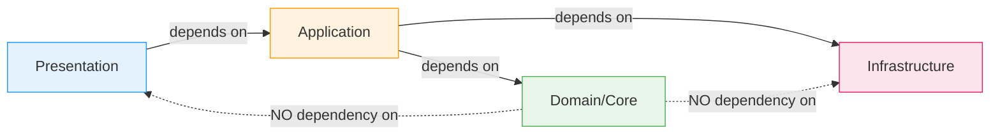

# Folder Structure & Clean Architecture

[← Back to README](../README.md)

## Current Structure

```
koperasi-kegelapan/
├── api/src/                    # API Worker (Cloudflare Workers)
│   ├── lib/                    # Shared utilities
│   ├── middleware/             # CORS, device block, rate limit, analytics
│   ├── routes/                 # Route handlers (11 modules)
│   └── __tests__/             # API integration tests
├── src/                        # Frontend Application
│   ├── components/
│   │   ├── ui/                 # Shadcn primitives (Button, Dialog, etc.)
│   │   ├── block/              # Composed UI blocks (NfcTapArea, DataTable)
│   │   ├── layout/            # Layout shells (AdminLayout, KioskLayout)
│   │   └── section/           # Page sections (GateSection, AdminSection)
│   ├── core/                   # Domain logic (framework-agnostic)
│   │   ├── crypto/            # AES-GCM, HKDF, HMAC, PBKDF2
│   │   ├── nfc/               # NFC adapters, engine, pipeline, state machine
│   │   ├── payload/           # Card binary encode/decode (496-byte)
│   │   ├── state-machine/     # Card state transitions
│   │   └── validation/        # Card & transaction validation
│   ├── db/                     # Database layer
│   │   ├── schema.ts          # Drizzle ORM schema (D1)
│   │   ├── local-db.ts        # Dexie IndexedDB schema
│   │   └── seed.ts            # Database seeding
│   ├── domain/                 # Domain models
│   │   ├── card/              # Card domain logic
│   │   ├── member/            # Member domain logic
│   │   └── transaction/       # Transaction domain logic
│   ├── hooks/                  # React hooks
│   │   ├── nfc/               # NFC-specific hooks
│   │   └── *.ts               # Auth, sync, session, reconciliation hooks
│   ├── integrations/           # External integrations (TanStack Query)
│   ├── lib/                    # Shared utilities
│   │   ├── sync*.ts           # Sync engine (push, pull, conflict resolver)
│   │   ├── indexeddb.ts       # IndexedDB store definitions
│   │   └── *.ts               # API client, formatters, device utils
│   ├── routes/                 # TanStack Router (file-based routing)
│   └── server/                 # Server-side logic (auth, reconcile, grants)
├── drizzle/                    # D1 SQL migrations
├── e2e/                        # Playwright E2E tests
├── docs/                       # Spec documentation (git submodule)
├── docs-arch/                  # Architecture docs (this folder)
└── public/                     # Static assets, PWA manifest, icons
```

## Ideal Clean Architecture (Target - Future Branch)

```
koperasi-kegelapan/
├── api/                            # Backend (Cloudflare Workers)
│   └── src/
│       ├── application/            # Use cases / application services
│       │   ├── auth/
│       │   ├── card/
│       │   ├── reconciliation/
│       │   └── sync/
│       ├── domain/                 # Pure domain models & business rules
│       │   ├── entities/
│       │   ├── value-objects/
│       │   └── events/
│       ├── infrastructure/         # External concerns
│       │   ├── persistence/        # Drizzle repositories
│       │   ├── crypto/             # Server-side crypto
│       │   └── analytics/          # Analytics Engine adapter
│       └── presentation/           # HTTP layer
│           ├── middleware/
│           └── routes/
├── src/                            # Frontend (React PWA)
│   ├── app/                        # App bootstrap, providers, router
│   ├── features/                   # Feature modules (vertical slices)
│   │   ├── auth/
│   │   │   ├── hooks/
│   │   │   ├── components/
│   │   │   └── services/
│   │   ├── card/
│   │   │   ├── hooks/
│   │   │   ├── components/
│   │   │   └── services/
│   │   ├── gate/
│   │   ├── terminal/
│   │   ├── kiosk/
│   │   └── admin/
│   ├── core/                       # Framework-agnostic domain logic
│   │   ├── crypto/
│   │   ├── nfc/
│   │   ├── payload/
│   │   ├── state-machine/
│   │   └── validation/
│   ├── shared/                     # Shared across features
│   │   ├── components/
│   │   │   ├── ui/                 # Shadcn primitives
│   │   │   └── layout/            # Layout shells
│   │   ├── hooks/                  # Generic hooks
│   │   ├── lib/                    # Utilities
│   │   └── types/                  # Shared TypeScript types
│   ├── infrastructure/             # External adapters
│   │   ├── api/                    # API client
│   │   ├── indexeddb/             # Dexie stores
│   │   └── nfc/                   # Web NFC adapter
│   └── routes/                     # TanStack Router (thin, delegates to features)
├── packages/                       # Shared packages (optional monorepo)
│   └── domain/                     # Shared domain types between API & frontend
├── drizzle/
├── e2e/
└── docs/
```

## Architecture Layer Diagram



## Dependency Rule



> **Core/Domain layer has ZERO external dependencies.** It contains pure TypeScript logic
> (crypto algorithms, payload encoding, state machine rules, validation) that can be tested
> in isolation without React, IndexedDB, or network access.

## Layer Rules

| Layer              | Can Import From      | Cannot Import From       |
| ------------------ | -------------------- | ------------------------ |
| **Routes**         | Sections             | Blocks, Hooks, Core, Lib |
| **Sections**       | Blocks, Hooks        | Routes, Core directly    |
| **Blocks**         | UI primitives        | Hooks, Core, API         |
| **Hooks**          | Core, Infrastructure | Components               |
| **Core/Domain**    | Nothing (pure logic) | Everything else          |
| **Infrastructure** | Core (types only)    | Hooks, Components        |
