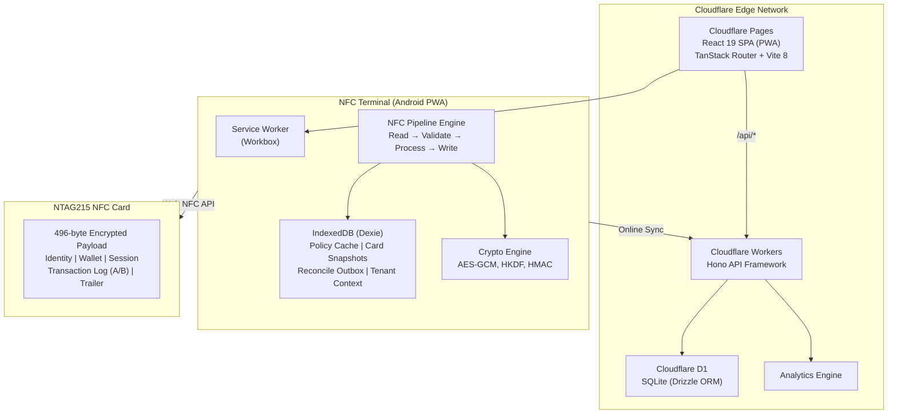
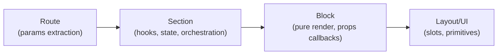
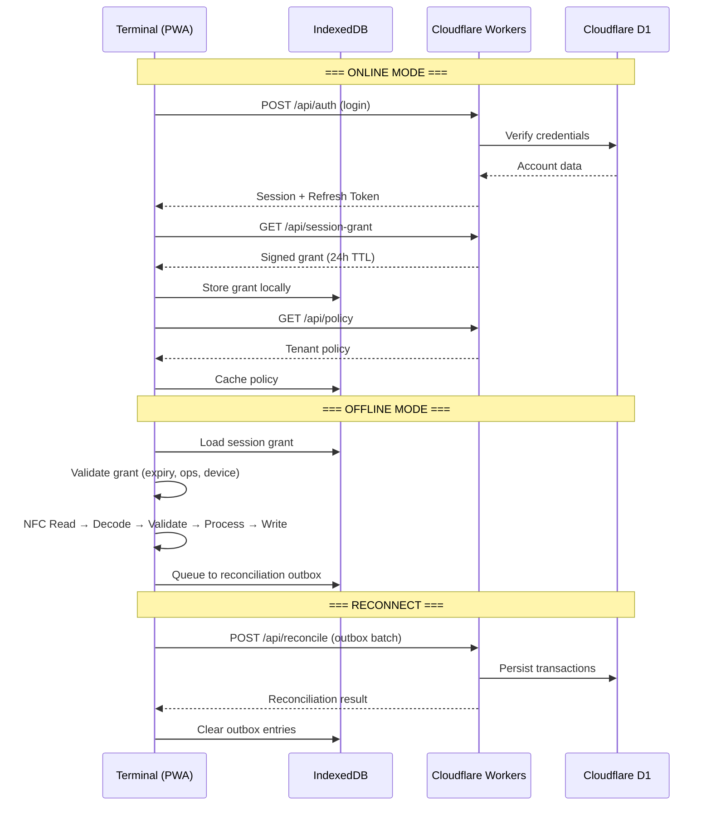
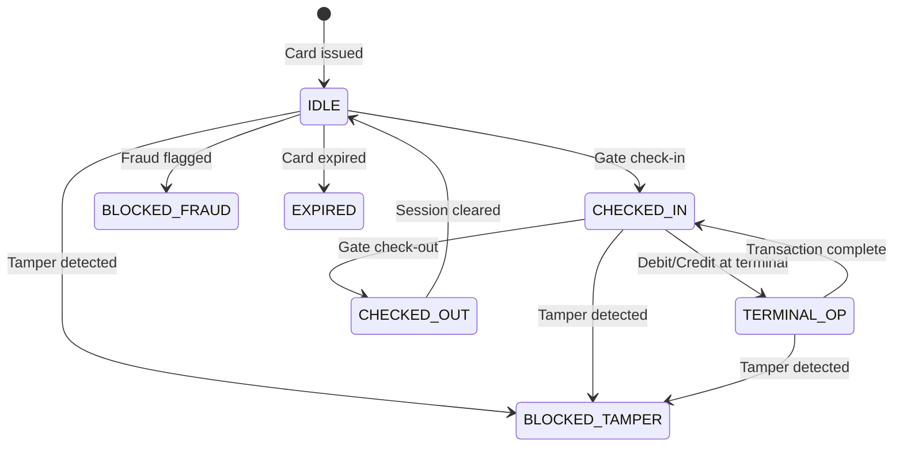
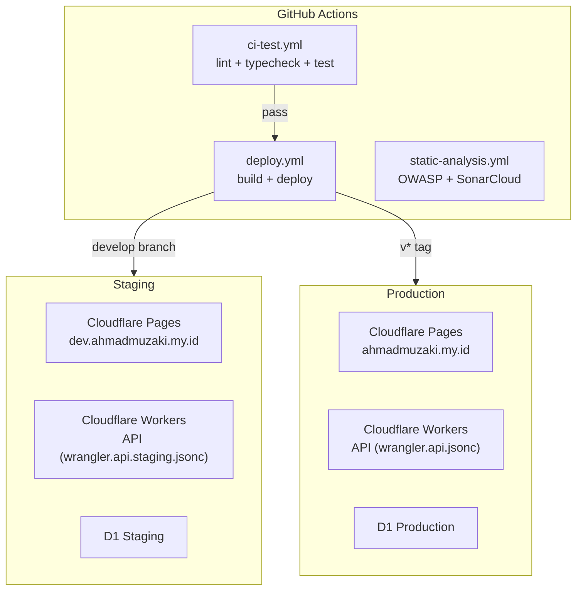

# High-Level Design (HLD)

[← Back to README](../README.md)

## System Overview

## Component Interaction (Atomic UI Layers)

| Layer       | Folder                    | Responsibility                                |
| ----------- | ------------------------- | --------------------------------------------- |
| **Route**   | `src/routes/`             | Extract route params, pass to Section         |
| **Section** | `src/components/section/` | Call hooks, own state, orchestrate Blocks     |
| **Block**   | `src/components/block/`   | Render data, handle user activity via props   |
| **Layout**  | `src/components/layout/`  | Define slot structure (children, named slots) |
| **UI**      | `src/components/ui/`      | Primitive atoms (Button, Input, Badge, …)     |

## Data Flow — Online vs Offline

## Card State Machine

## Deployment Topology

