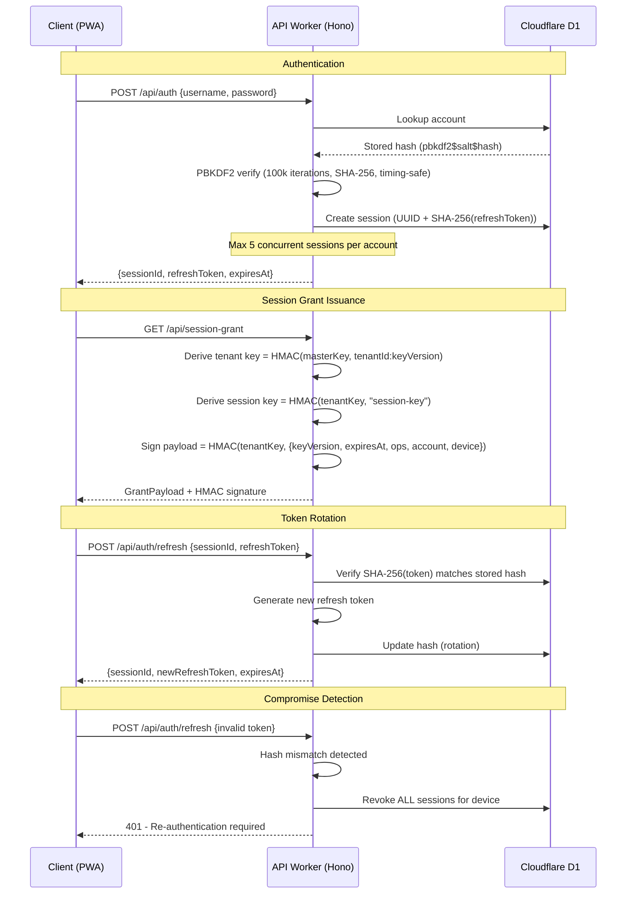
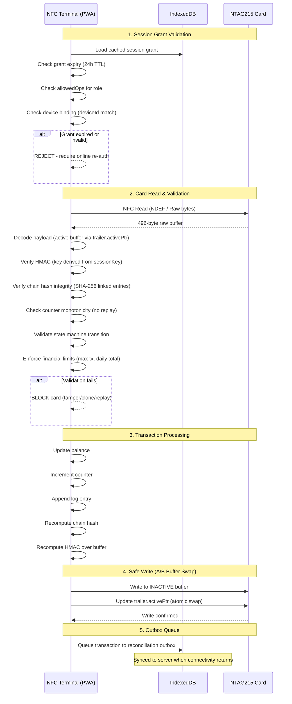
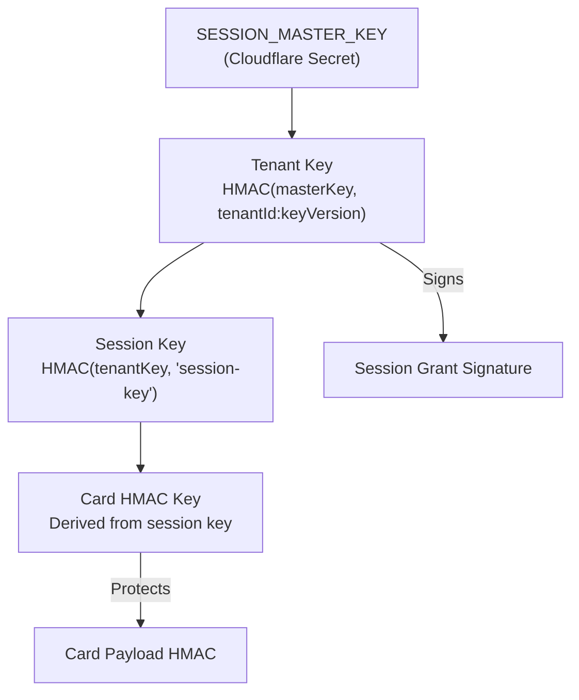
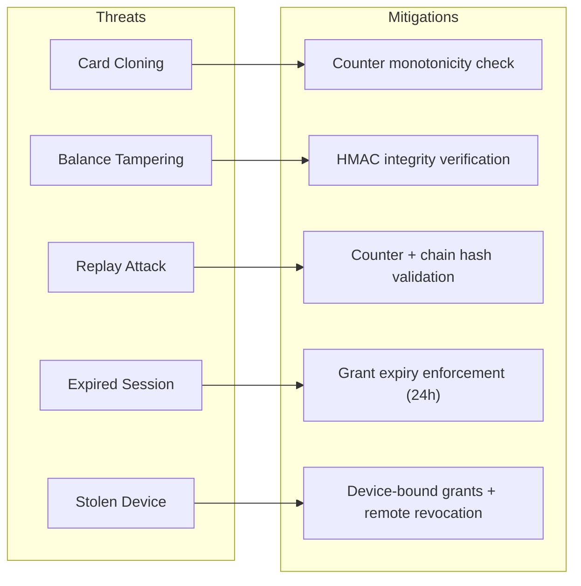

# Security Architecture

[← Back to README](../README.md)

## Overview

The system uses a **hybrid online/offline security model**. When online, the server issues cryptographically signed session grants. When offline, terminals validate card operations locally using those grants and card-embedded HMAC chains.

## Online Security Flow

## Offline Security Flow

## Key Hierarchy

## Security Controls Summary

| Control             | Implementation                                            |
| ------------------- | --------------------------------------------------------- |
| Password hashing    | PBKDF2 (100k iterations, SHA-256, 16-byte salt)           |
| Token storage       | SHA-256 hash stored, never raw token                      |
| Token rotation      | New refresh token on every refresh call                   |
| Compromise response | Revoke ALL device sessions on invalid token               |
| Session limit       | Max 5 concurrent sessions per account                     |
| Session grant       | HMAC-signed, 24h TTL, role-scoped, device-bound           |
| Card integrity      | HMAC over full payload buffer                             |
| Tamper detection    | Chain hash (SHA-256 linked log entries)                   |
| Replay protection   | Monotonic counter enforcement                             |
| Clone detection     | Counter mismatch vs backend projection                    |
| Financial limits    | Max transaction amount, max daily total (policy-enforced) |
| Device blocking     | Server-side device block list, middleware enforcement     |
| Rate limiting       | 60 req/min per device on sync routes                      |
| Dependency scanning | OWASP Dependency Check + npm audit (CI)                   |
| Static analysis     | SonarCloud (weekly + on PR)                               |
| CORS                | Strict origin allowlist via middleware                    |

## Threat Model (Offline)

