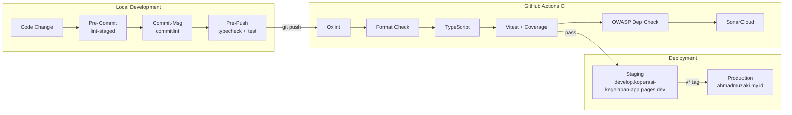
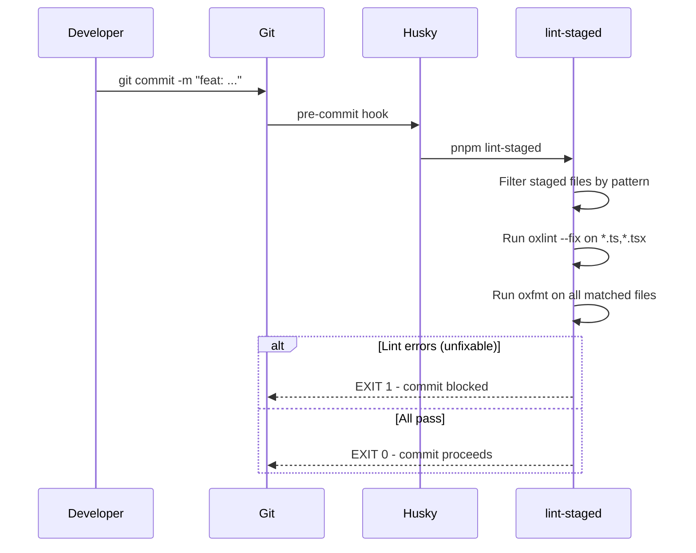
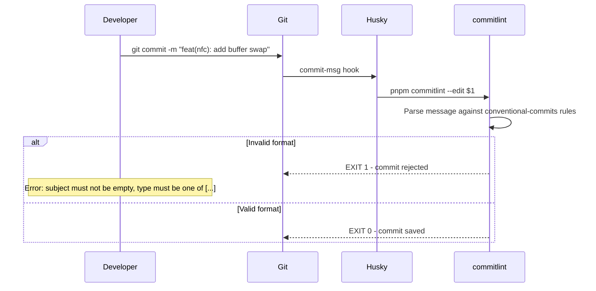
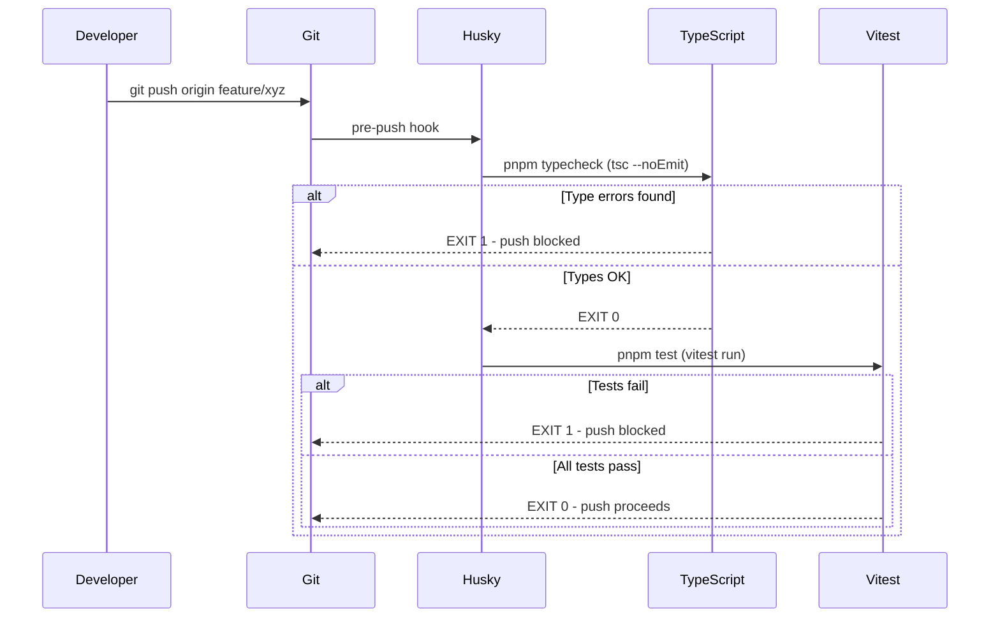
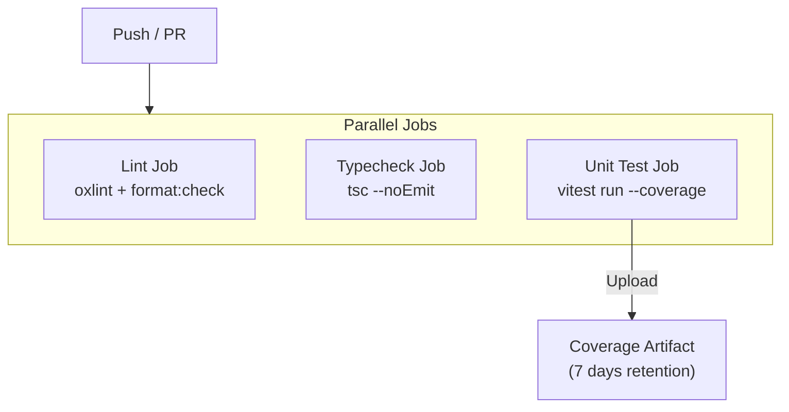
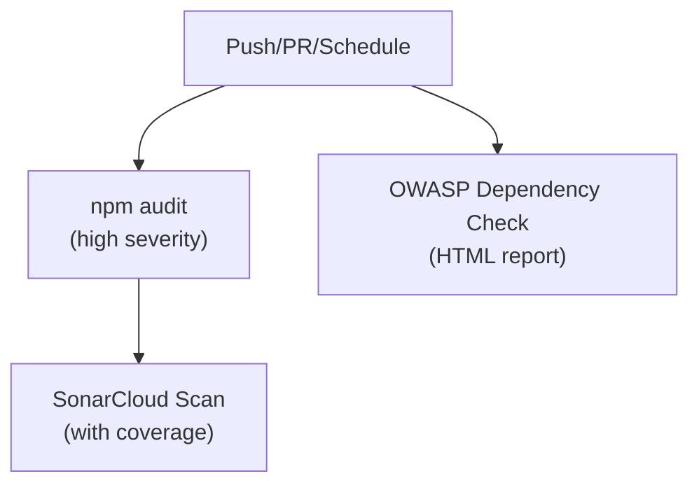
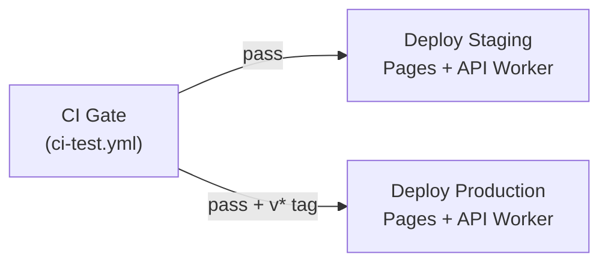

# Software Quality

[← Back to README](../README.md)

## Quality Gates Overview



---

## Pre-Commit Hook

**Trigger:** `git commit` (via Husky)
**Action:** Runs `lint-staged`

```json
// package.json → lint-staged
{
  "*.{ts,tsx,js,jsx}": ["oxlint --fix", "oxfmt"],
  "*.{json,md,css,html,yaml,toml}": ["oxfmt"]
}
```

### What it does:

1. **Oxlint** - Fast Rust-based linter with auto-fix
   - Plugins: `react`, `typescript`, `unicorn`
   - Key rules enforced:
     - `no-unused-vars` (error)
     - `typescript/consistent-type-imports` (error)
     - `typescript/no-unused-vars` (error)
     - `react/rules-of-hooks` (error)
     - `react/no-array-index-key` (warn)
2. **Oxfmt** - Rust-based formatter (Prettier-compatible)
   - No semicolons, single quotes, 2-space indent, trailing comma (ES5), 100 char width

### Flow:



---

## Commit Message Lint (Commitlint)

**Trigger:** `git commit` (commit-msg hook via Husky)
**Action:** Validates commit message format

### Configuration

```javascript
// commitlint.config.js
export default {
  extends: ["@commitlint/config-conventional"],
};
```

### Conventional Commits Format

```
<type>(<scope>): <subject>

[optional body]

[optional footer(s)]
```

### Allowed Types

| Type       | Description                                           |
| ---------- | ----------------------------------------------------- |
| `feat`     | New feature                                           |
| `fix`      | Bug fix                                               |
| `docs`     | Documentation only                                    |
| `style`    | Formatting, no code change                            |
| `refactor` | Code change that neither fixes a bug nor adds feature |
| `perf`     | Performance improvement                               |
| `test`     | Adding or correcting tests                            |
| `build`    | Build system or external dependencies                 |
| `ci`       | CI configuration                                      |
| `chore`    | Other changes (no src or test)                        |
| `revert`   | Reverts a previous commit                             |

### Examples

```bash
# ✅ Valid
feat(nfc): add A/B buffer swap on card write
fix(auth): handle expired refresh token gracefully
docs: update security architecture diagram
test(crypto): add property-based tests for HMAC

# ❌ Invalid
added new feature          # no type prefix
feat: Add new feature      # uppercase subject
feat(nfc) add buffer swap  # missing colon
```

### Flow:



---

## Pre-Push Hook

**Trigger:** `git push` (via Husky)
**Action:** Runs typecheck + full test suite

```bash
# .husky/pre-push
pnpm typecheck
pnpm test
```

### What it does:

1. **TypeScript type checking** (`tsc --noEmit`)
   - Full project type validation without emitting files
   - Catches type errors that oxlint doesn't cover
2. **Vitest test suite** (`vitest run`)
   - Runs all unit tests (non-watch mode)
   - Includes property-based tests (fast-check)
   - Must pass 100% before code reaches remote

### Flow:



---

## CI Pipeline (GitHub Actions)

### ci-test.yml

Triggered on: push to `master`/`develop`, PRs to `master`



| Job         | Steps                                  |
| ----------- | -------------------------------------- |
| `lint`      | `pnpm lint` + `pnpm format:check`      |
| `typecheck` | `pnpm typecheck`                       |
| `unit-test` | `pnpm test:coverage` + upload artifact |

### static-analysis.yml

Triggered on: push/PR to `master`, weekly Monday 03:00 UTC



| Job                      | Purpose                                   |
| ------------------------ | ----------------------------------------- |
| `npm-audit`              | Fast vulnerability scan (high+ severity)  |
| `owasp-dependency-check` | Full OWASP CVE database check             |
| `sonarcloud`             | Code quality, coverage, security hotspots |

### deploy.yml

Triggered on: `develop` push (staging), `v*` tags (production), manual dispatch



---

## Tool Summary

| Tool                 | Purpose                    | Stage          |
| -------------------- | -------------------------- | -------------- |
| **Oxlint**           | Linting (Rust, fast)       | Pre-commit, CI |
| **Oxfmt**            | Formatting (Rust, fast)    | Pre-commit, CI |
| **Commitlint**       | Commit message validation  | Commit-msg     |
| **TypeScript (tsc)** | Type checking              | Pre-push, CI   |
| **Vitest**           | Unit + property tests      | Pre-push, CI   |
| **fast-check**       | Property-based testing     | Pre-push, CI   |
| **Playwright**       | E2E browser tests          | CI             |
| **SonarCloud**       | Static analysis + coverage | CI (weekly)    |
| **OWASP Dep Check**  | Vulnerability scanning     | CI (weekly)    |
| **Husky**            | Git hook management        | Local          |
| **lint-staged**      | Staged-file-only linting   | Pre-commit     |
