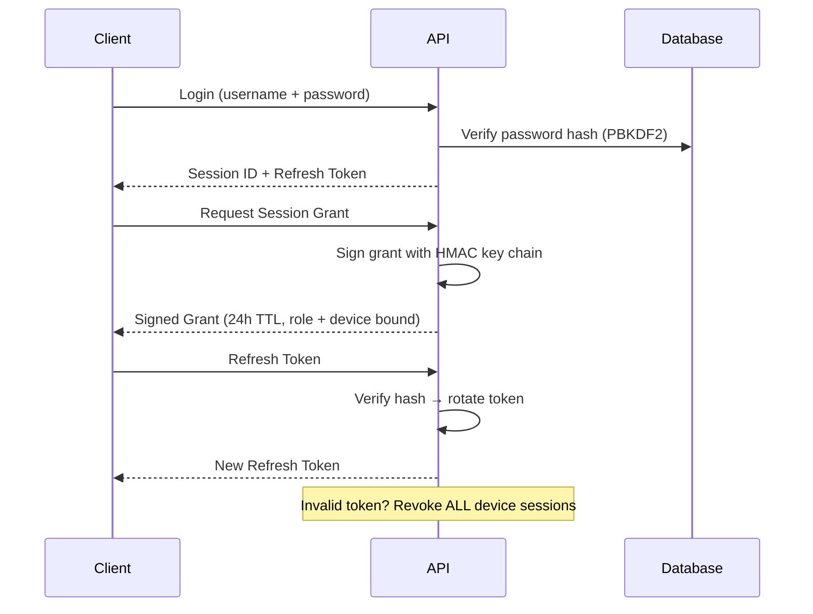
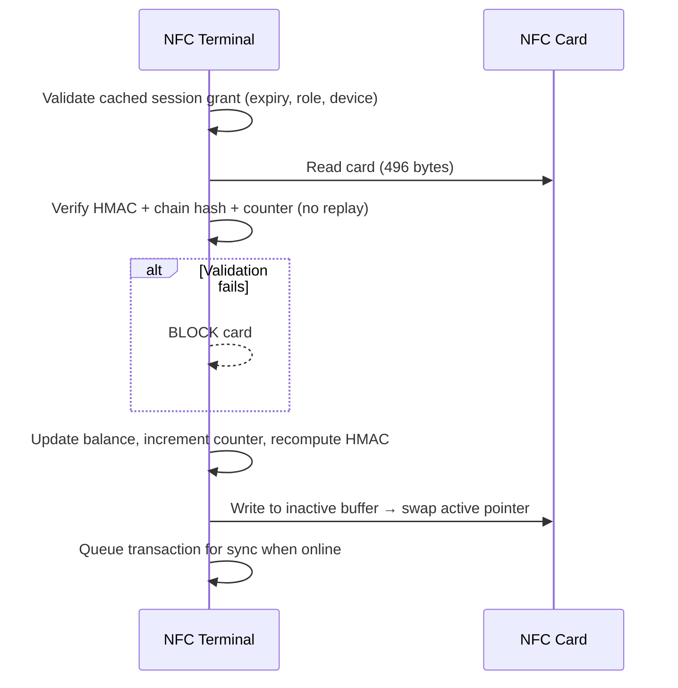
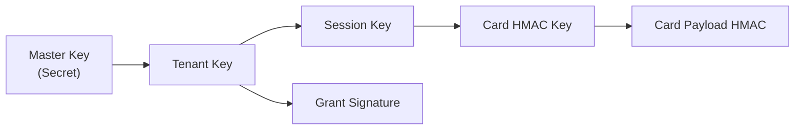

# Security Overview (Simplified)

[← Back to README](../README.md)

## Online Flow

## Offline Flow

## Key Hierarchy

## Key Controls

| Threat            | Mitigation                                   |
| ----------------- | -------------------------------------------- |
| Password breach   | PBKDF2 (100k iterations), hash stored only   |
| Token theft       | SHA-256 hash stored; rotate on every refresh |
| Token reuse       | Invalid token → revoke all device sessions   |
| Card cloning      | Monotonic counter check                      |
| Balance tampering | HMAC over full card payload                  |
| Replay attack     | Counter + chain hash validation              |
| Expired session   | 24h grant TTL enforced offline               |
| Stolen device     | Device-bound grants + remote revocation      |
