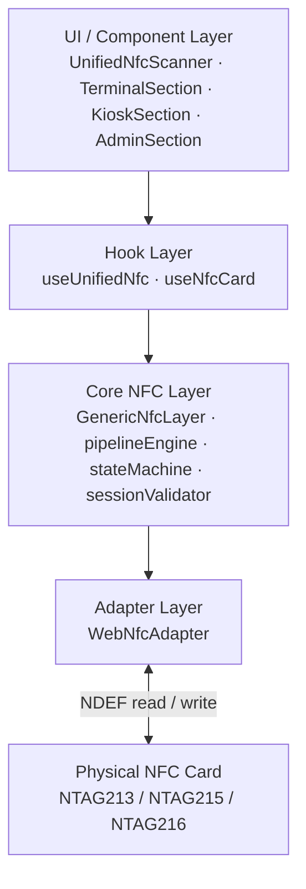
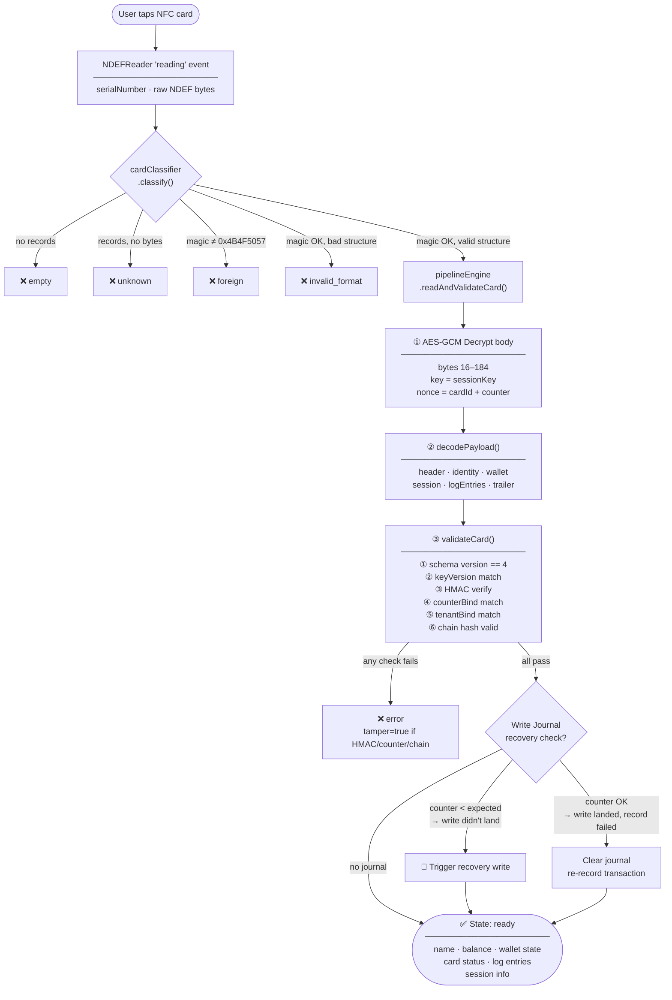
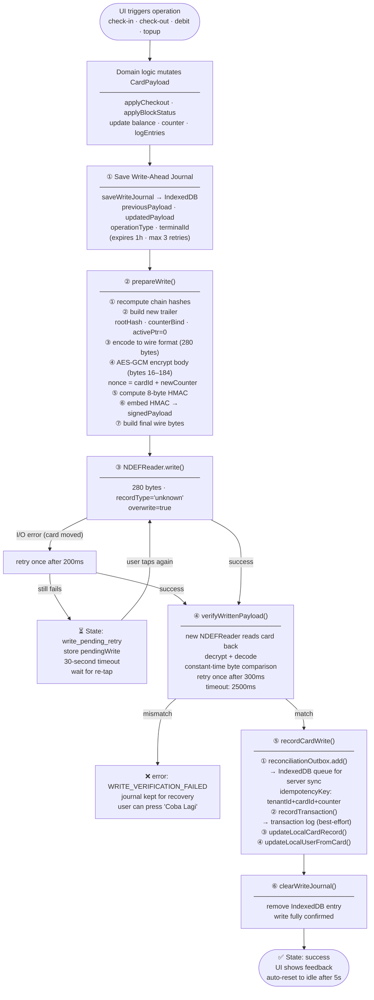
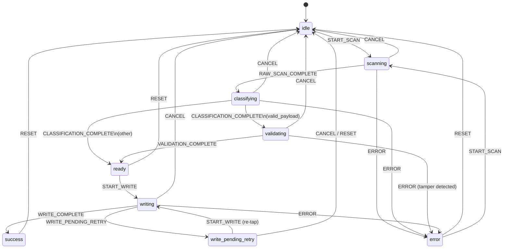
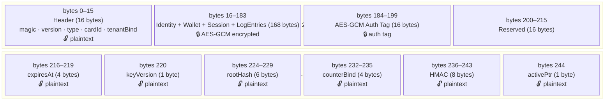
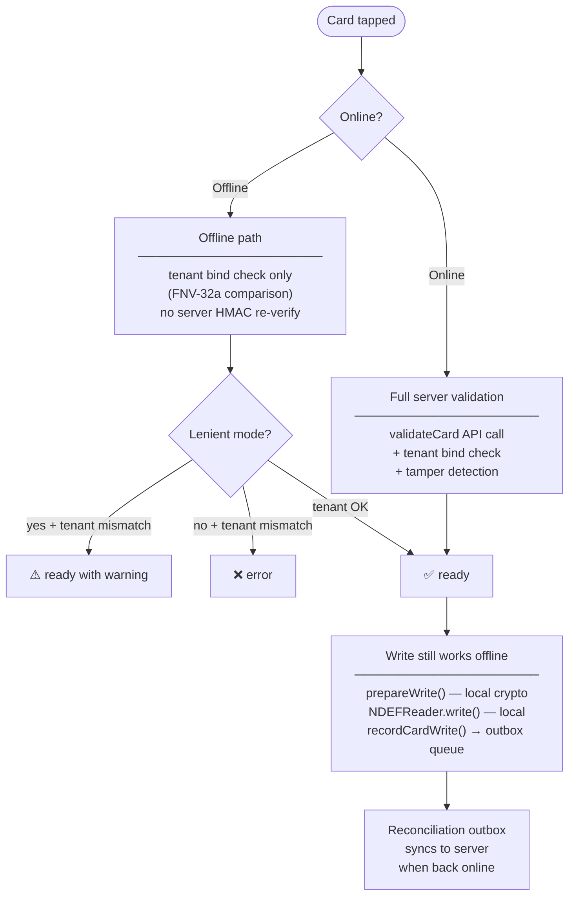

# NFC Read & Write Operation Diagrams

## 1. Architecture Layers

---

## 2. READ Operation

---

## 3. WRITE Operation

---

## 4. State Machine

---

## 5. Card Wire Format (280 bytes)

---

## 6. Security Chain

```mermaid
flowchart LR
    AES["🔒 AES-GCM Encryption\n─────────────────\nProtects: identity · wallet\nsession · log entries\nKey: sessionKey\nNonce: cardId + counter"]

    HMAC["🔏 HMAC-SHA256 (8 bytes)\n─────────────────\nCovers: encrypted buffer\n+ trailer\nDetects: any tampering"]

    CTR["🔢 Counter Binding\n─────────────────\nwallet.counter & 0xFFFFFFFF\n== trailer.counterBind\nPrevents: replay attacks"]

    CHAIN["⛓ Chain Hash\n─────────────────\nEach log entry hashes\nthe previous (SHA-256/4)\nDetects: log tampering"]

    TENANT["🏢 Tenant Binding\n─────────────────\nheader.tenantBind\n= FNV-32a(tenantId)\nPrevents: cross-tenant use"]

    VERIFY["✅ Write Verification\n─────────────────\nRead-back after every write\nConstant-time comparison\nPrevents: silent failures"]

    JOURNAL["📓 Write-Ahead Journal\n─────────────────\nIndexedDB before write\nAuto-recovery on next tap\nPrevents: lost transactions"]

    AES --> HMAC --> CTR --> CHAIN --> TENANT --> VERIFY --> JOURNAL
```

---

## 7. Offline / Online Behavior

